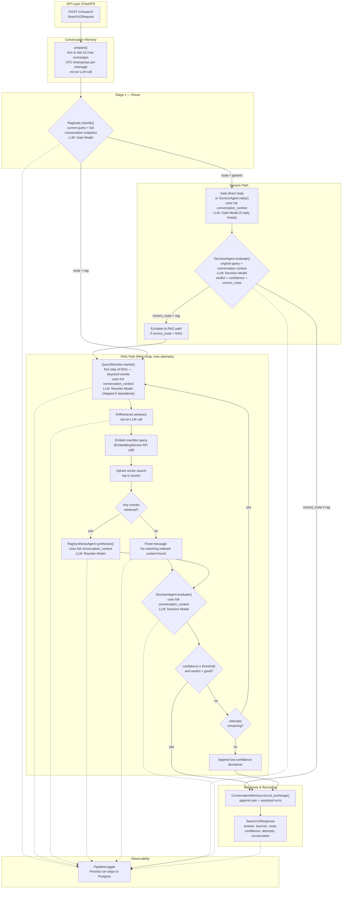
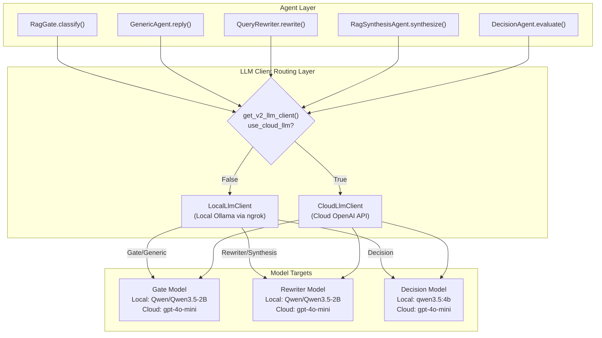
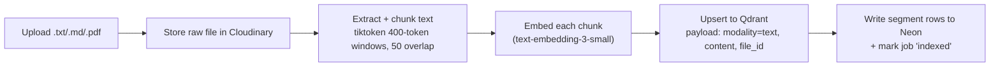
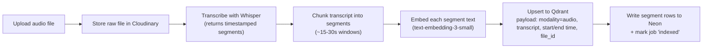
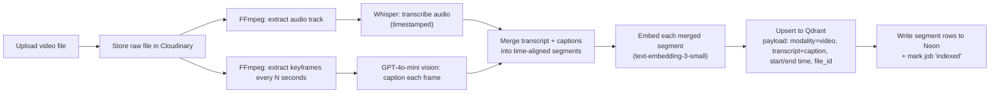
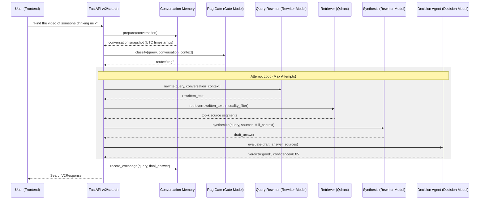

# Architecture — Scrutinize

Multi-modal AI embedding & retrieval system with an agentic local RAG pipeline.

## 1. Overview

**Scrutinize** is a unified ingestion and retrieval system that allows users to upload **text, audio, and video**, and subsequently perform natural-language search across all modalities. The system is split into four layers:

1. **Client** — React chat-style UI (upload + search in one surface).
2. **API Layer** — FastAPI, the single entry point for the frontend, routing queries to V1 or V2 services.
3. **Processing Layer** — Async Celery workers that process raw files, extract transcriptions/captions, and generate embeddings.
4. **Data Layer** — **Qdrant** (native vector database) for similarity search, **Neon Postgres** for metadata/jobs/logs, and **Cloudinary** for raw file storage.

A local **Agentic RAG pipeline (V2)** sits on top of the data layer at query time, orchestrating query understanding, routing, multi-stage retrieval, confidence evaluation, and synthesis.

---

## 2. High-Level Architecture

The query flow is orchestrated by the `PipelineOrchestrator` (`POST /v2/search`), using local LLMs (or cloud LLMs) for agentic routing, rewriting, and validation:



### LLM Running Placements & Client Routing Layer

Depending on the `USE_CLOUD_LLM` flag, all LLM calls are routed either locally (e.g. Qwen via Ollama) or to OpenAI:



---

## 3. Component Breakdown

| Module | Role | LLM / External dependency |
|---|---|---|
| `pipeline_orchestrator.py` | Coordinates the v2 gate → generic/decision or RAG (rewrite → retrieve → synthesis → decision) loop, error handling, and pipeline logging. | — |
| `conversation_memory.py` | Prepares and maintains a rolling snapshot of the last 10 chat exchanges with UTC timestamps. | — |
| `rag_gate.py` | Routes queries to `generic` or `rag` using the current query and full conversation snapshot; may return a direct generic reply. | Gate Model |
| `query_rewriter.py` | Enhances user query for keyword/dense search (RAG path only); incorporates correction feedback during RAG retries. | Rewriter Model |
| `generic_agent.py` | Generates a fallback conversational reply when the gate routes to `generic` without providing a reply. | Gate Model |
| `rrf_retriever.py` | Orchestrates query embedding and retrieves top-k matching documents from Qdrant. | Qdrant + Embedding Service |
| `rag_synthesis_agent.py` | Produces a cited, grounded, context-aware answer from retrieved segments. | Rewriter Model |
| `decision_agent.py` | Evaluates drafts for confidence and alignment; triggers retry feedback or escalates generic routes to RAG. | Decision Model |
| `pipeline_logger.py` | Writes steps (gate, rewrite, retrieval, synthesis, evaluation) to Neon Postgres for traceability. | Neon Postgres |
| `llm_clients/base.py` | Abstract base class for the LLM execution client | — |
| `llm_clients/local.py` | OpenAI-compatible HTTP client for local model host (ngrok/Ollama) | Local Ollama |
| `llm_clients/cloud.py` | OpenAI API client for cloud model host | OpenAI |

---

## 4. Tech Stack & Rationale

Here is how each technology operates within the pipeline and why it was selected:

### 4.1 FastAPI (Backend App)
* **How it works**: FastAPI hosts the `/v2/search` endpoints and orchestrates dependency injection (e.g., database sessions, clients, and pipeline components).
* **Why it's used**: Native asynchronous programming allows high-throughput handling of non-blocking I/O tasks (waiting on LLMs, database queries, and external APIs). It provides automated Pydantic verification and instant OpenAPI docs.

### 4.2 Qdrant (Vector Database)
* **How it works**: Holds text and media embeddings (1536 dimensions) mapped to payloads containing document IDs, modality types (`text`, `audio`, `video`), text contents, and timestamps.
* **Why it's used**: Purpose-built vector databases like Qdrant offer rapid approximate nearest neighbor (ANN) search, payload-based metadata filtering (e.g., modality filters), and support for multiple named vectors per point—allowing expansion into visual/audio embeddings without migration.

### 4.3 Neon Postgres (Relational DB & Observability)
* **How it works**: Serves as the database for relational schemas (files, processing jobs, segments) and houses `PipelineLogger` tables to track the multi-stage execution logs.
* **Why it's used**: Serverless Postgres provides full relational features (indexes, joins, and transactions) needed to correlate files and jobs. Storing detailed pipeline execution logs in SQL allows rich observability and debugging of agentic decisions.

### 4.4 Cloudinary (Object Storage)
* **How it works**: Holds the raw media files (source PDFs, MP3s, MP4s) and returns CDN-backed HTTPS URLs.
* **Why it's used**: Decouples binary assets from vector databases and Postgres. Playback in the UI requires byte-range seek support, which Cloudinary delivers out of the box.

### 4.5 Redis + Celery (Task Queue)
* **How it works**: Decouples slow files upload processing tasks (such as keyframe extraction, Whisper transcribing, and embedding generation) from request-response cycles.
* **Why it's used**: Media processing is CPU and time-intensive. Celery ensures reliability by allowing workers to process ingestion pipelines asynchronously.

### 4.6 Local LLM Client via Ngrok / Ollama (Agent Intelligence)
* **How it works**: Routes API completion payloads via `local_llm_client.py` to OpenAI-compatible local model servers.
* **Why it's used**: Allows offline/private model hosting. Using distinct model sizes (`0.8B` for fast routing, `2B` for query rewriting and synthesis, and `4B` for evaluation) minimizes hosting resource footprints while maintaining specialized accuracy.

---

## 5. Data Flows

### 5.1 Ingestion — Text


### 5.2 Ingestion — Audio


### 5.3 Ingestion — Video


### 5.4 Query / Search (v2 Pipeline)


---

## 6. Embedding Strategy (and how it scales up)

### Phase A — MVP: **single embedding space (caption-then-embed)**
Every piece of content — raw text, audio transcripts, and video (transcript + frame captions) — is converted to **text** and embedded with `text-embedding-3-small`.
* One Qdrant collection, one vector field, one dimensionality (1536) — minimal schema complexity.
* Cross-modal search works seamlessly because everything lives in the same vector space.

### Phase B — Enhancement: **native multi-vector points**
Once Phase A works end-to-end, add a **second named vector** per Qdrant point:
* `visual_vector` — CLIP image embedding of representative video keyframes, for true visual similarity search (independent of caption quality).
* `audio_vector` — CLAP (Contrastive Language-Audio Pretraining) embedding for content-based audio similarity.

Qdrant's named-vector support allows this to be an **additive** schema change without migrating existing `text_vector` data.

---

## 7. Vector DB Schema (Qdrant)

**Collection:** `segments`

| Field | Type | Notes |
|---|---|---|
| `id` (point id) | UUID | matches `segments.id` in Neon Postgres |
| vector: `text_vector` | float[1536] | `text-embedding-3-small`, cosine distance |
| payload.`file_id` | UUID | FK to Neon `files.id` |
| payload.`modality` | enum: `text` \| `audio` \| `video` | used for filtered search |
| payload.`content` | string | the transcript / caption / text chunk that was embedded |
| payload.`start_time` | float \| null | seconds, null for plain text |
| payload.`end_time` | float \| null | seconds, null for plain text |
| payload.`source_path` | string | Storage path/URL for playback |
| payload.`title` | string | original filename / display title |
| payload.`created_at` | datetime | for recency sorting/filtering |

---

## 8. Relational Schema (Neon Postgres)

```sql
-- Uploaded source files
create table files (
  id uuid primary key default gen_random_uuid(),
  filename text not null,
  modality text not null check (modality in ('text','audio','video')),
  storage_path text not null,
  duration_seconds numeric,           -- null for text
  size_bytes bigint,
  status text not null default 'uploaded'
    check (status in ('uploaded','processing','indexed','failed')),
  uploaded_at timestamptz not null default now()
);

-- Background processing jobs (one or more per file, per stage)
create table processing_jobs (
  id uuid primary key default gen_random_uuid(),
  file_id uuid not null references files(id) on delete cascade,
  stage text not null,                -- e.g. 'transcription','captioning','embedding'
  status text not null default 'pending'
    check (status in ('pending','running','done','failed')),
  error_message text,
  created_at timestamptz not null default now(),
  updated_at timestamptz not null default now()
);

-- Mirrors the Qdrant payload for relational querying/joins
create table segments (
  id uuid primary key default gen_random_uuid(),   -- == Qdrant point id
  file_id uuid not null references files(id) on delete cascade,
  modality text not null,
  content text not null,
  start_time numeric,
  end_time numeric,
  created_at timestamptz not null default now()
);

create index on segments (file_id);
create index on processing_jobs (file_id, status);
```

---

## 9. Non-Functional Considerations

* **Security**: API keys stay server-side only. File size validation is enforced at the API layer.
* **Cost Control**: Cache embeddings by content hash to prevent duplicate embedding requests; batch calls where possible.
* **Observability**: `PipelineLogger` stores step details in Postgres, making it simple to inspect why a specific query took a generic or RAG path, or why it failed evaluation.

---

## 10. Testing & CI/CD

Scrutinize uses **pytest** with marker-based test tiers:

| Tier | Location | Scope | CI job |
|---|---|---|---|
| **Unit** | `tests/unit/` | Pure logic — chunking, local LLM client parsing, memory formatting, utility checks. | `unit-tests` |
| **Integration** | `tests/integration/` | Real database connections, Redis, and Qdrant queries. Mocked LLMs where billing/network limits apply. | `integration-tests` |
| **System** | `tests/system/` | End-to-end flow from upload -> Celery worker -> Qdrant index -> V2 search query. | `system-tests` |

---

## 11. Dev / Deployment (Docker Compose)

```yaml
services:
  backend:
    build: ./backend
    ports: ["8000:8000"]
    env_file: .env
    environment:
      - QDRANT_URL=http://qdrant:6333
      - REDIS_URL=redis://redis:6379/0
    depends_on: [qdrant, redis]

  worker:
    build: ./backend
    command: celery -A app.workers.celery_app worker --loglevel=info
    env_file: .env
    environment:
      - QDRANT_URL=http://qdrant:6333
      - REDIS_URL=redis://redis:6379/0
    depends_on: [redis, qdrant]

  redis:
    image: redis:7-alpine

  qdrant:
    image: qdrant/qdrant:latest
    ports: ["6333:6333"]
    volumes: ["qdrant_data:/qdrant/storage"]

volumes:
  qdrant_data:
```