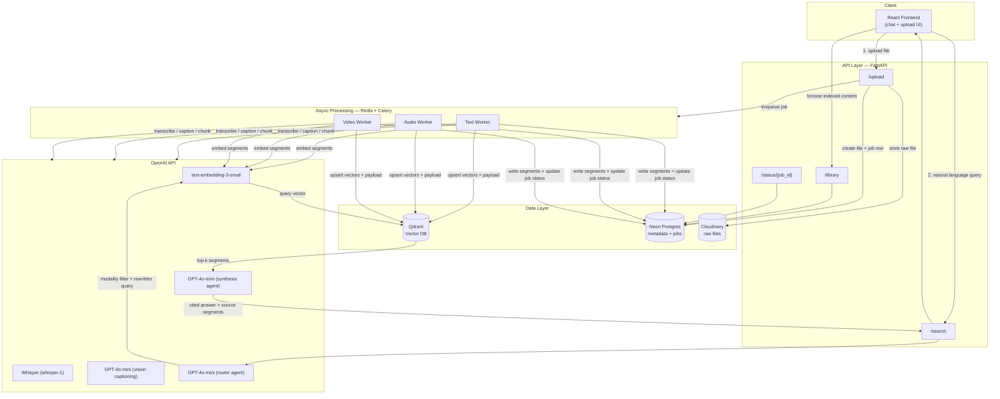
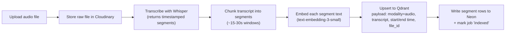
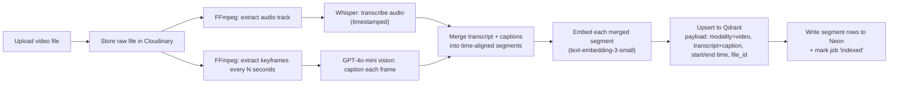
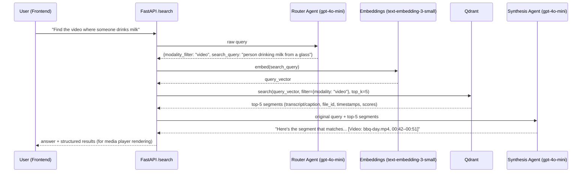

# Architecture — Scrutinize

Multi-modal AI embedding & retrieval system.

## 1. Overview

**Scrutinize** is a unified ingestion + retrieval system that lets a user drop in **text, audio, and video**, and later ask **one natural-language question** that can match content from *any* of those modalities. The system is split into four layers:

1. **Client** — React chat-style UI (upload + search in one surface)
2. **API layer** — FastAPI, the single entry point for the frontend
3. **Processing layer** — async workers that turn raw files into embeddings + metadata
4. **Data layer** — a native vector database (Qdrant) for similarity search + **Neon Postgres** for metadata/jobs + **Cloudinary** for raw files

A thin **agent layer** sits on top of the data layer at query time to turn "raw nearest-neighbor hits" into a useful, cited answer.

---

## 2. High-Level Architecture



---

## 3. Component Breakdown

| Layer | Component | Responsibility |
|---|---|---|
| Client | React + Tailwind SPA | Upload UI, chat-style search box, results renderer (text snippet / audio player / video player with seek), library/index browser |
| API | FastAPI app | Auth, validation (Pydantic), file intake → Storage, job creation, search endpoint, library endpoint |
| Queue | Redis + Celery | Decouples slow media processing (video especially) from the request/response cycle |
| Processing | Text / Audio / Video workers | Modality-specific pipelines that produce **segments** (text + timestamps + metadata) ready for embedding |
| AI Services | OpenAI API | Embeddings, transcription (Whisper), vision captioning (GPT-4o-mini), and the two retrieval agents |
| Vector DB | Qdrant | Stores embeddings + payload, runs the nearest-neighbor search |
| Relational DB | Neon Postgres | Source of truth for files, jobs, segments, users |
| Object Storage | Cloudinary | Raw uploaded files (HTTPS URLs for playback / seek) |
| Agents | Router + Synthesis (GPT-4o-mini) | Turn a raw query into a filtered vector search, and turn raw hits into a cited natural-language answer |

---

## 4. Tech Stack & Rationale

### 4.1 Backend — **FastAPI (Python)**

- The entire ML/media stack (Whisper, FFmpeg bindings, OpenAI SDK, embedding libs) is Python-first — staying in one language avoids a Python-microservice + Node-gateway split for a solo/small-team POC.
- Native `async def` support matches the I/O-heavy nature of this app (waiting on OpenAI, Qdrant, Storage).
- Pydantic gives free request/response validation and auto-generated OpenAPI docs — useful when the React frontend and backend are built somewhat independently.
- This is the de-facto standard for AI-product backends in 2024-2026 (most reference RAG architectures, LangChain/LlamaIndex templates, etc. ship FastAPI examples first).

### 4.2 Vector Database — **Qdrant** (native vector DB)

You said you're open to exploring a *real* native vector database rather than a Postgres extension — Qdrant is the best fit here:

- **Open-source, self-hostable via a single Docker container** — perfect for a POC, with a managed **Qdrant Cloud** path if it needs to go further.
- **Named vectors per point** — a single point (= one segment) can later carry *both* a text-embedding vector and a CLIP visual-embedding vector without a schema migration. This directly supports the "Phase 2" embedding upgrade described in §6.
- **Rich payload filtering combined with vector search** — e.g. "search only `modality == video`" or "only this `file_id`" in the same query, which is exactly what the brief's example queries need (Text→Video, Text→Audio, etc.).
- Mature Python client, good docs, fast (Rust core), and is genuinely used in production (not just demo-ware) — so this satisfies "industry standard" without the operational weight of Milvus or the GraphQL learning curve of Weaviate.

**Alternatives considered:**
- *Pinecone* — fully managed, great DX, but it's a black box (less to "explore"), and adds a paid dependency for a POC.
- *Weaviate* — equally capable, built-in multimodal modules, but heavier to self-host and its GraphQL-first API is more ceremony than this project needs.
- *ChromaDB* — great for a 1-day prototype, but it's not what most teams consider "production" — weaker filtering/scaling story than Qdrant.
- *pgvector* — would let us drop Qdrant entirely and keep everything in Postgres. Rejected because the brief specifically asks for a dedicated vector DB, and pgvector's ANN performance/feature set (no native multi-vector points, weaker payload-filter + vector hybrid story) is behind purpose-built engines at this scale.

### 4.3 Relational DB — **Neon** + Object Storage — **Cloudinary**

- **Neon** (serverless Postgres) hosts *structured* state: files, processing jobs, segments, users. Branching, connection pooling, and scale-to-zero suit a POC that still needs real SQL (`JOIN`, pagination, transactions) without running Postgres in Docker.
- **Cloudinary** holds the *original* audio/video/text files with CDN-backed HTTPS URLs, because search results need a playable link with timestamps — the vector DB only stores embeddings + small payload, not binaries.
- Splitting relational (Neon) from media storage (Cloudinary) keeps each service focused and lets Cloudinary handle transcoding/delivery optimizations for audio and video later if needed.
- **Why not just Qdrant for everything?** Qdrant payload is JSON and not meant for relational queries/joins/transactions — e.g. "show me all jobs that failed in the last hour" is a Neon SQL query, not a vector query.

**Neon connection notes:**
- Use the **pooled** connection string (`-pooler` host) for the API and Celery workers.
- Append `sslmode=require` (handled automatically when the host contains `neon.tech`).
- Set `DATABASE_URL` in `.env`; it is not bundled in Docker Compose.

### 4.4 LLM / AI — **OpenAI API**, multi-agent retrieval

| Use case | Model | Why |
|---|---|---|
| Text embeddings (all modalities, after transcription/captioning) | `text-embedding-3-small` (1536-dim) | Cheap, fast, strong general semantic quality; one consistent embedding space simplifies Qdrant schema |
| Audio transcription | Whisper (`whisper-1`) | Industry-standard ASR, handles noisy real-world audio, returns word/segment timestamps |
| Video frame captioning | `gpt-4o-mini` (vision) | Cost-effective vision model, good at descriptive captions ("a person drinking milk from a glass") which is exactly what Text→Video search needs |
| Query routing | `gpt-4o-mini` + function calling | Cheap classification/rewrite step, doesn't need a frontier model |
| Answer synthesis | `gpt-4o-mini` (upgrade to `gpt-4o` if quality demands it) | Turns top-k segments into a cited, readable answer |

**Is multi-agent worth it here? Yes — as a 2-agent "Agentic RAG" pattern, not a sprawling agent swarm:**

1. **Router Agent** — looks at the raw query and decides: *is this query about a specific modality?* (e.g. "find the **video** where...", "find the **song**...") and *does the query need rewriting* for better recall (e.g. expanding "XYZ's song" → richer search terms). Outputs a structured filter + a (possibly rewritten) query string via function calling.
2. **Synthesis Agent** — takes the top-k Qdrant hits (transcripts/captions + metadata) and the original question, and produces a short natural-language answer that **cites which file/segment/timestamp** the answer came from.

This two-agent split is the same shape used by most production RAG systems (query understanding → retrieval → answer generation), and it's the right amount of "multi-agent" for this scope — anything more (planner agents, tool-using sub-agents, etc.) would be scope creep relative to the brief.

### 4.5 Media Processing

| Tool | Used for |
|---|---|
| **FFmpeg** | Extract audio track from video; extract keyframes at fixed intervals (e.g. every 2–5s, or scene-change based) |
| **Whisper API** | Transcribe extracted audio (from both standalone audio files and video audio tracks) with timestamps |
| **GPT-4o-mini (vision)** | Caption extracted keyframes ("a person pouring milk into a glass at 00:14") |
| **tiktoken / LangChain text splitter** | Chunk long text documents and transcripts into embedding-friendly segments (~300–500 tokens, with overlap) |

### 4.6 Async Processing — **Redis + Celery**

- Video processing (frame extraction + multiple Whisper/GPT-4o-mini calls) can take well beyond an HTTP request's reasonable timeout.
- Celery + Redis is the standard Python pattern: the `/upload` endpoint returns immediately with a `job_id`, a worker processes the file in the background, and the frontend polls `/status/{job_id}` (or subscribes via a lightweight websocket/SSE if you want it to feel snappier).
- For a strict "weekend POC" you *could* substitute FastAPI `BackgroundTasks` — call this out in the report as a deliberate scope tradeoff if time is tight, with Celery as the documented "how this would run in production" path.

---

## 5. Data Flows

### 5.1 Ingestion — Text


### 5.2 Ingestion — Audio



### 5.3 Ingestion — Video



### 5.4 Query / Search



---

## 6. Embedding Strategy (and how it scales up)

### Phase A — MVP: **single embedding space (caption-then-embed)**

Every piece of content — raw text, audio transcripts, *and* video (transcript + frame captions) — is converted to **text** and embedded with `text-embedding-3-small`. This is a deliberate simplification:

- One Qdrant collection, one vector field, one dimensionality (1536) — minimal schema complexity.
- Cross-modal search "just works" because everything lives in the same vector space — the brief's Text→Video and Text→Audio examples are answered by this alone, *if* captioning/transcription is descriptive enough (GPT-4o-mini is generally strong at this).
- This is the same pattern used by many production multimodal search systems (e.g., caption-and-embed for image/video search) — it's pragmatic, not a shortcut that looks bad in a report.

**Known limitation to document in the report:** purely *acoustic* similarity (e.g. "find a song that sounds like X" based on melody, not lyrics/metadata) isn't captured by transcription alone.

### Phase B — Enhancement: **native multi-vector points**

Once Phase A works end-to-end, add a **second named vector** per Qdrant point:

- `visual_vector` — CLIP image embedding of representative video keyframes, for true visual similarity search (independent of caption quality).
- (Optional) `audio_vector` — CLAP (Contrastive Language-Audio Pretraining) embedding for content-based audio similarity, addressing the "song that sounds like X" gap.

Qdrant's named-vector support means this is an **additive** schema change — no migration of existing `text_vector` data, and the search API can query either or both spaces and merge results. This is the "Phase 2" story for the project report's "future work" section, demonstrating awareness of the gap without over-scoping the MVP.

---

## 7. Vector DB Schema (Qdrant)

**Collection:** `segments`

| Field | Type | Notes |
|---|---|---|
| `id` (point id) | UUID | matches `segments.id` in Neon |
| vector: `text_vector` | float[1536] | `text-embedding-3-small`, cosine distance |
| *(Phase B)* vector: `visual_vector` | float[512] | CLIP ViT-B/32 image embedding |
| payload.`file_id` | UUID | FK to Neon `files.id` |
| payload.`modality` | enum: `text` \| `audio` \| `video` | used for filtered search |
| payload.`content` | string | the transcript / caption / text chunk that was embedded |
| payload.`start_time` | float \| null | seconds, null for plain text |
| payload.`end_time` | float \| null | seconds, null for plain text |
| payload.`source_path` | string | Storage path/URL for playback |
| payload.`title` | string | original filename / display title |
| payload.`created_at` | datetime | for recency sorting/filtering |

---

## 8. Relational Schema (Neon Postgres)

```sql
-- Uploaded source files
create table files (
  id uuid primary key default gen_random_uuid(),
  filename text not null,
  modality text not null check (modality in ('text','audio','video')),
  storage_path text not null,
  duration_seconds numeric,           -- null for text
  size_bytes bigint,
  status text not null default 'uploaded'
    check (status in ('uploaded','processing','indexed','failed')),
  uploaded_at timestamptz not null default now()
);

-- Background processing jobs (one or more per file, per stage)
create table processing_jobs (
  id uuid primary key default gen_random_uuid(),
  file_id uuid not null references files(id) on delete cascade,
  stage text not null,                -- e.g. 'transcription','captioning','embedding'
  status text not null default 'pending'
    check (status in ('pending','running','done','failed')),
  error_message text,
  created_at timestamptz not null default now(),
  updated_at timestamptz not null default now()
);

-- Mirrors the Qdrant payload for relational querying/joins
create table segments (
  id uuid primary key default gen_random_uuid(),   -- == Qdrant point id
  file_id uuid not null references files(id) on delete cascade,
  modality text not null,
  content text not null,
  start_time numeric,
  end_time numeric,
  created_at timestamptz not null default now()
);

create index on segments (file_id);
create index on processing_jobs (file_id, status);
```

---

## 9. Non-Functional Considerations

- **Security**: API keys (OpenAI, Qdrant, Neon, Cloudinary) stay server-side only; frontend never talks to OpenAI/Qdrant/Neon/Cloudinary directly. Add auth on `/upload` and `/search` if multi-user.
- **File limits**: enforce max upload size and allowed MIME types at the API layer before enqueueing work.
- **Cost control**: cache embeddings by content hash (don't re-embed identical chunks); batch Whisper/embedding calls where possible; keep `gpt-4o-mini` as default and only escalate to `gpt-4o` for captioning if quality testing shows it's needed.
- **Scalability path**: Celery workers scale horizontally; Qdrant can move from single-node Docker → Qdrant Cloud; Neon scales as managed Postgres with pooling.

---

## 10. Testing & CI/CD

Scrutinize uses **pytest** with marker-based test tiers. Ruff is used locally for formatting/linting but is **not** part of CI.

| Tier | Location | Scope | CI job |
|---|---|---|---|
| **Unit** | `tests/unit/` | Pure logic — chunking, embedding wrapper (mocked OpenAI), Qdrant client (mocked), agent prompts (mocked) | `unit-tests` |
| **Integration** | `tests/integration/` | Real Qdrant + Redis + Neon (`DATABASE_URL` secret); mocked OpenAI/Whisper where billing/rate limits apply | `integration-tests` |
| **System** | `tests/system/` | Full stack via `docker compose` — upload → worker → index → search end-to-end | `system-tests` |
| **Security** | `tests/security/` + static analysis | Auth boundary checks, path traversal on upload, secret-leak scans (`bandit`), dependency audit (`pip-audit`) | `security-tests` |

**GitHub Actions** (`.github/workflows/ci.yml`) runs all four tiers on every push/PR to `main`. Integration and system jobs start Redis + Qdrant locally and connect to Neon via the `DATABASE_URL` secret. Other secrets (`OPENAI_API_KEY`, `CLOUDINARY_*`) are injected for jobs that hit external APIs.

---

## 11. Local Dev / Deployment (Docker Compose sketch)

```yaml
services:
  backend:
    build: ./backend
    ports: ["8000:8000"]
    env_file: .env
    environment:
      - OPENAI_API_KEY=${OPENAI_API_KEY}
      - QDRANT_URL=http://qdrant:6333
      - REDIS_URL=redis://redis:6379/0
    depends_on: [qdrant, redis]

  worker:
    build: ./backend
    command: celery -A app.workers.celery_app worker --loglevel=info
    env_file: .env
    environment:
      - OPENAI_API_KEY=${OPENAI_API_KEY}
      - QDRANT_URL=http://qdrant:6333
      - REDIS_URL=redis://redis:6379/0
    depends_on: [redis, qdrant]

  redis:
    image: redis:7-alpine

  qdrant:
    image: qdrant/qdrant:latest
    ports: ["6333:6333"]
    volumes: ["qdrant_data:/qdrant/storage"]

volumes:
  qdrant_data:
```

Neon (Postgres) and Cloudinary (media storage) are hosted services — configure `DATABASE_URL` and `CLOUDINARY_*` in `.env`. Docker Compose runs Redis, Qdrant, backend, and worker; the React frontend runs locally via `npm run dev` in `frontend/` for Vite HMR. See [Cloudinary runbook](../runbooks/cloudinary-setup.md).