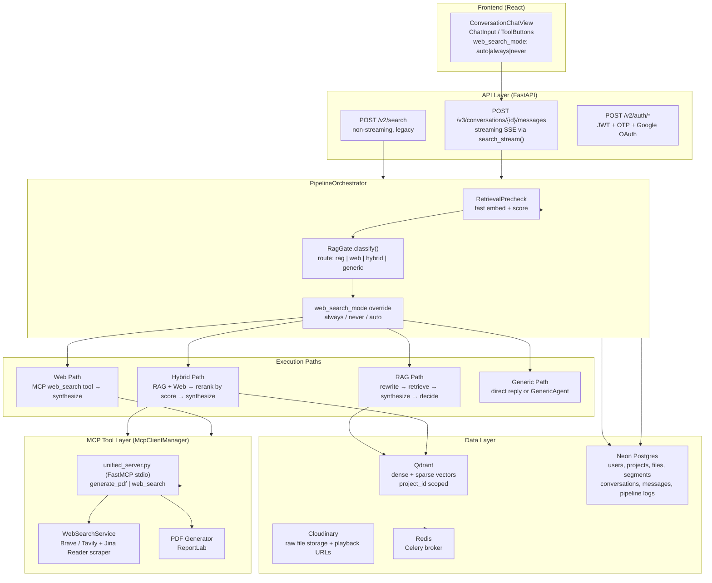
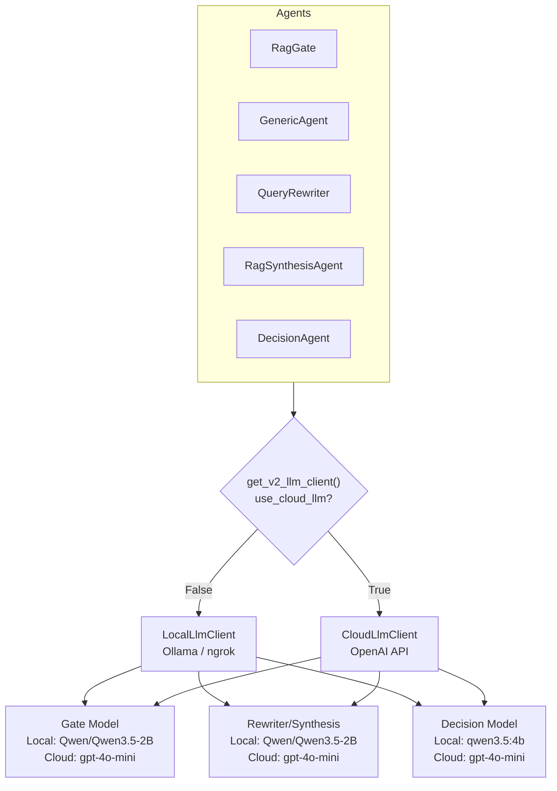
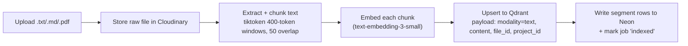
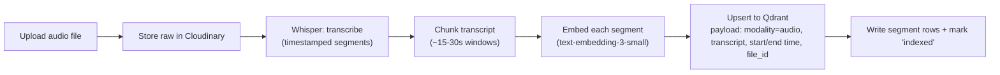
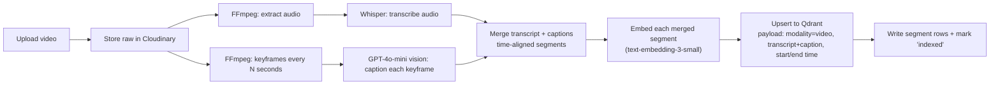
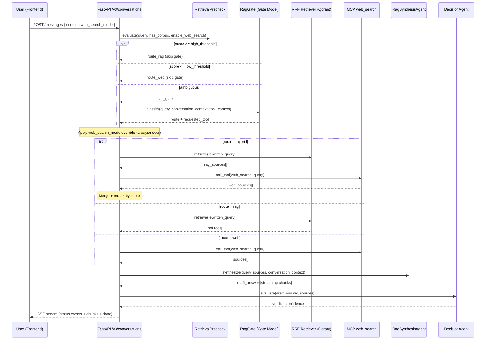

# Architecture — Scrutinize

Multi-modal AI ingestion, retrieval, and agentic search system with hybrid RAG + Live Web Search.

---

## 1. Overview

**Scrutinize** is a unified ingestion and retrieval platform that lets users upload **text, audio, and video**, then ask natural-language questions answered by either local document retrieval, live web search, or a combination of both. The system is split into four primary layers:

1. **Client** — React chat-style UI (conversation, upload, library) with persistent project workspaces.
2. **API Layer** — FastAPI, the single entry point for the frontend. Hosts three API generations (`/v1–v3`) plus dedicated auth endpoints.
3. **Processing Layer** — Async Celery workers that process raw files (extract transcriptions/captions) and generate embeddings.
4. **Data Layer** — **Qdrant** for vector similarity search, **Neon Postgres** for relational data and pipeline observability, and **Cloudinary** for raw binary file storage.

A local/cloud **Agentic Pipeline (V2)** orchestrates all query-time logic: query routing, retrieval precheck, hybrid retrieval, web search via MCP tools, synthesis, and quality evaluation. A **V3 Conversation API** sits on top, adding persistent per-user chat history, project-scoped workspaces, and streaming responses.

---

## 2. High-Level Architecture

At query time, requests flow through an **entry point → orchestrator → tools** hub-and-spoke model:


```mermaid
flowchart TD
    subgraph Client["Frontend (React)"]
        UI["ConversationChatView\nChatInput / ToolButtons\nweb_search_mode: auto|always|never"]
    end

    subgraph API["API Layer (FastAPI)"]
        V3["POST /v3/conversations/{id}/messages\nstreaming SSE via search_stream()"]
        V2["POST /v2/search\nnon-streaming, legacy"]
        AUTH["POST /v2/auth/*\nJWT + OTP + Google OAuth"]
    end

    subgraph Orchestrator["PipelineOrchestrator"]
        PRECHECK["RetrievalPrecheck\nfast embed + score"]
        GATE["RagGate.classify()\nroute: rag | web | hybrid | generic"]
        WMODE["web_search_mode override\nalways / never / auto"]
    end

    subgraph Paths["Execution Paths"]
        RAG["RAG Path\nrewrite → retrieve → synthesize → decide"]
        WEB["Web Path\nMCP web_search tool → synthesize"]
        HYBRID["Hybrid Path\nRAG + Web → rerank by score → synthesize"]
        GEN["Generic Path\ndirect reply or GenericAgent"]
    end

    subgraph MCP["MCP Tool Layer (McpClientManager)"]
        UNIFIED["unified_server.py (FastMCP stdio)\ngenerate_pdf | web_search"]
        WSSVC["WebSearchService\nBrave / Tavily + Jina Reader scraper"]
        PDFSVC["PDF Generator\nReportLab"]
    end

    subgraph Data["Data Layer"]
        QDRANT["Qdrant\ndense + sparse vectors\nproject_id scoped"]
        NEON["Neon Postgres\nusers, projects, files, segments\nconversations, messages, pipeline logs"]
        CDN["Cloudinary\nraw file storage + playback URLs"]
        REDIS["Redis\nCelery broker"]
    end

    UI --> V3
    V3 --> Orchestrator
    V2 --> Orchestrator
    Orchestrator --> PRECHECK
    PRECHECK --> GATE
    GATE --> WMODE
    WMODE --> RAG
    WMODE --> WEB
    WMODE --> HYBRID
    WMODE --> GEN
    WEB --> MCP
    HYBRID --> MCP
    HYBRID --> QDRANT
    RAG --> QDRANT
    MCP --> UNIFIED
    UNIFIED --> WSSVC
    UNIFIED --> PDFSVC
    Orchestrator --> NEON
    Orchestrator --> NEON
    Data --> REDIS
```

---

## 3. Query Routing — The Four Paths

### 3.1 Retrieval Precheck (Fast Path)

Before the Gate LLM is called, **`RetrievalPrecheck`** embeds the query and retrieves top-3 chunks from Qdrant. This short-circuits the full LLM gate call for unambiguous cases:

| Precheck Condition | Action |
|---|---|
| Client-requested tool is `generate_pdf` + corpus exists | Skip gate → route `rag` directly |
| Client-requested tool (other) | Always call gate |
| No corpus indexed for project | Route `web` if web search enabled, else `generic` |
| Top retrieval score ≥ `precheck_high_score` (default `0.025`) | Skip gate → route `rag` directly (reuse retrieved chunks) |
| Top retrieval score ≤ `precheck_low_score` (default `0.012`) | Skip gate → route `web` (or `generic` if web disabled) |
| Score is ambiguous (between thresholds) | Call Gate LLM to decide |

### 3.2 Gate LLM Routing

When the precheck calls the gate, **`RagGate.classify()`** receives:
- The current query and rolling conversation context (up to last 10 exchanges)
- Available MCP tools injected into the system prompt
- The `client_requested_tool` from the frontend (if any)

It returns one of four routes: `rag`, `web`, `hybrid`, `generic`.

### 3.3 Web Search Mode Override

The user can override routing from the frontend `ChatInput` using a three-state toggle:

| Mode | Behavior |
|---|---|
| `auto` | Gate + precheck decide routing normally |
| `always` | RAG → hybrid; generic → web; other routes unchanged |
| `never` | web/hybrid → rag; other routes unchanged |

This `web_search_mode` field travels from `ChatInput` → `MessageCreate` schema → `/v3/conversations/{id}/messages` → `PipelineOrchestrator.search_stream()`.

### 3.4 Route Execution

| Route | What happens |
|---|---|
| `rag` | Query rewrite → hybrid RRF retrieval from Qdrant → RAG synthesis → decision evaluation |
| `web` | MCP `web_search` tool call → scrape URLs → synthesis using web sources |
| `hybrid` | Both RAG retrieval and web search run → results merged as `SearchSource` objects → reranked by `score` → synthesis using combined context |
| `generic` | Gate direct reply (cached in `GateResult.reply`) or `GenericAgent.reply()` for conversational turns |

---

## 4. Component Breakdown

| Module | Role | LLM / External |
|---|---|---|
| `pipeline_orchestrator.py` | Central hub: wires precheck → gate → generic/decision or RAG/web/hybrid loop; applies web_search_mode override; logs runs | — |
| `retrieval_precheck.py` | Fast embed + retrieve to bypass the gate LLM for high/low-confidence cases | EmbeddingService + Qdrant |
| `conversation_memory.py` | Rolling snapshot of last N chat exchanges (UTC timestamps); not an LLM call | — |
| `conversation_format.py` | Greeting/chitchat detection (`is_standalone_message`) and context formatting | — |
| `rag_gate.py` | Classifies queries into `rag | web | hybrid | generic`; optionally returns a cached reply | Gate Model |
| `query_rewriter.py` | Keyword-focused query rewrite (RAG path only); incorporates retry feedback | Rewriter Model |
| `generic_agent.py` | Fallback conversational reply when gate routes generic without a pre-built reply | Gate Model |
| `rrf_retriever.py` | Dense + keyword retrieval orchestration → fuse_rrf_hits() → `SearchSource` list | EmbeddingService + Qdrant |
| `retrieval_utils.py` | RRF fusion, `SearchSource` mapping, retrieval stats | — |
| `keyword_search_utils.py` | NFKC normalization, compound collapsing, sparse index text building | fastembed BM25 |
| `vector_store.py` | Qdrant upsert / `search_hybrid()` with `project_id` filter | Qdrant |
| `embedding_service.py` | Dense embeddings for ingest + query | OpenAI |
| `rag_synthesis_agent.py` | Grounded cited answer from top-k chunks or combined sources | Rewriter Model |
| `decision_agent.py` | Quality-scores drafts; triggers retry feedback or generic→RAG escalation | Decision Model |
| `pipeline_logger.py` | `pipeline_runs` + `pipeline_steps` in Neon Postgres for full observability | Neon Postgres |
| `mcp_manager.py` | `McpClientManager` — spawns `unified_server.py` via stdio JSON-RPC; graceful local fallback | FastMCP SDK / stdio |
| `mcp_servers/unified_server.py` | FastMCP server exposing `generate_pdf` (ReportLab) and `web_search` tools | FastMCP |
| `web_search.py` | `WebSearchService` — queries Brave/Tavily API, scrapes full content via Jina Reader or direct HTTP | Brave / Tavily / Jina |
| `json_utils.py` | Robust JSON extraction from raw LLM responses (handles code fences) | — |
| `llm_clients/base.py` | `BaseLlmClient` abstract class and `LlmResponse` type | — |
| `llm_clients/local.py` | OpenAI-compatible HTTP client for local Ollama via ngrok | Ollama |
| `llm_clients/cloud.py` | OpenAI Chat Completions client | OpenAI |
| `auth_service.py` | Email/password signup + OTP verification + Google OAuth login | Resend email |
| `conversation_service.py` | CRUD for `ChatConversation` and `ChatMessage`; scoped to `general` (web-only) vs. `project` (RAG + web) | Neon Postgres |
| `project_service.py` | Project creation, admin/client keys, per-project model overrides | Neon Postgres |
| `job_orchestrator.py` | Enqueues Celery ingestion tasks (text/audio/video), polls job status | Redis + Celery |

---

## 5. MCP Tool Layer

Tools are exposed via a **unified FastMCP server** (`unified_server.py`) that runs as a subprocess, communicating via **JSON-RPC over stdio**. The `McpClientManager` manages the process lifecycle:

```
PipelineOrchestrator
    │
    ├── McpClientManager.list_tools()   →  JSON-RPC: tools/list
    │       ↕ stdio
    │   unified_server.py (FastMCP)
    │       ├── generate_pdf(title, content) → ReportLab → .pdf file path
    │       └── web_search(query, limit)     → WebSearchService → JSON results
    │
    └── McpClientManager.call_tool(name, args)  →  JSON-RPC: tools/call
```

**Fallback chain:** If the `mcp` Python package is unavailable, `McpClientManager` falls back to calling `generate_pdf` and `web_search` directly as local Python functions.

### Available MCP Tools

| Tool | Trigger | Output |
|---|---|---|
| `generate_pdf` | Gate sets `requested_tool = "generate_pdf"` | Absolute path to a compiled PDF file |
| `web_search` | Route is `web` or `hybrid` | JSON list of `{title, url, snippet, content}` dicts |

Web search results are converted to `SearchSource` objects (same schema as RAG results) and merged with any RAG sources. The combined list is **reranked by `score`** descending before synthesis, ensuring the most relevant sources appear first regardless of origin.

---

## 6. Conversation & Auth System (V3)

### 6.1 Authentication

JWT-based auth (`/v2/auth/`). Signup requires email OTP verification via **Resend**. Google OAuth provides passwordless login. All protected endpoints require `Authorization: Bearer <token>`.

### 6.2 Persistent Conversations (V3)

`/v3/conversations` adds persistent chat backed by **two new tables**:

| Model | Table | Key fields |
|---|---|---|
| `ChatConversation` | `chat_conversations` | `id`, `owner_user_id`, `project_id`, `scope` (general/project), `retrieval_policy` (web_only/project_rag), `title` |
| `ChatMessage` | `chat_messages` | `id`, `conversation_id`, `role`, `content`, `status`, `citations` (JSON), `pipeline_run_id` |

**Scopes:**
- `general` — No project, `retrieval_policy = web_only`. These conversations always use web search; project RAG paths are excluded.
- `project` — Linked to a project, `retrieval_policy = project_rag`. Runs the full pipeline (precheck + gate + RAG + web).

### 6.3 Streaming (SSE)

`POST /v3/conversations/{id}/messages` returns a **Server-Sent Events** stream. The pipeline emits typed status events as it works:

| Event | When emitted |
|---|---|
| `status { step: "precheck" }` | Before retrieval precheck |
| `status { step: "gate", model, route }` | After gate classification |
| `status { step: "rewrite" }` | Before query rewriting |
| `status { step: "retrieval" }` | Before Qdrant search |
| `status { step: "web_search" }` | Before MCP web_search call |
| `status { step: "synthesis", model }` | Before synthesis |
| `status { step: "evaluation" }` | Before decision agent |
| `chunk { text }` | Streaming answer tokens |
| `done { ... }` | Final answer with sources and citations |

---

## 7. LLM Client Routing

All pipeline LLM calls go through a `get_v2_llm_client()` factory that reads `USE_CLOUD_LLM`:


```mermaid
flowchart TD
    subgraph Agents["Agents"]
        GATE_A["RagGate"]
        GEN_A["GenericAgent"]
        RW_A["QueryRewriter"]
        SYN_A["RagSynthesisAgent"]
        DEC_A["DecisionAgent"]
    end

    CLIENT{"get_v2_llm_client()\nuse_cloud_llm?"}

    LOCAL["LocalLlmClient\nOllama / ngrok"]
    CLOUD["CloudLlmClient\nOpenAI API"]

    M_GATE["Gate Model\nLocal: Qwen/Qwen3.5-2B\nCloud: gpt-4o-mini"]
    M_REWRITE["Rewriter/Synthesis\nLocal: Qwen/Qwen3.5-2B\nCloud: gpt-4o-mini"]
    M_DECISION["Decision Model\nLocal: qwen3.5:4b\nCloud: gpt-4o-mini"]

    Agents --> CLIENT
    CLIENT -->|"False"| LOCAL
    CLIENT -->|"True"| CLOUD
    LOCAL --> M_GATE
    LOCAL --> M_REWRITE
    LOCAL --> M_DECISION
    CLOUD --> M_GATE
    CLOUD --> M_REWRITE
    CLOUD --> M_DECISION
```

Embeddings (dense) and ingestion media APIs (Whisper, GPT-4o-mini vision) always use **OpenAI** regardless of `USE_CLOUD_LLM`.

Per-project model overrides are stored in `projects.model_overrides` (JSON) and applied by the orchestrator for gate, rewriter, and decision models.

---

## 8. Data Flows

### 8.1 Ingestion — Text

```mermaid
flowchart LR
    A[Upload .txt/.md/.pdf] --> B[Store raw file in Cloudinary]
    B --> C["Extract + chunk text\ntiktoken 400-token windows, 50 overlap"]
    C --> D["Embed each chunk\n(text-embedding-3-small)"]
    D --> E["Upsert to Qdrant\npayload: modality=text, content, file_id, project_id"]
    E --> F["Write segment rows to Neon\n+ mark job 'indexed'"]
```

### 8.2 Ingestion — Audio

```mermaid
flowchart LR
    A[Upload audio file] --> B[Store raw in Cloudinary]
    B --> C["Whisper: transcribe\n(timestamped segments)"]
    C --> D["Chunk transcript\n(~15-30s windows)"]
    D --> E["Embed each segment\n(text-embedding-3-small)"]
    E --> F["Upsert to Qdrant\npayload: modality=audio, transcript, start/end time, file_id"]
    F --> G["Write segment rows + mark 'indexed'"]
```

### 8.3 Ingestion — Video

```mermaid
flowchart LR
    A[Upload video] --> B[Store raw in Cloudinary]
    B --> C["FFmpeg: extract audio"]
    B --> D["FFmpeg: keyframes every N seconds"]
    C --> E["Whisper: transcribe audio"]
    D --> F["GPT-4o-mini vision: caption each keyframe"]
    E --> G["Merge transcript + captions\ntime-aligned segments"]
    F --> G
    G --> H["Embed each merged segment\n(text-embedding-3-small)"]
    H --> I["Upsert to Qdrant\npayload: modality=video, transcript+caption, start/end time"]
    I --> J["Write segment rows + mark 'indexed'"]
```

### 8.4 Query / Search — Hybrid Pipeline (V2/V3)

```mermaid
sequenceDiagram
    participant U as User (Frontend)
    participant API as FastAPI /v3/conversations
    participant PRE as RetrievalPrecheck
    participant G as RagGate (Gate Model)
    participant RAG as RRF Retriever (Qdrant)
    participant WEB as MCP web_search
    participant S as RagSynthesisAgent
    participant D as DecisionAgent

    U->>API: POST /messages { content, web_search_mode }
    API->>PRE: evaluate(query, has_corpus, enable_web_search)
    alt score >= high_threshold
        PRE-->>API: route_rag (skip gate)
    else score <= low_threshold
        PRE-->>API: route_web (skip gate)
    else ambiguous
        PRE-->>API: call_gate
        API->>G: classify(query, conversation_context, tool_context)
        G-->>API: route + requested_tool
    end
    Note over API: Apply web_search_mode override (always/never)
    
    alt route = hybrid
        API->>RAG: retrieve(rewritten_query)
        RAG-->>API: rag_sources[]
        API->>WEB: call_tool(web_search, query)
        WEB-->>API: web_sources[]
        Note over API: Merge + rerank by score
    else route = rag
        API->>RAG: retrieve(rewritten_query)
        RAG-->>API: sources[]
    else route = web
        API->>WEB: call_tool(web_search, query)
        WEB-->>API: sources[]
    end

    API->>S: synthesize(query, sources, conversation_context)
    S-->>API: draft_answer [streaming chunks]
    API->>D: evaluate(draft_answer, sources)
    D-->>API: verdict, confidence

    API-->>U: SSE stream (status events + chunks + done)
```

---

## 9. Embedding & Search Strategy

### Phase A — MVP: Hybrid Search (Dense + Sparse/BM25)
Every piece of content is indexed with two vectors in the same Qdrant collection:
1. **Dense Vector** (`text_vector`): `text-embedding-3-small` (1536 dimensions) for semantic similarity.
2. **Sparse Vector** (`sparse_vector`): `fastembed` BM25 for exact lexical/keyword matching.

Retrieval runs both prefetches concurrently via Qdrant's `Prefetch` API, fused with **client-side Reciprocal Rank Fusion (RRF)** (`k = V2_RRF_K`, default 60).

### Keyword Normalization (`keyword_search_utils.py`)
Applied at **both ingest and query time** for high recall across spelling variations:
- **NFKC normalization** and lowercasing
- **Punctuation→space** conversion (hyphens, underscores)
- **Compound collapsing**: `open ai` ↔ `openai`
- **Filename stem extraction**: strips directory paths, extensions, URL encoding
- **Index enrichment**: `content + title + filename stem variants` passed to BM25 embedder

### Phase B — Future: Native Multi-Vector Points
Add a third named vector per Qdrant point:
- `visual_vector` — CLIP embedding of representative video keyframes
- `audio_vector` — CLAP embedding for audio similarity

Qdrant's named-vector architecture allows this as an **additive** schema change.

---

## 10. Vector DB Schema (Qdrant)

**Collection:** `segments`

| Field | Type | Notes |
|---|---|---|
| `id` (point id) | UUID | Matches `segments.id` in Neon Postgres |
| vector: `text_vector` | float[1536] | `text-embedding-3-small`, cosine distance |
| vector: `sparse_vector` | struct | `fastembed` BM25 (indices & values) for lexical search |
| payload.`project_id` | UUID | Scopes retrieval to a specific project |
| payload.`file_id` | UUID | FK to Neon `files.id` |
| payload.`modality` | enum: `text` \| `audio` \| `video` | Used for modality filter |
| payload.`content` | string | Transcript / caption / text chunk embedded |
| payload.`start_time` | float \| null | Seconds; null for plain text |
| payload.`end_time` | float \| null | Seconds; null for plain text |
| payload.`source_path` | string | CDN URL for playback |
| payload.`title` | string | Original filename / display title |
| payload.`created_at` | datetime | For recency filtering |

---

## 11. Relational Schema (Neon Postgres)

```sql
-- Auth
create table users (
  id uuid primary key default gen_random_uuid(),
  email text unique not null,
  password_hash text,
  is_verified boolean not null default false,
  verification_otp text,
  otp_expires_at timestamptz,
  created_at timestamptz not null default now()
);

-- Projects and membership
create table projects (
  id uuid primary key default gen_random_uuid(),
  ...
);

create table project_members (
  user_id uuid references users(id) on delete cascade,
  project_id uuid references projects(id) on delete cascade,
  role text not null default 'member',
  joined_at timestamptz not null default now(),
  primary key (user_id, project_id)
);

-- V3 persistent conversations
create table chat_conversations (
  id uuid primary key default gen_random_uuid(),
  owner_user_id uuid not null references users(id) on delete cascade,
  project_id uuid references projects(id) on delete cascade,
  scope text not null,           -- 'general' | 'project'
  retrieval_policy text not null,-- 'web_only' | 'project_rag'
  title text not null default 'New chat',
  created_at timestamptz not null default now(),
  updated_at timestamptz not null default now(),
  archived_at timestamptz
);

create table chat_messages (
  id uuid primary key default gen_random_uuid(),
  conversation_id uuid not null references chat_conversations(id) on delete cascade,
  role text not null,            -- 'user' | 'assistant'
  content text not null,
  status text not null default 'completed', -- 'pending' | 'streaming' | 'completed' | 'failed' | 'cancelled'
  client_message_id uuid,
  citations jsonb,               -- [{file_id, title, url, score, ...}]
  pipeline_run_id uuid references pipeline_runs(id),
  error_code text,
  created_at timestamptz not null default now(),
  completed_at timestamptz
);

-- File ingestion
create table files (
  id uuid primary key default gen_random_uuid(),
  filename text not null,
  modality text not null check (modality in ('text','audio','video')),
  storage_path text not null,
  duration_seconds numeric,
  size_bytes bigint,
  status text not null default 'uploaded'
    check (status in ('uploaded','processing','indexed','failed')),
  uploaded_at timestamptz not null default now()
);

create table processing_jobs (
  id uuid primary key default gen_random_uuid(),
  file_id uuid not null references files(id) on delete cascade,
  stage text not null,           -- 'transcription','captioning','embedding'
  status text not null default 'pending'
    check (status in ('pending','running','done','failed')),
  error_message text,
  created_at timestamptz not null default now(),
  updated_at timestamptz not null default now()
);

create table segments (
  id uuid primary key default gen_random_uuid(),   -- == Qdrant point id
  file_id uuid not null references files(id) on delete cascade,
  modality text not null,
  content text not null,
  start_time numeric,
  end_time numeric,
  created_at timestamptz not null default now()
);

-- Pipeline observability
create table pipeline_runs (id uuid primary key, ...);
create table pipeline_steps (run_id uuid references pipeline_runs(id), ...);

create index on segments (file_id);
create index on processing_jobs (file_id, status);
create index on chat_conversations (owner_user_id, updated_at desc);
create index on chat_messages (conversation_id, created_at);
```

---

## 12. Tech Stack & Rationale

### 12.1 FastAPI (Backend)
**How:** Hosts all API versions (`/v2`, `/v3`) with async endpoints, dependency injection, and Pydantic validation.  
**Why:** Native async I/O for non-blocking LLM and DB calls. Automatic OpenAPI docs. SSE streaming via `StreamingResponse`.

### 12.2 Qdrant (Vector DB)
**How:** Stores 1536-d dense vectors + BM25 sparse vectors per segment. Filters by `project_id` and `modality`.  
**Why:** Purpose-built ANN search with RRF fusion, named-vector architecture, and payload filtering all in one service.

### 12.3 Neon Postgres (Relational DB)
**How:** Stores users, projects, files, jobs, segments, conversations, messages, and pipeline run logs.  
**Why:** Serverless Postgres with full SQL semantics. Enables rich joins between pipeline observability tables and chat history.

### 12.4 Cloudinary (Object Storage)
**How:** Stores raw media files and returns CDN-backed HTTPS URLs with byte-range seek support.  
**Why:** Decouples binary assets from the vector store. Playback in the UI requires seek support that Cloudinary provides out of the box.

### 12.5 Redis + Celery (Task Queue)
**How:** Celery workers process slow ingestion tasks (Whisper transcription, vision captioning, embedding) asynchronously.  
**Why:** Media processing is CPU and time-intensive. Celery with Redis ensures reliability and allows horizontal scaling.

### 12.6 FastMCP (MCP Tool Server)
**How:** `unified_server.py` exposes `generate_pdf` and `web_search` as MCP tools via stdio JSON-RPC. `McpClientManager` spawns it as a subprocess and communicates via the `mcp` Python SDK.  
**Why:** Separates tool execution from the core pipeline. The stdio MCP protocol is language-agnostic and decoupled by design. Local Python fallbacks ensure the pipeline works even if the `mcp` package is absent.

### 12.7 Brave / Tavily + Jina Reader (Web Search)
**How:** `WebSearchService` queries Brave Search or Tavily API for search results, then scrapes full page content via Jina Reader (with a direct HTTP fallback). Results are returned as `SearchSource` objects.  
**Why:** Gives the pipeline access to real-time, live information unavailable in local project files. Jina Reader converts web pages to clean Markdown, dramatically improving synthesis quality.

### 12.8 Local LLMs via Ollama / Ngrok
**How:** `LocalLlmClient` sends OpenAI-compatible payloads to a locally hosted Ollama instance tunneled via ngrok.  
**Why:** Enables completely offline/private model hosting. Specialized model sizes (small for routing, medium for synthesis, larger for evaluation) balance quality and resource cost.

---

## 13. API Surface

| Method | Path | Auth | Purpose |
|---|---|---|---|
| `POST` | `/v2/auth/signup` | — | Register new user (sends OTP) |
| `POST` | `/v2/auth/verify` | — | Verify OTP, activate account |
| `POST` | `/v2/auth/login` | — | Email/password login → JWT |
| `POST` | `/v2/auth/google` | — | Google OAuth login → JWT |
| `GET` | `/v2/llm-health` | — | Probe gate LLM reachability |
| `POST` | `/v2/search` | Optional `X-Project-Key` | Non-streaming agentic search |
| `GET`/`POST` | `/v2/projects/…` | Admin key | Project management & model config |
| `POST` | `/v2/projects/files` | Admin key | Upload + enqueue ingestion |
| `POST` | `/v2/pdf/generate` | Optional key | Directly compile Markdown to PDF via MCP |
| `GET` | `/v2/pdf/download/{filename}` | — | Download compiled PDF |
| `POST` | `/v3/conversations` | JWT required | Create a new conversation (general or project) |
| `GET` | `/v3/conversations` | JWT required | List conversations for authenticated user |
| `GET` | `/v3/conversations/{id}` | JWT required | Get conversation details |
| `PATCH` | `/v3/conversations/{id}` | JWT required | Rename or archive a conversation |
| `GET` | `/v3/conversations/{id}/messages` | JWT required | List messages in a conversation |
| `POST` | `/v3/conversations/{id}/messages` | JWT required | Send message → SSE streaming response |
| `GET` | `/v3/conversations/{id}/sources` | JWT required | List indexed files available for this conversation |
| `POST` | `/v3/conversations/{id}/files` | JWT required | Upload a file directly into a conversation's project |

---

## 14. Configuration Reference

| Setting | Default | Purpose |
|---|---|---|
| `use_cloud_llm` | `false` | Route all LLM calls to OpenAI instead of local Ollama |
| `v2_max_pipeline_attempts` | `2` | RAG retry loop cap |
| `v2_confidence_threshold` | `0.7` | Decision agent exit threshold |
| `v2_rrf_top_k` | `5` | Fused segments returned from Qdrant |
| `v2_rrf_k` | `60` | RRF smoothing constant |
| `v2_conversation_window_size` | `10` | Chat exchanges kept in rolling memory |
| `v2_retrieval_precheck_high_score` | `0.025` | Above this → skip gate, route RAG |
| `v2_retrieval_precheck_low_score` | `0.012` | Below this → skip gate, route web/generic |
| `embedding_model` | `text-embedding-3-small` | Dense vectors (1536-d) |
| `qdrant_collection` | `segments` | Hybrid vector collection name |
| `enable_web_search` | `true` | Master switch for web search capability |
| `web_search_engine` | `brave` | `"brave"` or `"tavily"` |
| `brave_search_api_key` | `""` | Required for Brave Search |
| `tavily_api_key` | `""` | Required for Tavily Search |
| `jina_reader_token` | `""` | Optional: Jina Reader API token for better scraping |
| `mcp_pdf_server_enabled` | `true` | Enables the FastMCP tool subprocess |
| `jwt_secret_key` | _(must set)_ | JWT signing secret |
| `jwt_expiry_minutes` | `1440` | Token TTL (24 hours) |
| `otp_expiry_minutes` | `15` | Email verification OTP TTL |

---

## 15. Non-Functional Considerations

- **Security**: JWT tokens are server-signed. API keys stay server-side. File size validation enforced at API layer. OTP verification required for new accounts.
- **Streaming resilience**: SSE emits typed events so the frontend can track partial state even if a specific step fails. The `MessageStatus` enum (`pending → streaming → completed/failed`) is written to Postgres for recovery on reconnect.
- **Cost Control**: Cache embeddings by content hash. Retrieval precheck short-circuits the gate LLM for clear-cut queries, saving LLM tokens on every request with unambiguous corpus matches or empty corpora.
- **Observability**: `PipelineLogger` writes each gate, rewrite, retrieval, synthesis, and evaluation step to Neon Postgres with structured JSON payloads, enabling root-cause analysis of routing decisions and synthesis quality.

---

## 16. Testing & CI/CD

| Tier | Location | Scope | CI job |
|---|---|---|---|
| **Unit** | `tests/unit/` | Pure logic — chunking, LLM client parsing, memory formatting, keyword normalization, MCP manager fallback | `unit-tests` |
| **Integration** | `tests/integration/` | Real database, Redis, and Qdrant connections. Mocked LLMs for billing/network limits. | `integration-tests` |
| **System** | `tests/system/` | End-to-end: upload → Celery worker → Qdrant index → V2 search query | `system-tests` |

---

## 17. Deployment

### Docker Compose (local / staging)

```yaml
services:
  backend:
    build: ./backend
    ports: ["8000:8000"]
    env_file: .env
    environment:
      - QDRANT_URL=http://qdrant:6333
      - REDIS_URL=redis://redis:6379/0
    depends_on: [qdrant, redis]

  worker:
    build: ./backend
    command: celery -A app.workers.celery_app worker --loglevel=info
    env_file: .env
    environment:
      - QDRANT_URL=http://qdrant:6333
      - REDIS_URL=redis://redis:6379/0
    depends_on: [redis, qdrant]

  redis:
    image: redis:7-alpine

  qdrant:
    image: qdrant/qdrant:latest
    ports: ["6333:6333"]
    volumes: ["qdrant_data:/qdrant/storage"]

volumes:
  qdrant_data:
```

### Fly.io (production)
- Backend and Celery worker both deploy to **Fly.io**.
- `fly_scaler.py` triggers worker machine wakeup via the Fly Machines API on incoming upload jobs, and idles the worker after a configurable timeout period to minimize compute costs.
- Neon Postgres, Qdrant Cloud, Redis, and Cloudinary are all external managed services.