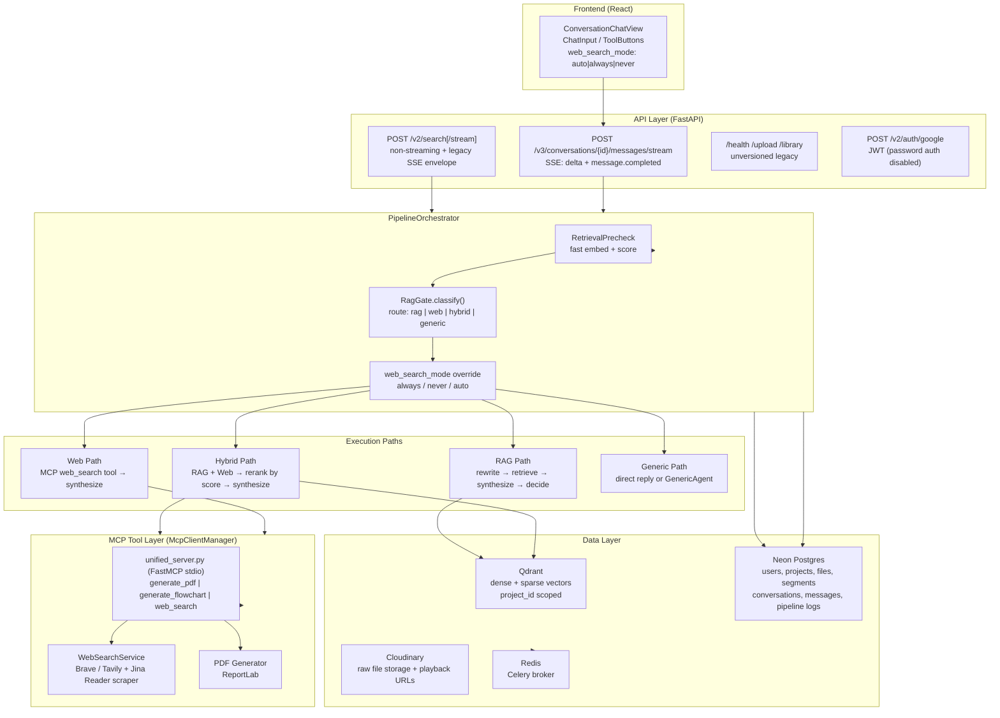
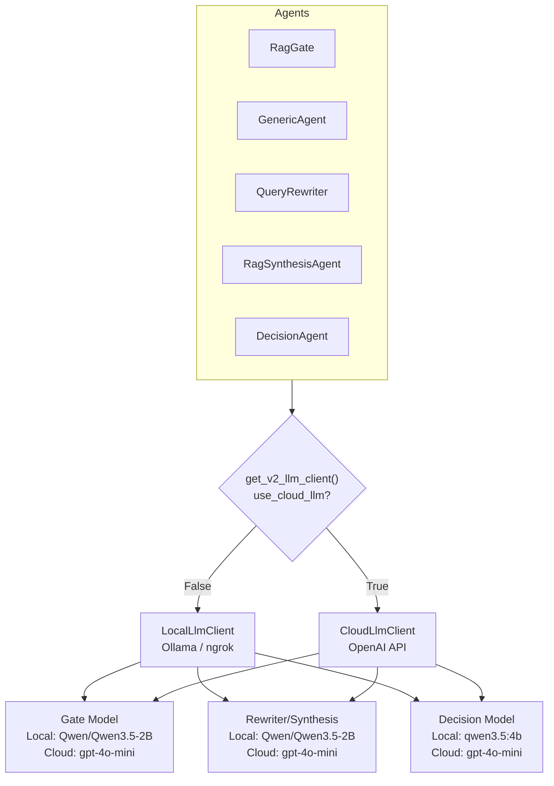
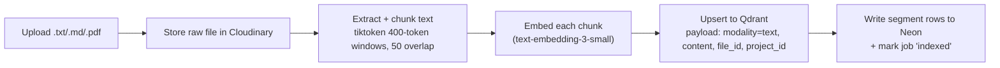
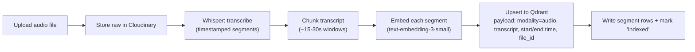
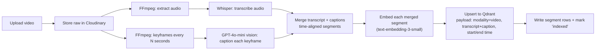
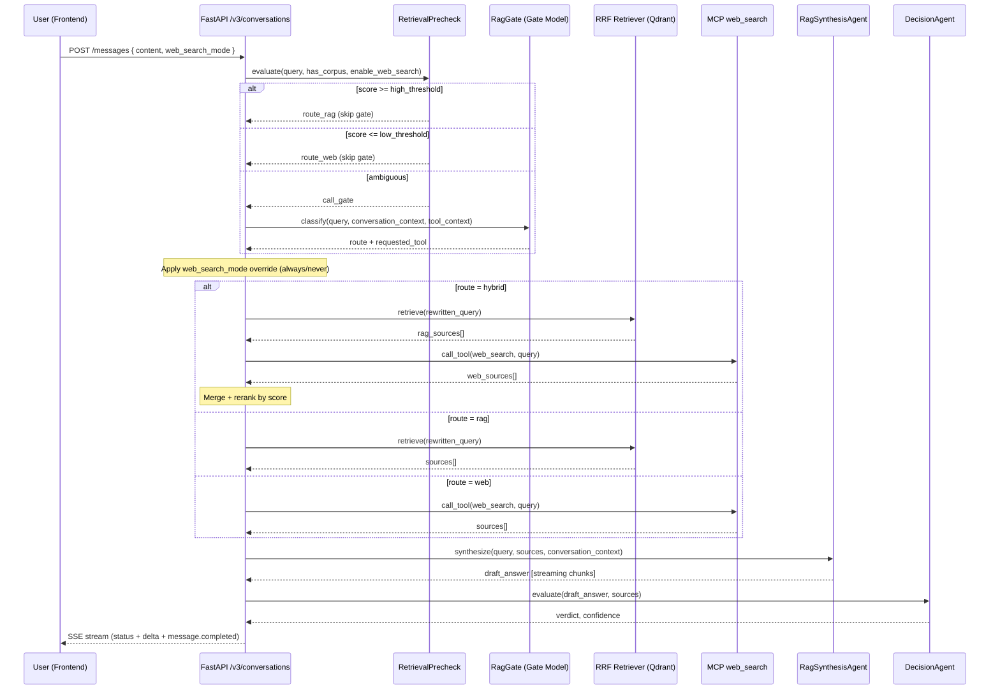

# Architecture — Scrutinize

Multi-modal AI ingestion, retrieval, and agentic search system with hybrid RAG + Live Web Search.

---

## 1. Overview

**Scrutinize** is a unified ingestion and retrieval platform that lets users upload **text, audio, and video**, then ask natural-language questions answered by either local document retrieval, live web search, or a combination of both. The system is split into four primary layers:

1. **Client** — React chat-style UI (conversation, upload, library) with persistent project workspaces.
2. **API Layer** — FastAPI, the single entry point for the frontend. Hosts **unversioned legacy routes** (`/health`, `/upload`, `/library`), **v2** project/search/auth APIs, and **v3** persistent conversations.
3. **Processing Layer** — Async Celery workers that process raw files (extract transcriptions/captions) and generate embeddings.
4. **Data Layer** — **Qdrant** for vector similarity search, **Neon Postgres** for relational data and pipeline observability, and **Cloudinary** for raw binary file storage.

A local/cloud **Agentic Pipeline (V2)** orchestrates all query-time logic: query routing, retrieval precheck, hybrid retrieval, web search via MCP tools, synthesis, and quality evaluation. A **V3 Conversation API** sits on top as the primary user-facing chat path, adding persistent per-user chat history, project-scoped workspaces, conversation-attached sources, and typed SSE streaming — while still executing the v2 pipeline engine for project chats.

### Repo layout

| Path | Role |
|---|---|
| `backend/app/` | FastAPI app, models, services, workers |
| `backend/migrations/` | Sequential SQL migrations (001–014) |
| `frontend/src/` | React 19 + Vite SPA |
| `deploy/fly/` | Fly.io configs (api, worker, redis, qdrant) |
| `tests/` | pytest unit / integration / system / security |
| `docs/architecture/` | This document + `architecture_v3.md` (original v3 plan, now largely implemented) |

---

## 2. High-Level Architecture

At query time, requests flow through an **entry point → orchestrator → tools** hub-and-spoke model:


```mermaid
flowchart TD
    subgraph Client["Frontend (React)"]
        UI["ConversationChatView\nChatInput / ToolButtons\nweb_search_mode: auto|always|never"]
    end

    subgraph API["API Layer (FastAPI)"]
        V3["POST /v3/conversations/{id}/messages/stream\nSSE: delta + message.completed"]
        V2["POST /v2/search[/stream]\nnon-streaming + legacy SSE envelope"]
        LEG["/health /upload /library\nunversioned legacy"]
        AUTH["POST /v2/auth/google\nJWT (password auth disabled)"]
    end

    subgraph Orchestrator["PipelineOrchestrator"]
        PRECHECK["RetrievalPrecheck\nfast embed + score"]
        GATE["RagGate.classify()\nroute: rag | web | hybrid | generic"]
        WMODE["web_search_mode override\nalways / never / auto"]
    end

    subgraph Paths["Execution Paths"]
        RAG["RAG Path\nrewrite → retrieve → synthesize → decide"]
        WEB["Web Path\nMCP web_search tool → synthesize"]
        HYBRID["Hybrid Path\nRAG + Web → rerank by score → synthesize"]
        GEN["Generic Path\ndirect reply or GenericAgent"]
    end

    subgraph MCP["MCP Tool Layer (McpClientManager)"]
        UNIFIED["unified_server.py (FastMCP stdio)\ngenerate_pdf | generate_flowchart | web_search"]
        WSSVC["WebSearchService\nBrave / Tavily + Jina Reader scraper"]
        PDFSVC["PDF Generator\nReportLab"]
    end

    subgraph Data["Data Layer"]
        QDRANT["Qdrant\ndense + sparse vectors\nproject_id scoped"]
        NEON["Neon Postgres\nusers, projects, files, segments\nconversations, messages, pipeline logs"]
        CDN["Cloudinary\nraw file storage + playback URLs"]
        REDIS["Redis\nCelery broker"]
    end

    UI --> V3
    V3 --> Orchestrator
    V2 --> Orchestrator
    Orchestrator --> PRECHECK
    PRECHECK --> GATE
    GATE --> WMODE
    WMODE --> RAG
    WMODE --> WEB
    WMODE --> HYBRID
    WMODE --> GEN
    WEB --> MCP
    HYBRID --> MCP
    HYBRID --> QDRANT
    RAG --> QDRANT
    MCP --> UNIFIED
    UNIFIED --> WSSVC
    UNIFIED --> PDFSVC
    Orchestrator --> NEON
    Orchestrator --> NEON
    Data --> REDIS
```

---

## 3. Query Routing — The Four Paths

### 3.1 Retrieval Precheck (Fast Path)

Before the Gate LLM is called, **`RetrievalPrecheck`** embeds the query and retrieves top-3 chunks from Qdrant. This short-circuits the full LLM gate call for unambiguous cases:

| Precheck Condition | Action |
|---|---|
| Client-requested tool is `generate_pdf` + corpus exists | Skip gate → route `rag` directly |
| Client-requested tool (other) | Always call gate |
| No corpus indexed for project | Route `web` if web search enabled, else `generic` |
| Top retrieval score ≥ `precheck_high_score` (default `0.025`) | Skip gate → route `rag` directly (reuse retrieved chunks) |
| Top retrieval score ≤ `precheck_low_score` (default `0.012`) | Skip gate → route `web` (or `generic` if web disabled) |
| Score is ambiguous (between thresholds) | Call Gate LLM to decide |

### 3.2 Gate LLM Routing

When the precheck calls the gate, **`RagGate.classify()`** receives:
- The current query and rolling conversation context (up to last 10 exchanges)
- Available MCP tools injected into the system prompt
- The `client_requested_tool` from the frontend (if any)

It returns one of four routes: `rag`, `web`, `hybrid`, `generic`.

### 3.3 Web Search Mode Override

The user can override routing from the frontend `ChatInput` using a three-state toggle:

| Mode | Behavior |
|---|---|
| `auto` | Gate + precheck decide routing normally |
| `always` | RAG → hybrid; generic → web; other routes unchanged |
| `never` | web/hybrid → rag; other routes unchanged |

This `web_search_mode` field travels from `ChatInput` → `AppContext` → `MessageCreate` schema → `POST /v3/conversations/{id}/messages/stream` → `PipelineOrchestrator.search_stream()`.

### 3.4 Route Execution

| Route | What happens |
|---|---|
| `rag` | Query rewrite → hybrid RRF retrieval from Qdrant → RAG synthesis → decision evaluation |
| `web` | MCP `web_search` tool call → scrape URLs → synthesis using web sources |
| `hybrid` | Both RAG retrieval and web search run → results merged as `SearchSource` objects → reranked by `score` → synthesis using combined context |
| `generic` | Gate direct reply (cached in `GateResult.reply`) or `GenericAgent.reply()` for conversational turns |

---

## 4. Component Breakdown

| Module | Role | LLM / External |
|---|---|---|
| `burr_orchestrator.py` | Apache Burr state machine: orchestrates precheck → gate → rewrite → retrieve → assess_evidence → synthesize → verify_and_evaluate → decision | — |
| `retrieval_precheck.py` | Fast embed + retrieve to bypass gate LLM for clear-cut queries | EmbeddingService + Qdrant |
| `conversation_memory.py` | Rolling snapshot of last N chat exchanges (UTC timestamps) | — |
| `memory_manager.py` | Letta persistent user/project memory synchronization | Letta API |
| `rag_gate.py` | Classifies queries into `rag \| web \| hybrid \| generic` | Gate Model |
| `query_rewriter.py` | Keyword-focused query rewrite; incorporates retry feedback | Rewriter Model |
| `rrf_retriever.py` | Dense + keyword retrieval orchestration → fuse_rrf_hits() → `SearchSource` list | EmbeddingService + Qdrant |
| `evidence_assessor.py` | Evaluates if retrieved chunks contain sufficient facts to answer | Gate Model |
| `rag_synthesis_agent.py` | Grounded cited answer generation from top-k or web sources | Synthesis Model |
| `citation_verifier.py` | Validates every claim/citation in answer draft against retrieved sources | Gate Model |
| `groundedness_evaluator.py` | Scores draft answer groundedness (0.0 to 1.0) | Gate Model |
| `decision_agent.py` | Quality evaluation; computes confidence & verdict | Decision Model |
| `pipeline_logger.py` | Relational execution log (`pipeline_runs` + `pipeline_steps`) in Neon Postgres | Neon Postgres |
| `mcp_manager.py` | Spawns `unified_server.py` via stdio JSON-RPC; graceful local fallback | FastMCP SDK / stdio |
| `mcp_servers/unified_server.py` | FastMCP server exposing `generate_pdf` and `web_search` tools | FastMCP |
| `web_search.py` | `WebSearchService` — Brave/Tavily API search + Jina Reader scraping | Brave / Tavily / Jina |
| `llm_clients/local.py` | OpenAI-compatible HTTP client for local Ollama via ngrok | Ollama |
| `llm_clients/cloud.py` | OpenAI Chat Completions client | OpenAI |
| `conversation_service.py` | CRUD for `ChatConversation` and `ChatMessage`; turn lifecycle | Neon Postgres |
| `project_service.py` | Project creation, admin/client keys, per-project model settings | Neon Postgres |
| `job_orchestrator.py` | Enqueues Celery ingestion tasks (text/audio/video), polls job status | Redis + Celery |

---

## 5. MCP Tool Layer

Tools are exposed via a **unified FastMCP server** (`unified_server.py`) that runs as a subprocess, communicating via **JSON-RPC over stdio**. The `McpClientManager` manages the process lifecycle:

```
PipelineOrchestrator
    │
    ├── McpClientManager.list_tools()   →  JSON-RPC: tools/list
    │       ↕ stdio
    │   unified_server.py (FastMCP)
    │       ├── generate_pdf(title, content)       → ReportLab → .pdf file path
    │       ├── generate_flowchart(title, content) → LLM Mermaid diagram
    │       └── web_search(query, limit)           → WebSearchService → JSON results
    │
    └── McpClientManager.call_tool(name, args)  →  JSON-RPC: tools/call
```

**Fallback chain:** If the `mcp` Python package is unavailable, `McpClientManager` falls back to calling `generate_pdf`, `generate_flowchart`, and `web_search` directly as local Python functions.

### Available MCP Tools

| Tool | Trigger | Output |
|---|---|---|
| `generate_pdf` | Client sets `requested_tool = "generate_pdf"` on v3 message | Absolute path to a compiled PDF file |
| `generate_flowchart` | Client sets `requested_tool = "generate_flowchart"` on v3 message | Mermaid flowchart wrapped in a fenced code block |
| `web_search` | Route is `web` or `hybrid` | JSON list of `{title, url, snippet, content}` dicts |
| `execute_python` | Agent requests python execution | Sandbox stdout/stderr output string |

Web search results are converted to `SearchSource` objects (same schema as RAG results) and merged with any RAG sources. The combined list is **reranked by `score`** descending before synthesis, ensuring the most relevant sources appear first regardless of origin.

### 5.2 Tool Policies, Sandboxing & Approvals (Phase 3)

The system enforces tool execution security bounds through a three-layered strategy:

1. **Deterministic Role-based Permissions**
   Every tool is mapped to a policy defining its risk level (`low`, `medium`, `high`) and the required workspace role.
   - `web_search`: Low risk (requires `member` role)
   - `generate_pdf`: Medium risk (requires `member` role)
   - `generate_flowchart`: Medium risk (requires `member` role)
   - `execute_python`: High risk (requires `owner` role)
   
   The `PermissionChecker` intercepts tool requests. If the user's role rank (where `owner` = 2, `member` = 1) is lower than the required rank, the execution is immediately blocked.

2. **E2B Sandbox Isolation**
   All code execution (`execute_python`) runs inside throwaway isolated Firecracker MicroVMs using the E2B client SDK. This ensures that arbitrary python code generated by LLM agents is completely sandboxed from the host machine. In the absence of an `E2B_API_KEY`, a safe local mockup environment is used as a development fallback.

3. **Human-in-the-Loop Approval Gate**
   Any tool classified with a `high` risk level (e.g., `execute_python`) requires human approval before executing:
   - When the agent calls a high-risk tool, the `BurrOrchestrator` creates a `ToolApproval` record in Postgres with status `waiting`.
   - The orchestrator yields an `approval.required` SSE event containing the approval ID, tool name, and arguments to the client.
   - The orchestrator thread sleep-loops, querying the database status of the approval until it changes to `approved` or `rejected`.
   - The user decides via `POST /v3/approvals/{id}/decide`. If approved, the orchestrator resumes and executes the tool. If rejected, it aborts execution and reports the rejection.

---

## 6. Conversation & Auth System (V3)

### 6.1 Authentication

**User auth (JWT):** Google OAuth is the active login path (`POST /v2/auth/google`). The backend verifies the Google ID token, creates or loads the user, and returns a custom HS256 JWT. Password signup, OTP verification, and email/password login routes exist but return **400 — disabled**.

All v3 conversation endpoints require `Authorization: Bearer <token>`. The user must be `is_verified` (Google users are auto-verified on first login).

**Project keys (embeddable API clients):**

| Key | Prefix | Used for |
|---|---|---|
| Admin key | `scrutinize_sk_` | File upload, library delete, project admin |
| Client key | `scrutinize_pk_` | v2 search (`POST /v2/search`) |

When both a JWT and `X-Project-Id` header are present, membership is checked instead of raw key lookup.

### 6.2 Persistent Conversations (V3)

`/v3/conversations` adds persistent chat backed by **two tables** (migration 012) plus conversation-scoped file sources (migration 013):

| Model | Table | Key fields |
|---|---|---|
| `ChatConversation` | `chat_conversations` | `id`, `owner_user_id`, `project_id`, `scope` (general/project), `retrieval_policy` (web_only/project_rag), `title` |
| `ChatMessage` | `chat_messages` | `id`, `conversation_id`, `role`, `content`, `status`, `citations` (JSON), `client_message_id`, `pipeline_run_id` |

**Scopes:**
- `general` — No project, `retrieval_policy = web_only`. When no indexed corpus exists, bypasses the full orchestrator and uses direct web search + gate-model streaming.
- `project` — Linked to a project, `retrieval_policy = project_rag`. Runs the full pipeline (precheck + gate + RAG + web).

**Conversation-scoped sources (migration 013):** Files uploaded via `POST /v3/conversations/{id}/sources` are tagged with `conversation_id` on both `files` and `segments`, enabling per-chat retrieval in addition to project-wide RRF search.

### 6.3 Streaming (SSE)

`POST /v3/conversations/{id}/messages/stream` returns a **Server-Sent Events** stream with typed event names:

| Event | When emitted |
|---|---|
| `message.accepted` | User message persisted; includes canonical `user_message` |
| `status { step: "precheck" }` | Before retrieval precheck |
| `status { step: "gate" \| "gate_end", route }` | Gate classification |
| `status { step: "rewrite" \| "rewrite_end" }` | Query rewriting |
| `status { step: "retrieval" \| "retrieval_end" }` | Qdrant hybrid search |
| `status { step: "synthesis" }` | Before answer generation |
| `status { step: "decision" \| "evaluation_end" }` | Decision agent evaluation |
| `status { step: "web_search" \| "web_search_end" }` | Direct web search path (general chat) |
| `delta { assistant_message_id, text }` | Streaming answer tokens |
| `message.completed` | Final `assistant_message` + `conversation` metadata (with citations) |
| `error { code, message, retryable }` | Pipeline or persistence failure |

**v2 legacy SSE** (`POST /v2/search/stream`) uses a single-channel JSON envelope instead:
```
data: {"event": "status"|"chunk"|"result"|"error", "data": {...}}
```

The frontend primary chat UI (`ConversationChatView`) consumes v3 typed SSE. The legacy `SearchView` component (v2 envelope) is **not mounted** in the current app shell.

### 6.4 Frontend Architecture

Navigation uses an **`AppView` reducer** in `AppContext` (no React Router):

| View | Component | Scope |
|---|---|---|
| `general-chat` | `ConversationChatView scope="general"` | Web-only general chat |
| `project` | `ProjectWorkspace` → tabs: Chats / Sources / Library / Settings | Project workspace |
| `account-settings` | `AccountSettingsView` | User account |

**Primary chat flow:**
1. `ChatInput` collects message + `web_search_mode` (auto/always/never) + optional tool (`generate_pdf`, `generate_flowchart`)
2. `ConversationChatView.runStream()` calls `streamConversationMessage()` → v3 SSE
3. Deltas update the in-flight assistant message directly in the `messages` array (by `assistant_message_id`)
4. `message.completed` replaces the streaming message with the persisted row (including citations)
5. `ThinkingPanel` renders pipeline step progress from `agentOutputs` (via `pipelineAgents.ts`)

### 6.5 v2 vs v3 — What Changed

| Aspect | v2 (legacy) | v3 (current primary) |
|---|---|---|
| Chat state | Client sends full `conversation` snapshot each request | Server-persisted `chat_messages` |
| Primary endpoint | `POST /v2/search[/stream]` | `POST /v3/conversations/{id}/messages/stream` |
| Auth | Project client key | JWT (`get_current_user`) |
| SSE format | JSON envelope (`chunk`, `result`) | Typed events (`delta`, `message.completed`) |
| File attachment | Project-level (`/v2/projects/files`) | Per-conversation (`/v3/conversations/{id}/sources`) |
| Citations | Returned in search response only | Stored in `chat_messages.citations` JSONB |
| Frontend UI | `SearchView` (orphaned, not in `App.tsx`) | `ConversationChatView` + `ProjectWorkspace` |
| Pipeline engine | `PipelineOrchestrator` | Same orchestrator, wrapped by v3 stream handler |

---

## 7. LLM Client Routing

All pipeline LLM calls go through a `get_v2_llm_client()` factory that reads `USE_CLOUD_LLM`:


```mermaid
flowchart TD
    subgraph Agents["Agents"]
        GATE_A["RagGate"]
        GEN_A["GenericAgent"]
        RW_A["QueryRewriter"]
        SYN_A["RagSynthesisAgent"]
        DEC_A["DecisionAgent"]
    end

    CLIENT{"get_v2_llm_client()\nuse_cloud_llm?"}

    LOCAL["LocalLlmClient\nOllama / ngrok"]
    CLOUD["CloudLlmClient\nOpenAI API"]

    M_GATE["Gate Model\nLocal: Qwen/Qwen3.5-2B\nCloud: gpt-4o-mini"]
    M_REWRITE["Rewriter/Synthesis\nLocal: Qwen/Qwen3.5-2B\nCloud: gpt-4o-mini"]
    M_DECISION["Decision Model\nLocal: qwen3.5:4b\nCloud: gpt-4o-mini"]

    Agents --> CLIENT
    CLIENT -->|"False"| LOCAL
    CLIENT -->|"True"| CLOUD
    LOCAL --> M_GATE
    LOCAL --> M_REWRITE
    LOCAL --> M_DECISION
    CLOUD --> M_GATE
    CLOUD --> M_REWRITE
    CLOUD --> M_DECISION
```

Embeddings (dense) and ingestion media APIs (Whisper, GPT-4o-mini vision) always use **OpenAI** regardless of `USE_CLOUD_LLM`.

Per-project model overrides and system prompt customizations are stored in `projects.settings` (JSON) — keys include `gate_model`, `rewriter_model`, `synthesis_model`, `decision_model`, and `system_prompt_overrides`. Applied by `ProjectService.resolve_context()` before each pipeline run.

---

## 8. Data Flows

### 8.1 Ingestion — Text

```mermaid
flowchart LR
    A[Upload .txt/.md/.pdf] --> B[Store raw file in Cloudinary]
    B --> C["Extract + chunk text\ntiktoken 400-token windows, 50 overlap"]
    C --> D["Embed each chunk\n(text-embedding-3-small)"]
    D --> E["Upsert to Qdrant\npayload: modality=text, content, file_id, project_id"]
    E --> F["Write segment rows to Neon\n+ mark job 'indexed'"]
```

### 8.2 Ingestion — Audio

```mermaid
flowchart LR
    A[Upload audio file] --> B[Store raw in Cloudinary]
    B --> C["Whisper: transcribe\n(timestamped segments)"]
    C --> D["Chunk transcript\n(~15-30s windows)"]
    D --> E["Embed each segment\n(text-embedding-3-small)"]
    E --> F["Upsert to Qdrant\npayload: modality=audio, transcript, start/end time, file_id"]
    F --> G["Write segment rows + mark 'indexed'"]
```

### 8.3 Ingestion — Video

```mermaid
flowchart LR
    A[Upload video] --> B[Store raw in Cloudinary]
    B --> C["FFmpeg: extract audio"]
    B --> D["FFmpeg: keyframes every N seconds"]
    C --> E["Whisper: transcribe audio"]
    D --> F["GPT-4o-mini vision: caption each keyframe"]
    E --> G["Merge transcript + captions\ntime-aligned segments"]
    F --> G
    G --> H["Embed each merged segment\n(text-embedding-3-small)"]
    H --> I["Upsert to Qdrant\npayload: modality=video, transcript+caption, start/end time"]
    I --> J["Write segment rows + mark 'indexed'"]
```

### 8.4 Query / Search — Hybrid Pipeline (V2/V3)

```mermaid
sequenceDiagram
    participant U as User (Frontend)
    participant API as FastAPI /v3/conversations
    participant PRE as RetrievalPrecheck
    participant G as RagGate (Gate Model)
    participant RAG as RRF Retriever (Qdrant)
    participant WEB as MCP web_search
    participant S as RagSynthesisAgent
    participant D as DecisionAgent

    U->>API: POST /messages { content, web_search_mode }
    API->>PRE: evaluate(query, has_corpus, enable_web_search)
    alt score >= high_threshold
        PRE-->>API: route_rag (skip gate)
    else score <= low_threshold
        PRE-->>API: route_web (skip gate)
    else ambiguous
        PRE-->>API: call_gate
        API->>G: classify(query, conversation_context, tool_context)
        G-->>API: route + requested_tool
    end
    Note over API: Apply web_search_mode override (always/never)
    
    alt route = hybrid
        API->>RAG: retrieve(rewritten_query)
        RAG-->>API: rag_sources[]
        API->>WEB: call_tool(web_search, query)
        WEB-->>API: web_sources[]
        Note over API: Merge + rerank by score
    else route = rag
        API->>RAG: retrieve(rewritten_query)
        RAG-->>API: sources[]
    else route = web
        API->>WEB: call_tool(web_search, query)
        WEB-->>API: sources[]
    end

    API->>S: synthesize(query, sources, conversation_context)
    S-->>API: draft_answer [streaming chunks]
    API->>D: evaluate(draft_answer, sources)
    D-->>API: verdict, confidence

    API-->>U: SSE stream (status + delta + message.completed)
```

---

## 9. Embedding & Search Strategy

### Phase A — MVP: Hybrid Search (Dense + Sparse/BM25)
Every piece of content is indexed with two vectors in the same Qdrant collection:
1. **Dense Vector** (`text_vector`): `text-embedding-3-small` (1536 dimensions) for semantic similarity.
2. **Sparse Vector** (`sparse_vector`): `fastembed` BM25 for exact lexical/keyword matching.

Retrieval runs both prefetches concurrently via Qdrant's `Prefetch` API, fused with **client-side Reciprocal Rank Fusion (RRF)** (`k = V2_RRF_K`, default 60).

### Keyword Normalization (`keyword_search_utils.py`)
Applied at **both ingest and query time** for high recall across spelling variations:
- **NFKC normalization** and lowercasing
- **Punctuation→space** conversion (hyphens, underscores)
- **Compound collapsing**: `open ai` ↔ `openai`
- **Filename stem extraction**: strips directory paths, extensions, URL encoding
- **Index enrichment**: `content + title + filename stem variants` passed to BM25 embedder

### Phase B — Future: Native Multi-Vector Points
Add a third named vector per Qdrant point:
- `visual_vector` — CLIP embedding of representative video keyframes
- `audio_vector` — CLAP embedding for audio similarity

Qdrant's named-vector architecture allows this as an **additive** schema change.

---

## 10. Vector DB Schema (Qdrant)

**Collection:** `segments`

| Field | Type | Notes |
|---|---|---|
| `id` (point id) | UUID | Matches `segments.id` in Neon Postgres |
| vector: `text_vector` | float[1536] | `text-embedding-3-small`, cosine distance |
| vector: `sparse_vector` | struct | `fastembed` BM25 (indices & values) for lexical search |
| payload.`project_id` | UUID | Scopes retrieval to a specific project |
| payload.`file_id` | UUID | FK to Neon `files.id` |
| payload.`modality` | enum: `text` \| `audio` \| `video` | Used for modality filter |
| payload.`content` | string | Transcript / caption / text chunk embedded |
| payload.`start_time` | float \| null | Seconds; null for plain text |
| payload.`end_time` | float \| null | Seconds; null for plain text |
| payload.`source_path` | string | CDN URL for playback |
| payload.`title` | string | Original filename / display title |
| payload.`created_at` | datetime | For recency filtering |

---

## 11. Relational Schema (Neon Postgres)

```sql
-- Auth
create table users (
  id uuid primary key default gen_random_uuid(),
  email text unique not null,
  password_hash text,
  is_verified boolean not null default false,
  verification_otp text,
  otp_expires_at timestamptz,
  created_at timestamptz not null default now()
);

-- Projects and membership
create table projects (
  id uuid primary key default gen_random_uuid(),
  ...
);

create table project_members (
  user_id uuid references users(id) on delete cascade,
  project_id uuid references projects(id) on delete cascade,
  role text not null default 'member',
  joined_at timestamptz not null default now(),
  primary key (user_id, project_id)
);

-- V3 persistent conversations
create table chat_conversations (
  id uuid primary key default gen_random_uuid(),
  owner_user_id uuid not null references users(id) on delete cascade,
  project_id uuid references projects(id) on delete cascade,
  scope text not null,           -- 'general' | 'project'
  retrieval_policy text not null,-- 'web_only' | 'project_rag'
  title text not null default 'New chat',
  created_at timestamptz not null default now(),
  updated_at timestamptz not null default now(),
  archived_at timestamptz
);

create table chat_messages (
  id uuid primary key default gen_random_uuid(),
  conversation_id uuid not null references chat_conversations(id) on delete cascade,
  role text not null,            -- 'user' | 'assistant'
  content text not null,
  status text not null default 'completed', -- 'pending' | 'streaming' | 'completed' | 'failed' | 'cancelled'
  client_message_id uuid,
  citations jsonb,               -- [{file_id, title, url, score, ...}]
  pipeline_run_id uuid references pipeline_runs(id),
  error_code text,
  created_at timestamptz not null default now(),
  completed_at timestamptz
);

-- File ingestion
create table files (
  id uuid primary key default gen_random_uuid(),
  filename text not null,
  modality text not null check (modality in ('text','audio','video')),
  storage_path text not null,
  duration_seconds numeric,
  size_bytes bigint,
  status text not null default 'uploaded'
    check (status in ('uploaded','processing','indexed','failed')),
  uploaded_at timestamptz not null default now()
);

create table processing_jobs (
  id uuid primary key default gen_random_uuid(),
  file_id uuid not null references files(id) on delete cascade,
  stage text not null,           -- 'transcription','captioning','embedding'
  status text not null default 'pending'
    check (status in ('pending','running','done','failed')),
  error_message text,
  created_at timestamptz not null default now(),
  updated_at timestamptz not null default now()
);

create table segments (
  id uuid primary key default gen_random_uuid(),   -- == Qdrant point id
  file_id uuid not null references files(id) on delete cascade,
  modality text not null,
  content text not null,
  start_time numeric,
  end_time numeric,
  created_at timestamptz not null default now()
);

-- Pipeline observability (migration 009 schema; route constraint expanded in 014)
create table pipeline_runs (
  id uuid primary key,
  original_query text not null,
  final_route text check (final_route is null or final_route in ('generic','rag','web','hybrid')),
  ...
);
create table pipeline_steps (
  run_id uuid references pipeline_runs(id),
  step_type text,          -- gate | rewrite | retrieval | synthesis | evaluation
  structured_output jsonb,
  retrieved_sources jsonb,
  ...
);

create index on segments (file_id);
create index on processing_jobs (file_id, status);
create index on chat_conversations (owner_user_id, updated_at desc);
create index on chat_messages (conversation_id, created_at);
```

---

## 12. Tech Stack & Rationale

### 12.1 FastAPI (Backend)
**How:** Hosts all API versions (`/v2`, `/v3`) with async endpoints, dependency injection, and Pydantic validation.  
**Why:** Native async I/O for non-blocking LLM and DB calls. Automatic OpenAPI docs. SSE streaming via `StreamingResponse`.

### 12.2 Qdrant (Vector DB)
**How:** Stores 1536-d dense vectors + BM25 sparse vectors per segment. Filters by `project_id` and `modality`.  
**Why:** Purpose-built ANN search with RRF fusion, named-vector architecture, and payload filtering all in one service.

### 12.3 Neon Postgres (Relational DB)
**How:** Stores users, projects, files, jobs, segments, conversations, messages, and pipeline run logs.  
**Why:** Serverless Postgres with full SQL semantics. Enables rich joins between pipeline observability tables and chat history.

### 12.4 Cloudinary (Object Storage)
**How:** Stores raw media files and returns CDN-backed HTTPS URLs with byte-range seek support.  
**Why:** Decouples binary assets from the vector store. Playback in the UI requires seek support that Cloudinary provides out of the box.

### 12.5 Redis + Celery (Task Queue)
**How:** Celery workers process slow ingestion tasks (Whisper transcription, vision captioning, embedding) asynchronously.  
**Why:** Media processing is CPU and time-intensive. Celery with Redis ensures reliability and allows horizontal scaling.

### 12.6 FastMCP (MCP Tool Server)
**How:** `unified_server.py` exposes `generate_pdf` and `web_search` as MCP tools via stdio JSON-RPC. `McpClientManager` spawns it as a subprocess and communicates via the `mcp` Python SDK.  
**Why:** Separates tool execution from the core pipeline. The stdio MCP protocol is language-agnostic and decoupled by design. Local Python fallbacks ensure the pipeline works even if the `mcp` package is absent.

### 12.7 Brave / Tavily + Jina Reader (Web Search)
**How:** `WebSearchService` queries Brave Search or Tavily API for search results, then scrapes full page content via Jina Reader (with a direct HTTP fallback). Results are returned as `SearchSource` objects.  
**Why:** Gives the pipeline access to real-time, live information unavailable in local project files. Jina Reader converts web pages to clean Markdown, dramatically improving synthesis quality.

### 12.8 Local LLMs via Ollama / Ngrok
**How:** `LocalLlmClient` sends OpenAI-compatible payloads to a locally hosted Ollama instance tunneled via ngrok.  
**Why:** Enables completely offline/private model hosting. Specialized model sizes (small for routing, medium for synthesis, larger for evaluation) balance quality and resource cost.

---

## 13. API Surface

### Unversioned (legacy)

| Method | Path | Auth | Purpose |
|---|---|---|---|
| `GET` | `/health` | — | Full dependency check (DB, Redis, Qdrant) |
| `GET` | `/health/wake` | — | Lightweight Fly wake probe (no Redis/Qdrant) |
| `GET` | `/status/{job_id}` | — | Celery ingestion job status |
| `POST` | `/upload` | Optional `X-Project-Key` | Legacy file upload |
| `GET` | `/library` | `X-Project-Key` | List indexed project files |
| `GET` | `/library/{file_id}/content` | `X-Project-Key` | Stream/download file content |
| `DELETE` | `/library/{file_id}` | `X-Project-Key` | Delete indexed file |

### `/v2`

| Method | Path | Auth | Purpose |
|---|---|---|---|
| `POST` | `/v2/auth/google` | — | Google OAuth login → JWT |
| `GET` | `/v2/auth/me` | JWT | Current user profile |
| `POST` | `/v2/auth/signup` | — | **Disabled** (400) |
| `POST` | `/v2/auth/login` | — | **Disabled** (400) |
| `GET` | `/v2/llm-health` | — | Probe gate LLM reachability |
| `POST` | `/v2/search` | Client key or JWT+`X-Project-Id` | Non-streaming agentic search |
| `POST` | `/v2/search/stream` | Client key or JWT+`X-Project-Id` | Legacy SSE search stream |
| `GET`/`POST` | `/v2/projects/…` | Admin/client key or JWT | Project management |
| `POST` | `/v2/projects/files` | Admin key | Upload + enqueue ingestion |
| `POST` | `/v2/pdf/generate` | Optional key | Directly compile Markdown to PDF via MCP |
| `GET` | `/v2/pdf/download/{filename}` | — | Download compiled PDF |
| `GET` | `/v2/pdf/preview/{filename}` | — | Inline PDF preview |

### `/v3` (primary chat API)

| Method | Path | Auth | Purpose |
|---|---|---|---|
| `POST` | `/v3/conversations` | JWT | Create conversation (general or project scope) |
| `GET` | `/v3/conversations` | JWT | List conversations (`scope`, `project_id` filters) |
| `GET/PATCH/DELETE` | `/v3/conversations/{id}` | JWT | Get, rename/archive, soft-delete |
| `GET` | `/v3/conversations/{id}/messages` | JWT | List messages |
| `POST` | `/v3/conversations/{id}/messages/stream` | JWT | Send message → **SSE streaming turn** |
| `GET` | `/v3/conversations/{id}/sources` | JWT | List conversation-attached files |
| `POST` | `/v3/conversations/{id}/sources` | JWT | Upload file scoped to conversation |

---

## 14. Configuration Reference

| Setting | Default | Purpose |
|---|---|---|
| `use_cloud_llm` | `false` | Route all LLM calls to OpenAI instead of local Ollama |
| `v2_max_pipeline_attempts` | `2` | RAG retry loop cap |
| `v2_confidence_threshold` | `0.7` | Decision agent exit threshold |
| `v2_rrf_top_k` | `5` | Fused segments returned from Qdrant |
| `v2_rrf_k` | `60` | RRF smoothing constant |
| `v2_conversation_window_size` | `10` | Chat exchanges kept in rolling memory |
| `v2_retrieval_precheck_high_score` | `0.025` | Above this → skip gate, route RAG |
| `v2_retrieval_precheck_low_score` | `0.012` | Below this → skip gate, route web/generic |
| `embedding_model` | `text-embedding-3-small` | Dense vectors (1536-d) |
| `qdrant_collection` | `segments` | Hybrid vector collection name |
| `enable_web_search` | `true` | Master switch for web search capability |
| `web_search_engine` | `brave` | `"brave"` or `"tavily"` |
| `brave_search_api_key` | `""` | Required for Brave Search |
| `tavily_api_key` | `""` | Required for Tavily Search |
| `jina_reader_token` | `""` | Optional: Jina Reader API token for better scraping |
| `mcp_pdf_server_enabled` | `true` | Enables the FastMCP tool subprocess |
| `jwt_secret_key` | _(must set)_ | JWT signing secret |
| `jwt_expiry_minutes` | `1440` | Token TTL (24 hours) |
| `celery_task_always_eager` | dev: `true` | Run Celery tasks inline (no worker needed for search-only dev) |
| `worker_idle_timeout_seconds` | dev: `0` (disabled) | Auto-shutdown idle Fly worker machines |

---

## 15. Non-Functional Considerations

- **Security**: JWT tokens are server-signed (custom HS256). Google OAuth is the active user auth path; password/OTP signup is disabled. Project API keys (`scrutinize_sk_` / `scrutinize_pk_`) enable embeddable API access. File size validation enforced at the API layer.
- **Streaming resilience**: v3 SSE emits typed events (`delta`, `message.completed`) so the frontend can finalize messages even when intermediate steps fail. `MessageStatus` (`pending → streaming → completed/failed`) is persisted in Postgres. The chat UI updates the in-flight assistant message in-place during streaming and only clears the cursor when `loading` ends or `message.completed` arrives.
- **Cost Control**: Cache embeddings by content hash. Retrieval precheck short-circuits the gate LLM for clear-cut queries, saving LLM tokens on every request with unambiguous corpus matches or empty corpora.
- **Observability**: `PipelineLogger` writes each gate, rewrite, retrieval, synthesis, and evaluation step to Neon Postgres with structured JSON payloads, enabling root-cause analysis of routing decisions and synthesis quality.

---

## 16. Testing & CI/CD

| Tier | Location | Scope | CI job |
|---|---|---|---|
| **Unit** | `tests/unit/` | Pure logic — chunking, LLM client parsing, memory formatting, keyword normalization, MCP manager fallback | `unit-tests` |
| **Integration** | `tests/integration/` | Real database, Redis, and Qdrant connections. Mocked LLMs for billing/network limits. | `integration-tests` |
| **System** | `tests/system/` | End-to-end: upload → Celery worker → Qdrant index → search query | `system-tests` |

v3 API coverage: `tests/unit/test_v3_conversations_api.py` (conversation CRUD, delete, cascade).

---

## 17. Deployment

### Docker Compose (local / staging)

```yaml
services:
  backend:
    build: ./backend
    ports: ["8000:8000"]
    env_file: .env
    environment:
      - QDRANT_URL=http://qdrant:6333
      - REDIS_URL=redis://redis:6379/0
    depends_on: [qdrant, redis]

  worker:
    build: ./backend
    command: celery -A app.workers.celery_app worker --loglevel=info
    env_file: .env
    environment:
      - QDRANT_URL=http://qdrant:6333
      - REDIS_URL=redis://redis:6379/0
    depends_on: [redis, qdrant]

  redis:
    image: redis:7-alpine

  qdrant:
    image: qdrant/qdrant:latest
    ports: ["6333:6333"]
    volumes: ["qdrant_data:/qdrant/storage"]

volumes:
  qdrant_data:
```

### Fly.io (production)

Configs live under `deploy/fly/` (`api/`, `worker/`, `redis/`, `qdrant/`).

- **API** (`scrutinize-api`): scale-to-zero; `/health/wake` avoids cold-start dependency checks
- **Worker** (`scrutinize-worker`): Celery; self-idles after configurable timeout; woken by `fly_scaler.py` on upload
- **Redis** and **Qdrant**: separate Fly apps (manual deploy)
- **CI** (`.github/workflows/deploy-fly.yml`): deploys API only; worker/redis deployed manually
- **External services**: Neon Postgres (`DATABASE_URL`), Qdrant Cloud, Cloudinary
- Production defaults: `USE_CLOUD_LLM=true`, models `gpt-4o-mini`

---

## 18. Database Migrations

Applied via `make db-migrate` → `backend/scripts/apply_migrations.py` (tracks `migration_history` table).

| Migration | Summary |
|---|---|
| 001–002 | Core `files`, `processing_jobs`, `segments`; FK cascades |
| 003–005 | Pipeline logging (`pipeline_runs`, `pipeline_steps`); JSONB simplification |
| 006 | Multi-tenant `projects`, `project_id` on files/segments |
| 007–008 | Project passwords, prompt overrides in `settings` |
| 009 | Logging v2 schema (JSONB `structured_output`, `retrieved_sources`) |
| 010–011 | `users`, `project_members`; Google auth (nullable `password_hash`) |
| **012** | **v3 conversations** — `chat_conversations`, `chat_messages` |
| **013** | **Conversation-scoped sources** — `conversation_id` on `files`/`segments` |
| **014** | **`pipeline_runs.final_route` CHECK** — adds `web`, `hybrid` (required for Web Search → Always) |