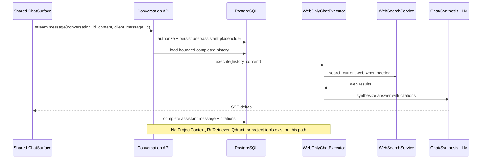
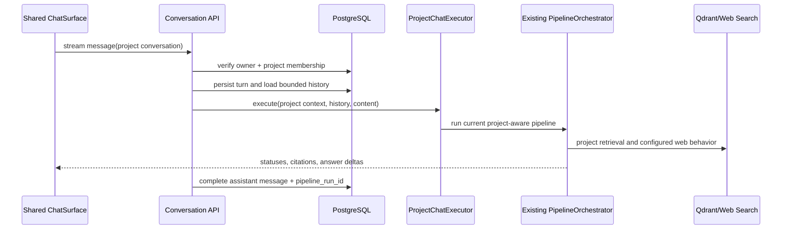

# Scrutinize Architecture v3 — Project Workspaces and Persistent Chat

Status: proposed architecture and implementation plan (no application code)

Date: 2026-07-13

## 1. Objective

Architecture v3 reorganizes Scrutinize around two understandable chat contexts:

1. **Project workspace** — clicking a project opens a dedicated workspace. Directly below the project chatbot/composer, a horizontal choice-chip header switches among `Chats`, `Sources`, and `Library`. Project chats use that project's indexed sources and may use web search according to the existing project search behavior. `Sources` contains the existing `UploadView`; `Library` contains the existing `LibraryView`. Neither surface remains global.
2. **General chat** — an expandable `Chats` section in the main sidebar contains conversations that are not attached to a project. These conversations never run the project RAG/retrieval pipeline; they use web search plus the normal conversational model.

The visual direction is inspired by the interaction hierarchy of the referenced ChatGPT project interface, while retaining Scrutinize's identity. Glassmorphism and animation support hierarchy and feedback; they are not applied at the expense of contrast, performance, accessibility, or clarity.

The verified OpenAI product reference describes Projects as dedicated workspaces that keep chats, uploaded files, instructions, and related context together. It also distinguishes quick standalone chats from work that belongs in a longer-running project. Scrutinize v3 follows that information-architecture principle while retaining its own components, retrieval rules, terminology, and visual identity. References: [Projects in ChatGPT — OpenAI Help Center](https://help.openai.com/en/articles/10169521-using-projects-in-chatgpt) and [Using projects in ChatGPT — OpenAI Academy](https://openai.com/academy/projects/).

This document is intentionally a plan. It does not change application code or the current schema snapshot in `docs/db/schema.md`.

## 2. Codebase findings that constrain v3

The plan is based on the current repository, especially:

- `frontend/src/App.tsx` switches a global `AppView` without URL routing.
- `frontend/src/components/Sidebar.tsx` exposes global `Chat`, `Upload`, and `Library` destinations. Selecting a project only changes project context; it does not open a project workspace.
- `frontend/src/components/SearchView.tsx` already owns the established chat presentation, assistant/user messages, streamed response display, source previews, and PDF behavior.
- `frontend/src/components/ChatInput.tsx` is the reusable composer design and should remain the single composer primitive.
- `frontend/src/components/UploadView.tsx` and `frontend/src/components/LibraryView.tsx` operate through active project request context, but both are currently presented as global destinations. V3 relocates both into the project workspace and makes project identity explicit in their routes and requests.
- `frontend/src/context/AppContext.tsx` combines authentication/session, navigation, upload, library, and one ephemeral search conversation in a single reducer. Switching projects resets this in-memory conversation.
- `frontend/src/api/client.ts` sends the whole conversation snapshot with each `/v2/search/stream` request. No conversation ID is used.
- `backend/app/services/v2/conversation_memory.py` trims client-provided messages; it does not persist them.
- `backend/app/services/v2/pipeline_orchestrator.py` can route among generic, RAG, web, and hybrid behaviors. Its web search mode is not a sufficiently strong boundary for general chat because the same orchestrator may still enter project retrieval paths.
- `pipeline_runs` and `pipeline_steps` are execution/observability records. They are not a safe user-facing chat-history model and must not be repurposed as one.
- Authentication already supports a user belonging to projects through `project_members`, and authenticated requests can identify a project with `X-Project-Id`.
- The current frontend has no test runner configured. Backend tests use pytest.

## 3. Product and HCI principles

### 3.1 Information architecture

The sidebar should answer two questions immediately: “Which project am I working in?” and “Which general chat am I using?” Project navigation has higher visual and document order than general chat history.

Proposed desktop hierarchy:

```text
Scrutinize
├── Projects
│   ├── New project
│   ├── Project A
│   ├── Project B
│   └── …
├── Chats (expand/collapse)
│   ├── New chat
│   ├── Recent general conversation
│   └── …
└── Profile / Settings / Sign out
```

Rules:

- Remove both global `Upload` and global `Library` navigation items.
- Render `Projects` first in `Sidebar.tsx`; render expandable general `Chats` below the complete Projects section.
- `New chat` inside the general Chats section creates or opens a general, web-only conversation.
- Expanding `Chats` reveals recent general conversations, ordered by `updated_at` descending.
- Clicking a project navigates to its workspace rather than merely swapping hidden request headers.
- The selected project and selected conversation have distinct visual states.
- On mobile, the same hierarchy appears in a drawer/sheet; do not maintain a separate information model in `MobileNav`.

### 3.2 Project workspace

The project workspace contains project identity, the standard project chatbot/composer, and a horizontal single-select choice-chip header immediately below the chatbot. The chips are:

- **Chats** — default choice. Shows the project's recent conversations and a clear `New chat` action. Selecting a conversation opens the standard chat surface. An empty project shows example prompts grounded in the project's sources.
- **Sources** — renders the project-scoped `UploadView` for adding files and monitoring upload/ingestion jobs.
- **Library** — renders the project-scoped `LibraryView` for browsing, previewing, and deleting files already belonging to the active project.

The chatbot/composer remains visually stable while the chip-controlled content below it changes. This preserves context and reduces navigation cost. On a conversation detail route, the feed may occupy the primary area above the composer; the choice-chip header remains the project-local navigation boundary and must never move into the global sidebar.

Choice-chip selection must be reflected in navigation state and be deep-linkable. Recommended routes:

```text
/chat/:conversationId?                 general chat, web-only
/projects/:projectId/chats             project chat list/empty state
/projects/:projectId/chats/:chatId     project conversation
/projects/:projectId/sources           project UploadView/add-source surface
/projects/:projectId/library           project LibraryView/browse surface
/settings
```

Use a router rather than expanding the current global `AppView` union. URLs provide refresh safety, browser back/forward behavior, deep links, and unambiguous project/chat identity.

### 3.3 Interaction feedback and error prevention

- Display a persistent context cue near the composer: `Web` for general chat and the project name/`Project sources` for project chat.
- General chat must not display modality filters or controls that imply project-source retrieval.
- Sources/upload and Library controls are only available within a project workspace and to authorized project members.
- Preserve unsent composer text per conversation during choice-chip changes.
- Use optimistic user-message insertion, but show `Sending`, `Failed — Retry`, and cancellation states explicitly.
- Disable duplicate submissions while the same turn is being accepted; support cancelling an active stream.
- Confirm destructive actions such as deleting a conversation or source. Renaming does not need confirmation.
- Empty, loading, error, offline, and permission-denied states must be designed for every list and project choice.

### 3.4 Glassmorphism and motion system

Glass is appropriate for the sidebar, floating composer, horizontal choice-chip header, menus, and transient overlays. Dense message content and long project Library lists should use mostly opaque surfaces for readability.

Recommended tokens:

- translucent surface, elevated translucent surface, hairline border, soft inner highlight, backdrop blur, and restrained shadow;
- text and icon colors meeting WCAG AA contrast against the final composited background;
- one accent treatment for selection/focus, not multiple competing gradients.

Recommended motion:

- sidebar section expand/collapse: 160–220 ms opacity + grid/height transition;
- route/choice-chip content: 140–180 ms fade with a small translate, without delaying input readiness;
- new message: subtle fade/translate; streaming text itself should not animate per character;
- upload progress and skeletons: restrained continuous motion;
- hover/focus: 100–150 ms color, border, and shadow transitions.

All motion must respect `prefers-reduced-motion`. Keyboard focus must remain visible, tab order logical, the single-select choice-chip control must expose tab semantics with `role=tablist/tab/tabpanel`, expandable sections expose `aria-expanded`, and focus moves predictably after navigation or dialog actions.

## 4. Target frontend architecture

### 4.1 Separate server state, navigation state, and transient UI state

The current `AppContext` should be decomposed instead of becoming a larger global store:

- **Session/Project context:** authenticated user, memberships, active project identity.
- **Router state:** workspace choice, conversation ID, settings route.
- **Chat state:** active conversation, messages, stream lifecycle, composer draft, pagination.
- **Source state:** upload queue, source list, ingestion status.
- **Transient UI:** dialogs, drawers, active source preview, sidebar expansion.

Lists and message history are server state. They should be fetched, cached, invalidated, and paginated through focused hooks/services rather than copied permanently into one reducer. If no server-state library is added, implement the same responsibilities in domain hooks with request cancellation and stale-response guards.

### 4.2 Proposed component modules

```text
components/
├── layout/
│   ├── AppShell
│   ├── Sidebar
│   ├── MobileSidebarSheet
│   └── WorkspaceHeader
├── navigation/
│   ├── GeneralChatSection
│   ├── ProjectSection
│   └── ProjectChoiceChips
├── chat/
│   ├── ChatSurface
│   ├── ChatFeed
│   ├── ChatMessage
│   ├── ChatComposer        (wraps/reuses current ChatInput)
│   ├── ChatEmptyState
│   ├── ChatList
│   ├── ChatListItem
│   └── ChatStreamStatus
├── projects/
│   ├── ProjectWorkspace
│   ├── ProjectChatsView
│   ├── ProjectSourcesView  (hosts UploadView)
│   └── ProjectLibraryView  (hosts LibraryView)
└── sources/
    ├── SourceUploader      (extracted from UploadView)
    ├── UploadQueue
    └── ProjectSourceList
```

`ChatSurface` is the single visual implementation used by general and project conversations. It receives capabilities/configuration rather than branching on scattered route checks:

```text
ChatSurfaceConfig
  scope: general | project
  retrievalPolicy: web_only | project_rag
  projectId: UUID | null
  showProjectSourceControls: boolean
  contextLabel: string
```

The server remains authoritative for `retrievalPolicy`; frontend configuration only controls presentation.

### 4.3 Navigation behavior

- Selecting a project navigates to its last visited project choice (`/chats`, `/sources`, or `/library`) or `/chats` by default.
- Selecting a recent general chat navigates to `/chat/:id` and clears active project context from the chat request.
- Selecting a project chat always carries both `projectId` and `conversationId` in the route.
- A mismatched conversation/project pair returns 404 rather than leaking that the conversation exists.
- `Sources` and `Library` always derive project ID from the workspace route, cross-check it against authorized project context, and never fall back to a global collection.
- `Sources` lazy-loads uploader/job state and `Library` lazy-loads that project's files. Upload jobs continue polling through source-domain state when the user changes the active project choice.
- Sidebar expansion preference may live in local storage; conversation data must not.

## 5. Target backend architecture

### 5.1 Domain separation

Add a conversation domain beside, not inside, pipeline logging:

```text
API routes
  /v3/conversations/*
        |
ConversationService ---- authorization/membership checks
        |
ConversationRepository ---- PostgreSQL conversations/messages
        |
ChatExecutionService
   |-- WebOnlyChatExecutor -------- WebSearchService + synthesis LLM
   `-- ProjectChatExecutor -------- existing PipelineOrchestrator
                                            |
                                      Qdrant/project sources
```

Responsibilities:

- `ConversationService`: create/list/get/rename/archive conversations, paginate messages, verify ownership/membership, and coordinate atomic message writes.
- `WebOnlyChatExecutor`: dedicated general-chat path. It may call `WebSearchService` and a response synthesizer, but it must not receive `RrfRetriever`, Qdrant, `project_id`, or project source tools as dependencies.
- `ProjectChatExecutor`: adapter around the existing v2 pipeline. It supplies persisted conversation context and project context, then maps the result into chat messages.
- `PipelineLogger`: remains observability. A project assistant message may optionally reference its `pipeline_run_id` for debugging, but user history is read from `chat_messages`.

This dependency separation is the enforcement mechanism for “general chats never run RAG.” Do not implement it only as `web_search_mode="always"` on the existing orchestrator, because the current orchestrator can still select hybrid/project retrieval behavior.

### 5.2 Persistence model (additive migration)

Keep `docs/db/schema.md` unchanged as the requested current/historical schema snapshot. Add a new numbered migration (next after the repository's current migrations) and document the proposed v3 delta here. After deployment verification, a separately approved task may regenerate a new canonical schema snapshot.

Proposed tables:

```sql
chat_conversations
  id uuid primary key
  owner_user_id uuid not null references users(id) on delete cascade
  project_id uuid null references projects(id) on delete cascade
  scope text not null check (scope in ('general', 'project'))
  retrieval_policy text not null check (retrieval_policy in ('web_only', 'project_rag'))
  title text not null default 'New chat'
  created_at timestamptz not null
  updated_at timestamptz not null
  archived_at timestamptz null

chat_messages
  id uuid primary key
  conversation_id uuid not null references chat_conversations(id) on delete cascade
  role text not null check (role in ('user', 'assistant', 'system'))
  content text not null
  status text not null check (status in ('pending', 'streaming', 'completed', 'failed', 'cancelled'))
  client_message_id uuid null
  citations jsonb not null default '[]'
  pipeline_run_id uuid null references pipeline_runs(id) on delete set null
  error_code text null
  created_at timestamptz not null
  completed_at timestamptz null
```

Existing source records remain in `files`, `processing_jobs`, and `segments`; do not create a second library table. V3 tightens their project ownership contract:

- Every newly uploaded `files` row must have a non-null `project_id` derived from the authorized workspace, never supplied as an unverified body value.
- Every `processing_jobs.file_id` inherits project scope through its file. Job lookups must join/authorize through `files.project_id`.
- Every new `segments` row must carry the same `project_id` as its parent file. Ingestion must reject or repair mismatches transactionally before vector upsert.
- Qdrant payload `project_id` must match the relational segment/file project ID. Project deletion must remove relational rows, stored objects, and vector points through the existing deletion workflow.
- The migration should audit nullable legacy `files.project_id` and `segments.project_id` rows. Preserve the known legacy project, but prohibit new null project ownership. After legacy remediation, add `NOT NULL` constraints or equivalent validated checks.
- Keep/add indexes for `files(project_id, uploaded_at DESC)`, `files(project_id, status)`, and `segments(project_id, file_id)` so the project Library and ingestion status queries cannot degrade into global scans.

The project Library is therefore a scoped view over existing source records, not a separate product-wide entity.

Required invariants and indexes:

- Database check: `(scope='general' AND project_id IS NULL AND retrieval_policy='web_only') OR (scope='project' AND project_id IS NOT NULL AND retrieval_policy='project_rag')`.
- Unique partial index on `(conversation_id, client_message_id)` when `client_message_id IS NOT NULL` for idempotent retries.
- Index conversations by `(owner_user_id, updated_at DESC)` and `(project_id, updated_at DESC)` with `archived_at IS NULL`.
- Index messages by `(conversation_id, created_at, id)` for cursor pagination.
- Update `chat_conversations.updated_at` transactionally when a turn is accepted/completed.

Initial ownership is deliberately simple: a conversation belongs to its creator. Project membership grants access only if product requirements explicitly choose shared project chat later. The schema can later add a visibility policy without conflating membership with authorship.

### 5.3 API contract

All endpoints require the user's bearer token. Project endpoints additionally verify current project membership server-side; do not trust only `X-Project-Id`.

```text
POST   /v3/conversations
       body: { scope, project_id?, title? }

GET    /v3/conversations?scope=general&cursor=&limit=
GET    /v3/projects/{project_id}/conversations?cursor=&limit=
GET    /v3/projects/{project_id}/library?cursor=&limit=&status=&modality=
POST   /v3/projects/{project_id}/sources                  multipart upload
GET    /v3/projects/{project_id}/sources/jobs/{job_id}
DELETE /v3/projects/{project_id}/library/{file_id}

GET    /v3/conversations/{conversation_id}
PATCH  /v3/conversations/{conversation_id}        { title | archived }
DELETE /v3/conversations/{conversation_id}        archive by default

GET    /v3/conversations/{conversation_id}/messages?cursor=&limit=
POST   /v3/conversations/{conversation_id}/messages/stream
       body: { content, client_message_id }
```

The stream should keep the existing SSE transport but use a versioned, stable event envelope:

```text
message.accepted  { user_message }
status            { phase, label }
source            { citation }
delta             { assistant_message_id, text }
message.completed { assistant_message, conversation }
error             { code, retryable, message }
```

The client sends only the new message, not the full conversation. The server loads the bounded context window from persisted messages. This removes client tampering, reduces payload size, and enables reliable multi-device history.

Use cursor pagination, bounded page sizes, sanitized titles/content, request rate limits, and explicit maximum message length. Never expose raw model thinking or `pipeline_steps.model_input` through chat history APIs.

### 5.4 Turn transaction and failure semantics

1. Authorize access to the conversation and derive scope/policy from the database.
2. Insert the user message using `client_message_id`; return the existing row on a retry.
3. Insert an assistant placeholder with `streaming` status.
4. Load the bounded prior completed-message context.
5. Dispatch to the executor selected by the persisted retrieval policy.
6. Stream deltas; accumulate server-side output.
7. On success, atomically mark the assistant message completed, persist citations and optional `pipeline_run_id`, and update conversation timestamp/title.
8. On cancellation or failure, retain a visible failed/cancelled assistant record that can be retried without duplicating the user message.

Automatic titles should be generated asynchronously from the first completed exchange, with a deterministic truncated-user-message fallback.

## 6. Query flows

### 6.1 General chat: enforced web-only



### 6.2 Project chat



## 7. Security, privacy, and operational requirements

- Derive user identity from JWT and conversation scope from the database on every request.
- For project conversations, verify both conversation ownership and active `project_members` membership.
- Use 404 for inaccessible conversation IDs to reduce enumeration.
- General-chat executor must be dependency-isolated from project retrieval, with an automated test proving Qdrant/RRF is never invoked.
- Treat scraped web content and uploaded sources as untrusted prompt input; preserve tool/prompt-injection defenses.
- Store citations as safe metadata; validate URLs before rendering and use `noopener noreferrer` for external navigation.
- Add structured logs for conversation ID, message ID, scope, executor, latency, status, and pipeline run ID, excluding message content by default.
- Define retention/archive policy before production rollout. Cascading project deletion removes its chat history; archiving a project should not silently delete it.
- Apply per-user and per-conversation stream concurrency limits and close abandoned executor tasks on client cancellation where supported.

## 8. Implementation plan

### Phase 0 — Confirm product rules and freeze contracts

- Confirm that project chats use project RAG plus existing configured web behavior, while general chats are always web-only.
- Confirm whether project chats are private to their creator (recommended for v3 launch) or shared with every member.
- Treat the product decision as fixed: global Upload and Library navigation are removed; project-local `Sources` hosts `UploadView` and project-local `Library` hosts `LibraryView`.
- Define route map, API schemas, SSE events, error codes, pagination shape, and accessibility acceptance criteria before UI implementation.

Exit criterion: reviewed API/OpenAPI draft and low-fidelity desktop/mobile interaction map.

### Phase 1 — Add conversation persistence

- Add SQLAlchemy models for conversations/messages and an additive migration; include project-ownership validation/indexes for existing file/segment records.
- Add repository/service methods with cursor pagination, membership/ownership checks, archive/rename, idempotent message insertion, and transactional status updates.
- Keep `docs/db/schema.md` untouched; add migration notes and rollback/backup instructions to the database runbook.
- Add backend unit/integration tests for constraints, cascade behavior, pagination stability, authorization, and idempotency.

Exit criterion: conversations and messages can be created, listed, paged, renamed, archived, and securely retrieved without invoking an LLM.

### Phase 2 — Split execution policies

- Introduce `ChatExecutor` interface plus `WebOnlyChatExecutor` and `ProjectChatExecutor`.
- Reuse `WebSearchService` and LLM client abstractions in the web-only executor without importing project retrieval dependencies.
- Adapt the existing pipeline orchestrator behind `ProjectChatExecutor`; do not rewrite the working RAG pipeline in the first v3 increment.
- Persist citations and `pipeline_run_id`; implement cancellation and failed-message status.
- Add tests proving general chat never calls RRF/Qdrant, project chat is project-filtered, and cross-project access fails.

Exit criterion: backend policy is enforced independent of frontend controls.

### Phase 3 — Publish v3 conversation API

- Add versioned schemas/routes and stable SSE event serialization.
- Apply authentication, membership checks, rate limits, input limits, and consistent error envelopes.
- Add contract tests for success, reconnect/retry, malformed events, cancellation, and mid-stream executor failure.
- Update API reference and OpenAPI examples.

Exit criterion: a thin test client can create both scopes, stream turns, reconnect, and reload persisted history.

### Phase 4 — Refactor reusable frontend chat modules

- Extract message/feed/composer/source-preview parts from `SearchView` into the `chat/` module while preserving current behavior.
- Keep one `ChatComposer`/`ChatInput` design across general and project surfaces.
- Add conversation hooks/API client types for list, detail, pagination, stream lifecycle, retry, rename, and archive.
- Move conversation history out of the global `AppContext`; retain only appropriate cross-app/session state.
- Add a frontend test stack (recommended: Vitest, React Testing Library, and user-event) before changing navigation.

Exit criterion: existing chat behavior passes component tests through the shared `ChatSurface`.

### Phase 5 — Introduce routed shell and sidebar

- Add URL routing and route guards.
- Rebuild desktop/mobile sidebar from shared navigation data, with Projects first and expandable general Chats below.
- Remove both Upload and Library items from global navigation.
- Implement selected, hover, focus, loading, empty, collapsed, and overflow states.
- Ensure browser back/forward, refresh, direct links, and project switching restore the correct context.

Exit criterion: navigation is deterministic on desktop/mobile and keyboard-only operation passes.

### Phase 6 — Build project workspace

- Add `ProjectWorkspace`, a horizontal `ProjectChoiceChips` control below the chatbot, and project chat list/empty/conversation states.
- Place the refactored `UploadView` under `ProjectSourcesView` and `LibraryView` under `ProjectLibraryView`; neither component may have a global route or sidebar entry.
- Preserve upload polling and progress across choice-chip switches.
- Add glass surfaces and motion tokens centrally in `index.css`/Tailwind theme, including reduced-motion fallbacks.

Exit criterion: clicking a project opens Chats; the horizontal chips switch to project-scoped Sources/UploadView and Library/LibraryView; no global Upload or Library route remains.

### Phase 7 — Quality, migration, and rollout

- Backend: authorization, executor-policy, migration, pagination, SSE, retry/idempotency, and load tests.
- Frontend: component, routing, keyboard, reduced-motion, contrast, responsive, offline, and stream-failure tests.
- End-to-end: create general chat, verify web citations and zero RAG calls; create project chat, verify project isolation; upload in Sources, find the file only in that project's Library, return to Chats, and reload persisted history.
- Add telemetry dashboards for stream error rate, first-token latency, completion latency, executor distribution, and unauthorized-access attempts.
- Release behind `conversation_v3` feature flag; run migration first, enable backend API, then frontend routes. Keep v2 search available during rollback window.

Exit criterion: acceptance suite passes, telemetry is healthy, and rollback has been rehearsed.

## 9. File-level implementation map

Expected additions/changes in the later coding phase:

| Area | Existing files to refactor | New modules expected |
|---|---|---|
| Shell/navigation | `App.tsx`, `Sidebar.tsx`, `MobileHeader.tsx`, `MobileNav.tsx`, `types/api.ts` | router config, app shell, shared desktop/mobile navigation model |
| Shared chat UI | `SearchView.tsx`, `ChatInput.tsx`, `SourceCard.tsx`, `ThinkingPanel.tsx`, `PdfDrawer.tsx` | `chat/ChatSurface`, feed/message/list/status hooks and components |
| Project workspace | `UploadView.tsx`, `LibraryView.tsx` | workspace, horizontal project choice chips, project chats, project sources/uploader, project library |
| Frontend data | `api/client.ts`, `context/AppContext.tsx` | conversation API client, chat/source/session domain hooks |
| Backend API | `api/v2/search.py`, `api/v2/projects.py`, `api/v2/router.py` (kept for compatibility) | `api/v3/conversations.py`, v3 schemas/router |
| Backend domain | current pipeline and web-search services reused through adapters | conversation models/repository/service, executor interface and two executors |
| Database | current migrations and `docs/db/schema.md` preserved | next additive migration for `chat_conversations`/`chat_messages` |
| Tests/docs | existing pytest suite and API docs | conversation service/API/policy tests, frontend test setup, updated API/runbook docs |

## 10. Acceptance criteria

The v3 implementation is complete only when:

- Upload and Library are absent from global sidebar navigation.
- The sidebar renders Projects first and the expandable general Chats section below Projects.
- Clicking a project opens a workspace whose accessible horizontal choice-chip header sits below the chatbot and contains `Chats`, `Sources`, and `Library`.
- `Sources` contains the existing `UploadView`; `Library` contains the existing `LibraryView`; both show and mutate data only for the active authorized project.
- Project chats are persisted, reloadable, paginated, and isolated across projects/users.
- General chats appear in an expandable sidebar section, persist across reloads, and cannot invoke project RAG/Qdrant even with a crafted request.
- General and project chats use the same composer/message design with context-specific capabilities.
- URL navigation, refresh, back/forward, mobile navigation, keyboard use, screen-reader semantics, reduced motion, and failure recovery work.
- Glass and animation treatments preserve readable contrast and do not obscure content or slow primary actions.
- Existing v2 RAG/search behavior remains available during migration and pipeline observability remains separate from user chat history.
- The historical/current `docs/db/schema.md` file has not been overwritten as part of this planning task.

## 11. Explicit non-goals for the first v3 release

- Rebuilding the existing RAG pipeline.
- Using `pipeline_runs` as user-visible conversation history.
- Shared collaborative project conversations unless explicitly approved.
- Offline message sending or cross-device real-time collaborative editing.
- Pixel-for-pixel copying of ChatGPT branding or proprietary visual assets.
- Updating the canonical database snapshot before the additive migration is implemented and verified.
