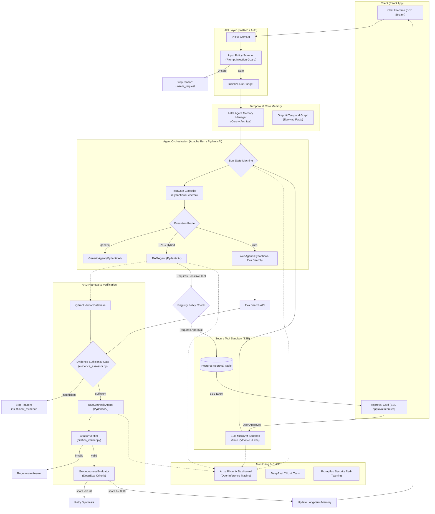

# Scrutinize System Architecture V4

**Version:** 4.0  
**Status:** Draft / Proposed  
**Last Updated:** July 2026  
**Core Objective:** Upgrade Scrutinize from a prototype RAG pipeline to a production-grade, policy-controlled, citation-verified, and sandboxed agentic knowledge system.

---

## 1. Executive Summary

Scrutinize V4 bridges the gap between raw LLM capabilities and secure, deterministic enterprise software. The V4 architecture embeds a strict validation harness *around* the generative models, ensuring that the system is safe from prompt-injection attacks, guarantees citation truthfulness, enforces budget limits, executes tools in secure isolation, and provides absolute observability.

Rather than building these validation and orchestration systems from scratch, Scrutinize V4 adopts a modern, modular stack of 2026 AI tools to implement the required controls:

1. **State Orchestration & Type Safety:** **Apache Burr** (state machine flow) and **PydanticAI** (strict JSON schemas and tool signatures).
2. **Temporal & Persistent Memory:** **Letta** (long-term memory state) and **Graphiti** (temporal graph to manage evolving context).
3. **Evidence & Citation Validation:** Custom **Evidence Assessor** and **Citation Verifier** services integrated directly into the Burr state flow.
4. **Sandboxed Code Execution:** **E2B Sandboxes** (Firecracker MicroVMs) to execute agent-generated code safely.
5. **Observability & Evaluation:** **OpenInference + Arize Phoenix** (tracing), **DeepEval** (CI unit-testing RAG metrics), and **Promptfoo** (adversarial red-teaming).
6. **Advanced Ingest & Retrieval:** **Exa Search API** (clean web markdown scraping) alongside **Qdrant** (hybrid dense/sparse vector retrieval).

---

## 2. High-Level Architecture Flow

The request execution pipeline follows a visual sequence of safety checks, state transitions, retrieval validations, and execution gates:



---

## 3. Structural Components & Technology Stack

### 3.1. Agent Flow & Orchestration Layer (Apache Burr + PydanticAI)
* **PydanticAI:** Defines all agent system structures, input contracts, and output contracts. By wrapping the routing agent, RAG synthesis agent, and validation agent in PydanticAI models, Scrutinize guarantees type safety. If the LLM generates an invalid output schema, PydanticAI handles the validation failure and prompts the model to auto-correct itself.
* **Apache Burr:** Rather than chaining raw code, the overall execution flow is compiled into a Burr state machine. The state machine visually logs every transition (e.g., `input_validated` → `routed` → `retrieved` → `validated_citations` → `responded`). This isolates logic steps, supports pausing for user actions (like approvals), and makes the execution fully inspectable.

### 3.2. Temporal Memory & Project Context (Letta + Graphiti)
* **Letta (formerly MemGPT):** Replaces short-term chat-message truncation. Letta maintains a permanent memory partition (Core Memory) per user/project and a searchable archive (Archival Memory) of previous conversations.
* **Graphiti:** Works alongside Qdrant. For project-scoped RAG, facts evolve over time (e.g., "The team switched from Postgres to Neon"). Graphiti parses files and text to extract entity-relationship triplets with active timestamps, resolving conflicts so that older, superseded documents do not hallucinate out-of-date answers.

### 3.3. Validation Harness Layer (Custom Gates + DeepEval)
* **Evidence Sufficiency Gate (`evidence_assessor.py`):** Runs after vector retrieval. An LLM checks if the retrieved text chunks actually contain the facts needed to answer the user query. If the retrieved content is irrelevant or missing, the gate triggers an immediate abstention flow rather than generating a guessed answer.
* **Citation Verifier (`citation_verifier.py`):** Automatically extracts citations and factual claims from the draft response. It verifies deterministically:
  1. Does the cited source ID exist in the Qdrant retrieval list?
  2. Does the cited text chunk semantically match and support the claim?
* **Groundedness Evaluator (`groundedness_evaluator.py`):** Scores the answer on a scale of `0.0` to `1.0`. Any draft scoring below `0.90` is rejected and triggers a regeneration retry.

### 3.4. Secure Execution & Tool Permissions (E2B Sandboxes)
* **Tool Registry & Permission Checker:** Determines if a proposed tool call is allowed for the user's role and project scope.
* **Human Approval Gate:** If the tool is flagged as "sensitive" or "destructive" (e.g., delete files, invoke third-party transactional APIs), the Burr flow pauses, saves a record to the `tool_approvals` table, and broadcasts an SSE event `approval.required` to the client. The agent waits until the user approves or rejects the action via the UI.
* **E2B Sandbox:** When the agent needs to execute generated code (e.g., Python calculations on retrieved data sheets, file generation), the code is executed inside a secure, throwaway E2B Firecracker MicroVM, keeping the main backend server completely isolated.

### 3.5. Observability & CI Hardening (OpenInference + Phoenix / DeepEval / Promptfoo)
* **OpenTelemetry + Phoenix:** All LLM calls, tool execution timelines, and database latencies are instrumented using the OpenInference standard. The data traces are pushed to a local Phoenix instance, allowing developers to inspect full execution timelines, token usages, and costs in real time.
* **DeepEval / Promptfoo:** Used inside the CI/CD pipeline to evaluate prompt regressions, groundedness performance, and jailbreak security (prompt injection) on every PR before merging code.

---

## 4. API Design Additions (FastAPI V3)

### 4.1. SSE Streaming & Chat
* **`POST /v3/chat`**
  Initiates a stateful chat run in the Burr engine. Streams events to the client:
  * `status` (e.g., "analyzing sources", "verifying claims")
  * `text` (synthesis chunk)
  * `approval.required` (blocking tool confirmation request)
  * `error` / `complete`

### 4.2. Tool Approvals
* **`POST /v3/approvals/{approval_id}/decide`**
  Submits a user decision (`approve` or `reject`) for a paused tool execution.
* **`GET /v3/approvals/pending`**
  Fetches outstanding approval actions for the active project.

---

## 5. Directory Mapping

The next version will add structure under the following packages:

```text
backend/app/
├── api/v3/                      # FastAPI V3 Routes (Chat, Approvals, Run Observability)
│   ├── chat.py
│   ├── approvals.py
│   └── telemetry.py
│
├── security/                    # Defense layers
│   ├── input_policy.py          # User message prompt-injection filter
│   ├── content_scanner.py       # Retrieved file/web injection filter
│   └── redaction.py             # Redacts sensitive data from logging
│
├── services/v3/                 # Core RAG Harness Logic
│   ├── evidence_assessor.py     # Sufficiency gate
│   ├── citation_verifier.py     # Citation validation
│   ├── groundedness_evaluator.py# Groundedness checks
│   ├── run_budget.py            # Enforces call, token, and cost caps
│   ├── memory_manager.py        # Letta and Graphiti integration client
│   └── burr_orchestrator.py     # Apache Burr state flow runner
│
├── tools/                       # Tool policy and registry
│   ├── policy.py                # Defines risk levels and permissions
│   ├── registry.py              # Exposes validated agent tools
│   ├── permission_checker.py    # Checks role-based access to tools
│   └── execution_sandbox.py     # E2B Sandbox launcher
│
└── evals/                       # Automated performance & safety tests
    ├── datasets/                # JSONL test files
    ├── graders/                 # Evaluation rubrics
    └── runner.py                # Evals execution runner
```
