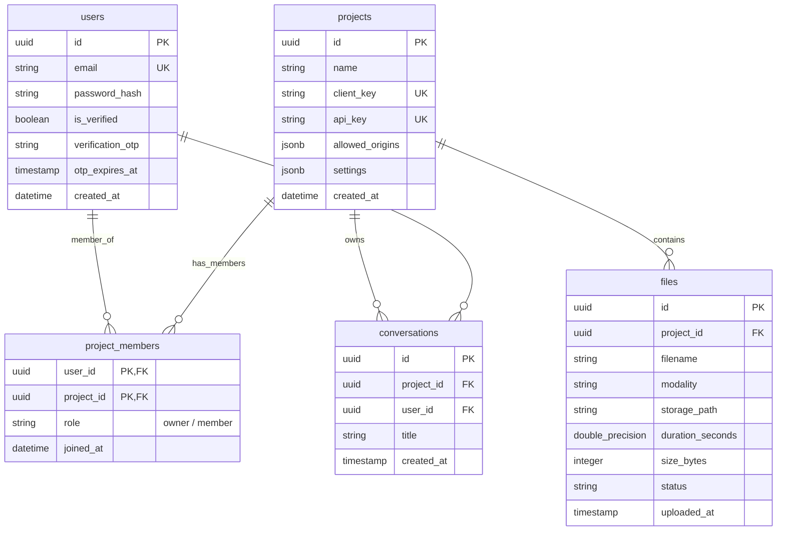
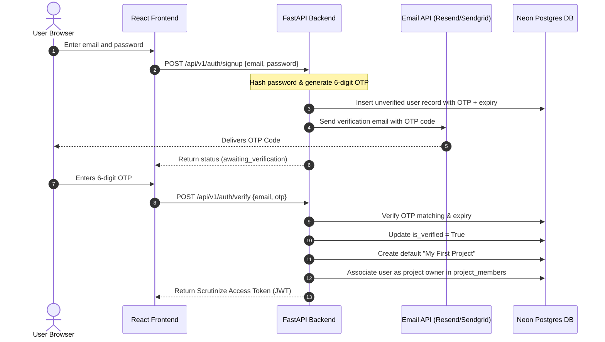

# Per-Person Authentication and Multi-Project Architecture

This document describes the final approved design, system flows, runbooks list, and implementation plan to evolve Scrutinize from its current single project-level authentication (where project name + password hashes/keys map 1:1) to a modern, robust **Per-Person Authentication and Multi-Project tenancy model**.

---

## 1. Core Architecture Decisions (Aligned with User Inputs)

1. **Email & Password Login with OTP Verification**:
   * Skip Google Authentication for now, but keep placeholder hooks in the UI/endpoints to easily add it later without breaking the architecture.
   * New signups are verified using a one-time passcode (OTP) sent to the registered email. We will use a generous free-tier email provider (e.g., Resend, Mailgun, or SendGrid) to dispatch the emails.
   * Authentication is powered by signed custom JWT (JSON Web Tokens) generated by the backend upon successful validation.
2. **Glassmorphic Lazy-Loaded Sidebar Projects**:
   * Sidebar will feature a project listing showing 3 projects with an expandable chevron.
   * Clicking the expand icon loads *all* user projects lazily from `/api/v1/projects` (recently accessed/created first).
   * When expanded, the sidebar becomes scrollable using a customized, clean glassmorphism scrollbar style matching the workspace aesthetics.
3. **Payload-Based Vector Database Isolation**:
   * To prevent high database overhead, vector databases are isolated using Qdrant payload filters rather than spinning up individual collection endpoints.
   * Queries include metadata payload filters: `project_id == active_project_id` to strictly limit responses.
4. **Per-Project API Keys**:
   * To maintain secure widget and external integration isolation, each project maintains its own private/public API keys (`scrutinize_pk_...` / `scrutinize_sk_...`). 
   * When calling API routes directly from the Scrutinize frontend web client, the active user's JWT authorization context + the specific header `X-Project-Id` (resolved by database membership check) is utilized.

---

## 2. Updated Relational Database Schema & Migration Blueprint

Based on the [schema.md](file:///c:/Programming/Projects/01_ACTIVE/ai_news/Scrutinize/docs/db/schema.md), the database holds `projects`, `files`, `processing_jobs`, `segments`, `pipeline_runs`, and `pipeline_steps`. We will migrate the schema using the following blueprint.

### Entity Relationship Model



### SQL Migration Steps (Postgres)
We will execute the following SQL changes:

```sql
-- 1. Create users table
CREATE TABLE users (
    id UUID PRIMARY KEY DEFAULT gen_random_uuid(),
    email VARCHAR(255) UNIQUE NOT NULL,
    password_hash VARCHAR(255) NOT NULL,
    is_verified BOOLEAN DEFAULT FALSE NOT NULL,
    verification_otp VARCHAR(6),
    otp_expires_at TIMESTAMP WITH TIME ZONE,
    created_at TIMESTAMP WITH TIME ZONE DEFAULT NOW() NOT NULL
);

-- 2. Create project_members association table
CREATE TABLE project_members (
    user_id UUID NOT NULL REFERENCES users(id) ON DELETE CASCADE,
    project_id UUID NOT NULL REFERENCES projects(id) ON DELETE CASCADE,
    role VARCHAR(50) DEFAULT 'member' NOT NULL,
    joined_at TIMESTAMP WITH TIME ZONE DEFAULT NOW() NOT NULL,
    PRIMARY KEY (user_id, project_id)
);

-- 3. Backfill legacy data (if password_hash exists on projects, map existing password-based projects to a system admin user or decouple)
ALTER TABLE projects ALTER COLUMN password_hash DROP NOT NULL;

-- 4. Create index on project_members for performance lookup
CREATE INDEX idx_project_members_user_id ON project_members(user_id);
```

---

## 3. Data & Authentication Flow

### Sign-up with OTP Verification Flow



---

## 4. UI Layout & View Specifications

```
+--------------------------------------------------------------------------+
|  Logo   |                                                                |
|  S      |  [Library] [Upload] [Chat]                           Profile   |
|         |                                                                |
|---------+----------------------------------------------------------------|
|         |                                                                |
| Sidebar |                   MIDDLE SECTION (If no project selected)      |
|         |                                                                |
| - Chat  |    +------------------------------------------------------+    |
| - Lib   |    |         TOP 5 PROJECTS (RANDOM SVG DESIGNS)          |    |
| - Sett  |    |  [Proj A]    [Proj B]    [Proj C]   [Proj D]  [Proj E]   |    |
|         |    |  (SVG Icon)  (SVG Icon)  (SVG Icon) (SVG)     (SVG)    |    |
| Projects|    +------------------------------------------------------+    |
| [P1]    |                                                                |
| [P2]    |                   MIDDLE SECTION (If project selected)         |
| [P3]    |                                                                |
| [v] Exp |                   Chat history feed / messages                 |
|         |                                                                |
|         |                                                                |
|         |  +----------------------------------------------------------+  |
|         |  |  Chat Input Box (Docked at the Bottom)                   |  |
|         |  +----------------------------------------------------------+  |
+---------+----------------------------------------------------------------+
```

### Component Specifications:
1. **[SearchView.tsx](file:///c:/Programming/Projects/01_ACTIVE/ai_news/Scrutinize/frontend/src/components/SearchView.tsx)**:
   * **Layout restructure**: The central main viewport dynamically changes based on `activeProjectId`.
   * **Unselected Project Mode**: Displays the "Top 5 Project Cards" using premium random inline SVG abstract art as placeholders. 
   * **Selected Project Mode**: Automatically displays the Chat input box docked at the bottom and opens the RAG context history for that specific project.
2. **[ChatInput.tsx](file:///c:/Programming/Projects/01_ACTIVE/ai_news/Scrutinize/frontend/src/components/ChatInput.tsx)**:
   * Pinned strictly at the bottom layout container. Inactive input mode shows if no project is active, displaying a prompt to choose or create a project.
3. **[Sidebar.tsx](file:///c:/Programming/Projects/01_ACTIVE/ai_news/Scrutinize/frontend/src/components/Sidebar.tsx)**:
   * Shows a **Projects** collapsible sub-panel.
   * Limits view to 3 projects, followed by an **Expand [v]** chevron.
   * Expanding triggers a lazy-loading query to fetch projects ordered by last accessed.
   * Glassmorphism styles are injected into the sidebar scrollable track:
     ```css
     .glass-sidebar-scroll::-webkit-scrollbar {
         width: 6px;
     }
     .glass-sidebar-scroll::-webkit-scrollbar-track {
         background: rgba(255, 255, 255, 0.05);
         backdrop-filter: blur(10px);
     }
     .glass-sidebar-scroll::-webkit-scrollbar-thumb {
         background: rgba(255, 255, 255, 0.25);
         border-radius: 4px;
         border: 1px solid rgba(255, 255, 255, 0.1);
     }
     ```
4. **[LibraryView.tsx](file:///c:/Programming/Projects/01_ACTIVE/ai_news/Scrutinize/frontend/src/components/LibraryView.tsx)**:
   * If `activeProjectId` is active: fetches matching files.
   * If `activeProjectId` is null: displays a unified recent additions dashboard loading files from any projects owned by the user, paginating data lazily with infinite scroll.

---

## 5. Implementation Roadmap

### Step 1: Database Migration
* Add DB schemas via Alembic.
* Add seed/migration query to move existing single-tenant parameters to the updated layout.

### Step 2: Backend Auth & Verification Routing
* Add `backend/app/services/email_service.py` to dispatch OTP codes.
* Add POST `/auth/signup`, POST `/auth/verify`, and POST `/auth/login` endpoints.
* Implement JWT validation middleware.

### Step 3: Frontend Views & Glassmorphic Components
* Inject user context hooks to handle state transition.
* Refactor Sidebar, SearchView bottom docking, and Project Selection card components.

---

## 6. Required Setup Runbooks
The following documentation runbooks will be generated inside the [docs/runbooks](file:///c:/Programming/Projects/01_ACTIVE/ai_news/Scrutinize/docs/runbooks) directory:

1. **`email_provider_setup.md`**: Guide to obtaining free-tier email credentials (e.g. Resend / SendGrid), configuring SMTP/API keys in `.env`, and customized HTML templates for OTP deliveries.
2. **`database_migration.md`**: Detailed migration command instructions using Alembic to upgrade tables without data corruption.
3. **`jwt_security_policy.md`**: Cryptographic keys config procedures to generate secret values and configure signature expiry thresholds.
