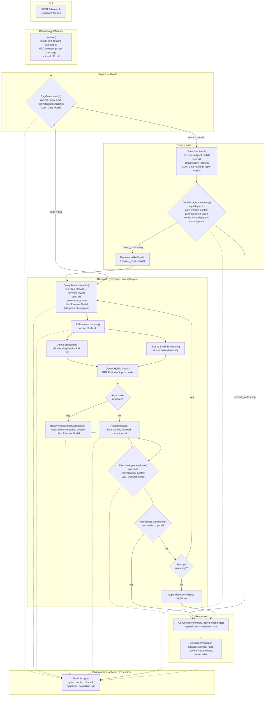
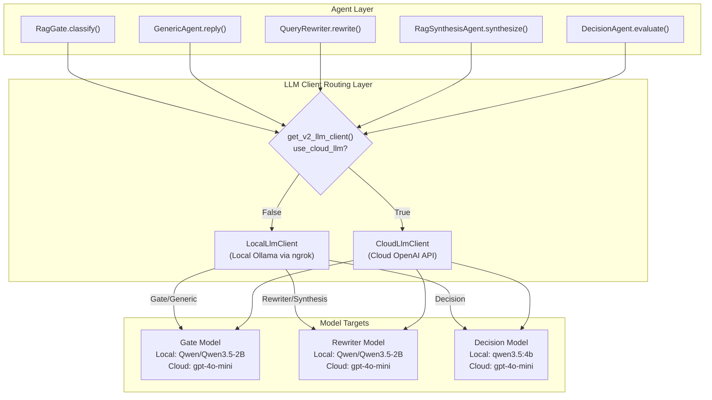

# v2 Search Pipeline

Architecture for `backend/app/services/v2/` as wired by `PipelineOrchestrator` (`POST /v2/search`).

## Flowchart Diagram

## LLM Running Placements & Client Routing Layer

Depending on the `USE_CLOUD_LLM` flag, all LLM calls are routed either locally or to OpenAI:

## Component map

| Module | Role | LLM / external |
|--------|------|----------------|
| `conversation_memory.py` | Rolling snapshot of last 10 chat exchanges with UTC timestamps | — |
| `rag_gate.py` | Route `generic` vs `rag` using current query + full conversation; optional generic reply | Gate Model |
| `query_rewriter.py` | Keyword-focused rewrite (RAG path only); uses feedback on retry | Rewriter Model |
| `generic_agent.py` | Fallback reply when gate routes generic without reply | Gate Model |
| `rrf_retriever.py` | Orchestrates query embedding and retrieves top-k matching documents from Qdrant | Embedding Service + Qdrant (no LLM) |
| `retrieval_utils.py` | Qdrant hit → `SearchSource` | — |
| `rag_synthesis_agent.py` | Grounded answer from top-5 chunks | Rewriter Model |
| `decision_agent.py` | Score draft answer; trigger retry or RAG escalation | Decision Model |
| `pipeline_orchestrator.py` | Wires stages, retry loop, escalation, and logging | — |
| `pipeline_logger.py` | Writes steps (gate, rewrite, retrieval, synthesis, evaluation) to Postgres | Neon Postgres |
| `llm_clients/base.py` | Abstract base class for the LLM execution client | — |
| `llm_clients/local.py` | OpenAI-compatible HTTP client for local model host (ngrok/Ollama) | Local Ollama |
| `llm_clients/cloud.py` | OpenAI API client for cloud model host | OpenAI |

## Retrieval detail

On each RAG attempt, `RrfRetriever`:

1. Embeds the **rewritten** query via `EmbeddingService` (Dense Vector).
2. Generates the lexical sparse representation via the local `fastembed` model (Sparse Vector).
3. Queries both indexes concurrently in Qdrant and combines them natively using **Reciprocal Rank Fusion (RRF)**.
4. Returns those `SearchSource` chunks to synthesis.

Defaults: `v2_rrf_top_k=5`, `v2_max_pipeline_attempts=2`, `v2_confidence_threshold=0.7`.

