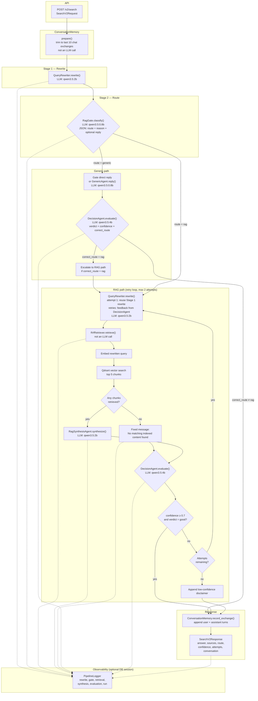

# v2 Search Pipeline

Architecture for `backend/app/services/v2/` as wired by `PipelineOrchestrator` (`POST /v2/search`).

## Component map

| Module | Role | LLM / external |
|--------|------|----------------|
| `conversation_memory.py` | Rolling snapshot of last 10 chat exchanges with UTC timestamps | — |
| `query_rewriter.py` | Keyword-focused rewrite; uses feedback on RAG retry | qwen3.5:2b |
| `rag_gate.py` | Route `generic` vs `rag`; optional generic reply | qwen3.5:0.8b |
| `generic_agent.py` | Fallback reply when gate routes generic without reply | qwen3.5:0.8b |
| `rrf_retriever.py` | Qdrant dense search on rewritten query | Qdrant (no LLM) |
| `retrieval_utils.py` | Qdrant hit → `SearchSource` | — |
| `rag_synthesis_agent.py` | Grounded answer from top-5 chunks | qwen3.5:2b |
| `decision_agent.py` | Score draft answer; trigger retry or RAG escalation | qwen3.5:4b |
| `pipeline_orchestrator.py` | Wires stages, retry loop, escalation | — |
| `pipeline_logger.py` | Persists run steps when DB session present | — |
| `local_llm_client.py` | HTTP client to local model host (ngrok/Ollama) | — |

## Retrieval detail

On each RAG attempt, `RrfRetriever`:

1. Embeds the **rewritten** query via `EmbeddingService`.
2. Runs one Qdrant dense search with `top_k = v2_rrf_top_k` (default **5**).
3. Returns those `SearchSource` chunks to synthesis.

Defaults: `v2_rrf_top_k=5`, `v2_max_pipeline_attempts=2`, `v2_confidence_threshold=0.7`.
