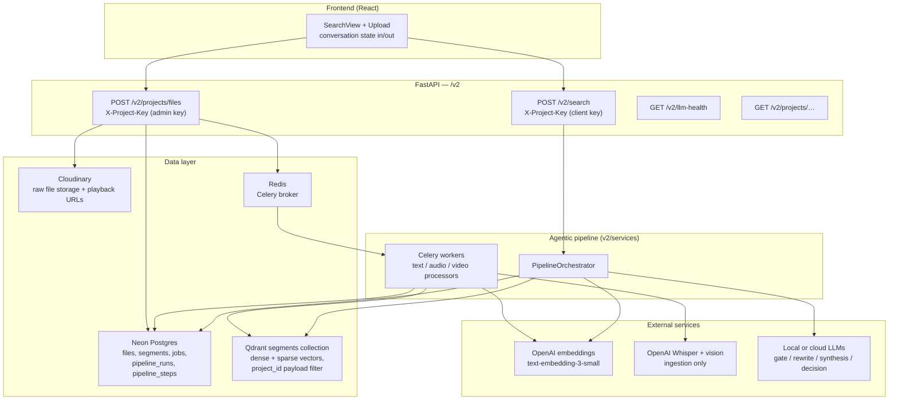
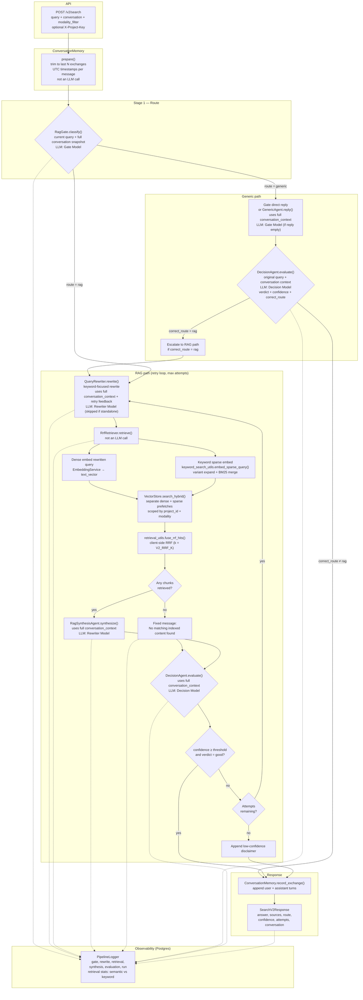
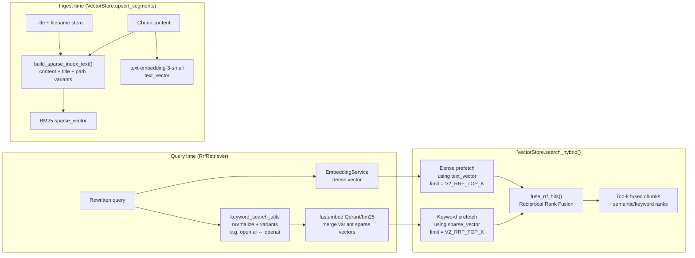
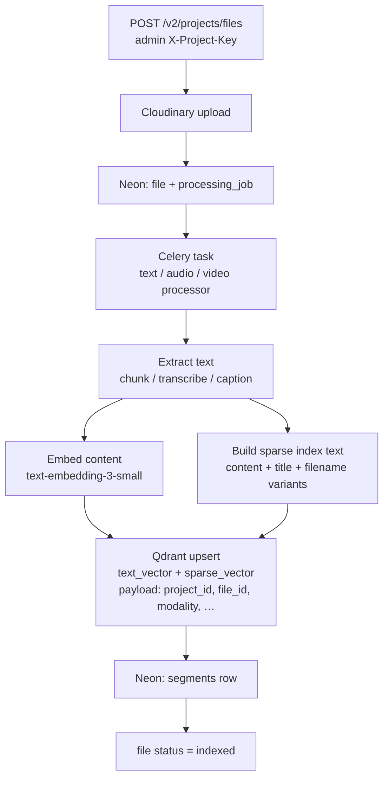
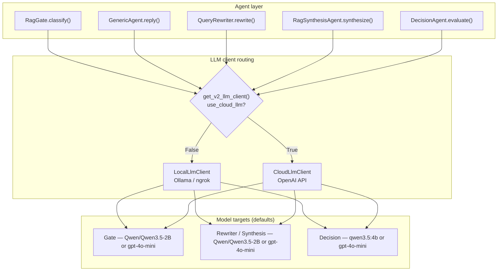

# Scrutinize Architecture Diagrams (v2)

Visual reference for the **active v2 stack** — agentic RAG search, hybrid retrieval, project-scoped ingestion, and pipeline observability.

Entry points: `POST /v2/search`, `POST /v2/projects/files`, `GET /v2/llm-health`  
Orchestrator: `backend/app/services/v2/pipeline_orchestrator.py`

---

## 1. System context

```mermaid
flowchart TB
    subgraph Client["Frontend (React)"]
        UI["SearchView + Upload<br/>conversation state in/out"]
    end

    subgraph API["FastAPI — /v2"]
        SEARCH["POST /v2/search<br/>X-Project-Key (client key)"]
        UPLOAD["POST /v2/projects/files<br/>X-Project-Key (admin key)"]
        HEALTH["GET /v2/llm-health"]
        PROJ["GET /v2/projects/…"]
    end

    subgraph Agents["Agentic pipeline (v2/services)"]
        ORCH["PipelineOrchestrator"]
        WORKERS["Celery workers<br/>text / audio / video processors"]
    end

    subgraph External["External services"]
        OPENAI_EMB["OpenAI embeddings<br/>text-embedding-3-small"]
        OPENAI_MEDIA["OpenAI Whisper + vision<br/>ingestion only"]
        LLM["Local or cloud LLMs<br/>gate / rewrite / synthesis / decision"]
    end

    subgraph Data["Data layer"]
        NEON["Neon Postgres<br/>files, segments, jobs,<br/>pipeline_runs, pipeline_steps"]
        QDRANT["Qdrant segments collection<br/>dense + sparse vectors,<br/>project_id payload filter"]
        CDN["Cloudinary<br/>raw file storage + playback URLs"]
        REDIS["Redis<br/>Celery broker"]
    end

    UI --> SEARCH
    UI --> UPLOAD
    SEARCH --> ORCH
    UPLOAD --> CDN
    UPLOAD --> NEON
    UPLOAD --> REDIS
    REDIS --> WORKERS
    WORKERS --> OPENAI_EMB
    WORKERS --> OPENAI_MEDIA
    WORKERS --> QDRANT
    WORKERS --> NEON
    ORCH --> LLM
    ORCH --> OPENAI_EMB
    ORCH --> QDRANT
    ORCH --> NEON
```

Each **project** has its own document corpus. Uploads and Qdrant points are tagged with `project_id`; search with a client key only retrieves that project's segments.

---

## 2. Search pipeline

```mermaid
flowchart TD
    subgraph API["API"]
        REQ["POST /v2/search<br/>query + conversation + modality_filter<br/>optional X-Project-Key"]
    end

    subgraph Memory["ConversationMemory"]
        PREP["prepare()<br/>trim to last N exchanges<br/>UTC timestamps per message<br/>not an LLM call"]
    end

    subgraph Stage1["Stage 1 — Route"]
        GATE{"RagGate.classify()<br/>current query + full conversation snapshot<br/>LLM: Gate Model"}
    end

    subgraph GenericPath["Generic path"]
        GREPLY["Gate direct reply<br/>or GenericAgent.reply()<br/>uses full conversation_context<br/>LLM: Gate Model (if reply empty)"]
        GDEC{"DecisionAgent.evaluate()<br/>original query + conversation context<br/>LLM: Decision Model<br/>verdict + confidence + correct_route"}
        GESCALATE["Escalate to RAG path<br/>if correct_route = rag"]
    end

    subgraph RAGPath["RAG path (retry loop, max attempts)"]
        RW["QueryRewriter.rewrite()<br/>keyword-focused rewrite<br/>uses full conversation_context + retry feedback<br/>LLM: Rewriter Model (skipped if standalone)"]
        RRF["RrfRetriever.retrieve()<br/>not an LLM call"]
        DENSE["Dense embed rewritten query<br/>EmbeddingService → text_vector"]
        KW["Keyword sparse embed<br/>keyword_search_utils.embed_sparse_query()<br/>variant expand + BM25 merge"]
        HYBRID["VectorStore.search_hybrid()<br/>separate dense + sparse prefetches<br/>scoped by project_id + modality"]
        FUSE["retrieval_utils.fuse_rrf_hits()<br/>client-side RRF (k = V2_RRF_K)"]
        EMPTY{"Any chunks<br/>retrieved?"}
        SYN["RagSynthesisAgent.synthesize()<br/>uses full conversation_context<br/>LLM: Rewriter Model"]
        NOIDX["Fixed message:<br/>No matching indexed content found"]
        RDEC{"DecisionAgent.evaluate()<br/>uses full conversation_context<br/>LLM: Decision Model"}
        OK{"confidence ≥ threshold<br/>and verdict = good?"}
        RETRY{"Attempts<br/>remaining?"}
        DISCLAIM["Append low-confidence disclaimer"]
    end

    subgraph Output["Response"]
        RESP["SearchV2Response<br/>answer, sources, route,<br/>confidence, attempts, conversation"]
        RECORD["ConversationMemory.record_exchange()<br/>append user + assistant turns"]
    end

    subgraph Observability["Observability (Postgres)"]
        LOG["PipelineLogger<br/>gate, rewrite, retrieval,<br/>synthesis, evaluation, run<br/>retrieval stats: semantic vs keyword"]
    end

    REQ --> PREP --> GATE
    GATE -->|"route = generic"| GREPLY --> GDEC
    GDEC -->|"correct_route ≠ rag"| RECORD
    GDEC -->|"correct_route = rag"| GESCALATE --> RW
    GATE -->|"route = rag"| RW

    RW --> RRF
    RRF --> DENSE
    RRF --> KW
    DENSE --> HYBRID
    KW --> HYBRID
    HYBRID --> FUSE --> EMPTY
    EMPTY -->|"no"| NOIDX --> RDEC
    EMPTY -->|"yes"| SYN --> RDEC
    RDEC --> OK
    OK -->|"yes"| RECORD
    OK -->|"no"| RETRY
    RETRY -->|"yes"| RW
    RETRY -->|"no"| DISCLAIM --> RECORD
    RECORD --> RESP

    GATE -.-> LOG
    RW -.-> LOG
    RRF -.-> LOG
    SYN -.-> LOG
    NOIDX -.-> LOG
    GDEC -.-> LOG
    RDEC -.-> LOG
    RESP -.-> LOG
```

---

## 3. Hybrid retrieval (dense + keyword)

Both paths search the same Qdrant `segments` collection. Dense uses raw chunk `content`; keyword uses enriched BM25 text built at ingest time.

### Spelling Normalization & Variant Expansion (`keyword_search_utils.py`)
To ensure high recall for keyword search across spelling variations, spacing, and symbols, the system applies these rules at both ingest (indexing) and search (querying) time:
- **Normalization**: Text is unified to lowercase, Unicode-normalized (NFKC), and punctuation characters (like hyphens, underscores, etc.) are converted to spaces.
- **Compound Collapsing**: Alphanumeric whitespace is stripped to generate collapsed variants (e.g. `open ai` -> `openai`) so searching for either retrieves the correct chunk.
- **Filename Stem Extraction**: Searchable stems are extracted from file paths/URLs by stripping directory prefixes, extensions, and URL encoding.
- **Index Enrichment**: Enriches the text passed to the sparse embedder with content, title, and filename stem variations, optimizing the matching accuracy.

```mermaid
flowchart LR
    subgraph Query["Query time (RrfRetriever)"]
        Q["Rewritten query"]
        Q --> D_EMB["EmbeddingService<br/>dense vector"]
        Q --> K_UTIL["keyword_search_utils<br/>normalize + variants<br/>e.g. open ai ↔ openai"]
        K_UTIL --> K_EMB["fastembed Qdrant/bm25<br/>merge variant sparse vectors"]
    end

    subgraph Qdrant["VectorStore.search_hybrid()"]
        D_PREF["Dense prefetch<br/>using text_vector<br/>limit = V2_RRF_TOP_K"]
        S_PREF["Keyword prefetch<br/>using sparse_vector<br/>limit = V2_RRF_TOP_K"]
        D_EMB --> D_PREF
        K_EMB --> S_PREF
        D_PREF --> RRF["fuse_rrf_hits()<br/>Reciprocal Rank Fusion"]
        S_PREF --> RRF
        RRF --> TOP["Top-k fused chunks<br/>+ semantic/keyword ranks"]
    end

    subgraph Ingest["Ingest time (VectorStore.upsert_segments)"]
        C["Chunk content"]
        T["Title + filename stem"]
        C --> SPARSE_TEXT["build_sparse_index_text()<br/>content + title + path variants"]
        T --> SPARSE_TEXT
        SPARSE_TEXT --> SPARSE_IDX["BM25 sparse_vector"]
        C --> DENSE_IDX["text-embedding-3-small<br/>text_vector"]
    end
```

**Logged per retrieval step** (`pipeline_steps.structured_output.retrieval`): `semantic_prefetch_count`, `keyword_prefetch_count`, `qdrant_retrieved_count`, RRF breakdown (`semantic_only`, `keyword_only`, `both_lists`). See [`docs/extras/logging.md`](../extras/logging.md).

---

## 4. Ingestion pipeline

```mermaid
flowchart TD
    UP["POST /v2/projects/files<br/>admin X-Project-Key"] --> STORE["Cloudinary upload"]
    STORE --> JOB["Neon: file + processing_job"]
    JOB --> CELERY["Celery task<br/>text / audio / video processor"]

    CELERY --> EXTRACT["Extract text<br/>chunk / transcribe / caption"]
    EXTRACT --> DENSE["Embed content<br/>text-embedding-3-small"]
    EXTRACT --> SPARSE["Build sparse index text<br/>content + title + filename variants"]
    DENSE --> UPSERT["Qdrant upsert<br/>text_vector + sparse_vector<br/>payload: project_id, file_id, modality, …"]
    SPARSE --> UPSERT
    UPSERT --> SEG["Neon: segments row"]
    SEG --> DONE["file status = indexed"]
```

Re-index existing files after keyword-indexing changes so sparse vectors include enriched text.

---

## 5. LLM client routing

All agent LLM calls go through `get_v2_llm_client()` (`USE_CLOUD_LLM` flag):

```mermaid
flowchart TD
    subgraph AgentLayer["Agent layer"]
        GATE_A["RagGate.classify()"]
        GEN_A["GenericAgent.reply()"]
        RW_A["QueryRewriter.rewrite()"]
        SYN_A["RagSynthesisAgent.synthesize()"]
        DEC_A["DecisionAgent.evaluate()"]
    end

    subgraph ClientRouting["LLM client routing"]
        CLIENT{"get_v2_llm_client()<br/>use_cloud_llm?"}
        LOCAL["LocalLlmClient<br/>Ollama / ngrok"]
        CLOUD["CloudLlmClient<br/>OpenAI API"]
    end

    subgraph Models["Model targets (defaults)"]
        M_GATE["Gate — Qwen/Qwen3.5-2B or gpt-4o-mini"]
        M_REWRITE["Rewriter / Synthesis — Qwen/Qwen3.5-2B or gpt-4o-mini"]
        M_DECISION["Decision — qwen3.5:4b or gpt-4o-mini"]
    end

    GATE_A --> CLIENT
    GEN_A --> CLIENT
    RW_A --> CLIENT
    SYN_A --> CLIENT
    DEC_A --> CLIENT

    CLIENT -->|"False"| LOCAL
    CLIENT -->|"True"| CLOUD

    LOCAL --> M_GATE
    LOCAL --> M_REWRITE
    LOCAL --> M_DECISION
    CLOUD --> M_GATE
    CLOUD --> M_REWRITE
    CLOUD --> M_DECISION
```

Embeddings (dense) and ingestion media APIs (Whisper, vision) always use OpenAI regardless of `USE_CLOUD_LLM`.

---

## 6. Component map

| Module | Role | LLM / external |
|--------|------|----------------|
| `pipeline_orchestrator.py` | Wires gate → generic/decision or RAG loop; escalation; logging | — |
| `conversation_memory.py` | Rolling chat snapshot (default 10 exchanges, UTC timestamps) | — |
| `conversation_format.py` | Greeting/chitchat check (`is_standalone_message`) and formatting for LLM conversation contexts | — |
| `rag_gate.py` | Route `generic` vs `rag`; optional direct generic reply | Gate model |
| `query_rewriter.py` | Keyword-focused rewrite (RAG only); retry feedback | Rewriter model |
| `generic_agent.py` | Fallback reply when gate routes generic without reply | Gate model |
| `rrf_retriever.py` | Dense + keyword retrieval orchestration | EmbeddingService + Qdrant |
| `retrieval_utils.py` | RRF fusion, `SearchSource` mapping, retrieval stats | — |
| `keyword_search_utils.py` | Spelling normalization (NFKC, lowercase), compound collapsing (`open ai` -> `openai`), and sparse index text building | fastembed BM25 |
| `vector_store.py` | Qdrant upsert/search; `search_hybrid()` with project filter | Qdrant |
| `embedding_service.py` | Dense embeddings for ingest + query | OpenAI |
| `rag_synthesis_agent.py` | Grounded answer from top-k chunks | Rewriter model |
| `decision_agent.py` | Score draft; retry or generic→RAG escalation | Decision model |
| `pipeline_logger.py` | `pipeline_runs` + `pipeline_steps` in Postgres | Neon |
| `json_utils.py` | Robust parsing of JSON structures from raw LLM responses (handling code fences) | — |
| `llm_clients/base.py` | Base client class (`BaseLlmClient`) and structured LLM response interfaces | — |
| `llm_clients/local.py` | OpenAI-compatible local HTTP client | Ollama / ngrok |
| `llm_clients/cloud.py` | OpenAI chat completions | OpenAI |
| `project_service.py` | Project keys, per-project model overrides | — |

---

## 7. API surface (v2)

| Method | Path | Auth | Purpose |
|--------|------|------|---------|
| `POST` | `/v2/search` | Optional `X-Project-Key` (client) | Agentic search pipeline |
| `POST` | `/v2/projects/files` | `X-Project-Key` (admin) | Upload + enqueue ingestion |
| `GET` | `/v2/llm-health` | — | Probe gate LLM reachability |
| `GET/POST` | `/v2/projects/…` | Admin key | Project management |

Frontend default search path: `VITE_SEARCH_API=/v2/search`.

---

## 8. Defaults (`config.py`)

| Setting | Default | Purpose |
|---------|---------|---------|
| `v2_rrf_top_k` | `5` | Fused segments returned |
| `v2_rrf_k` | `60` | RRF smoothing constant |
| `v2_max_pipeline_attempts` | `2` | RAG retry loop cap |
| `v2_confidence_threshold` | `0.7` | Decision agent exit threshold |
| `v2_conversation_window_size` | `10` | Chat exchanges kept in memory |
| `embedding_model` | `text-embedding-3-small` | Dense vectors (1536-d) |
| `qdrant_collection` | `segments` | Hybrid vector collection |
