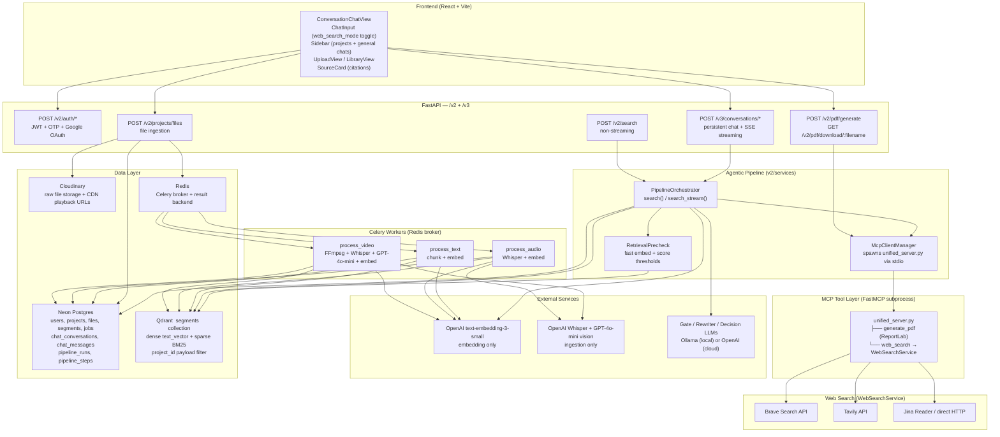
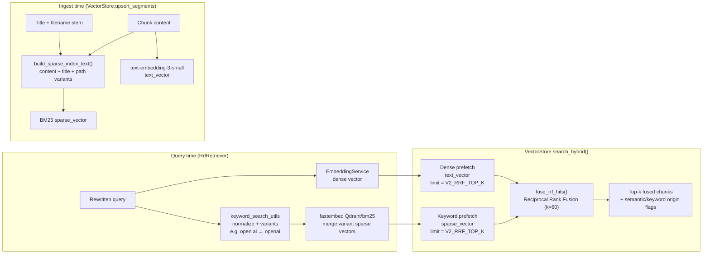
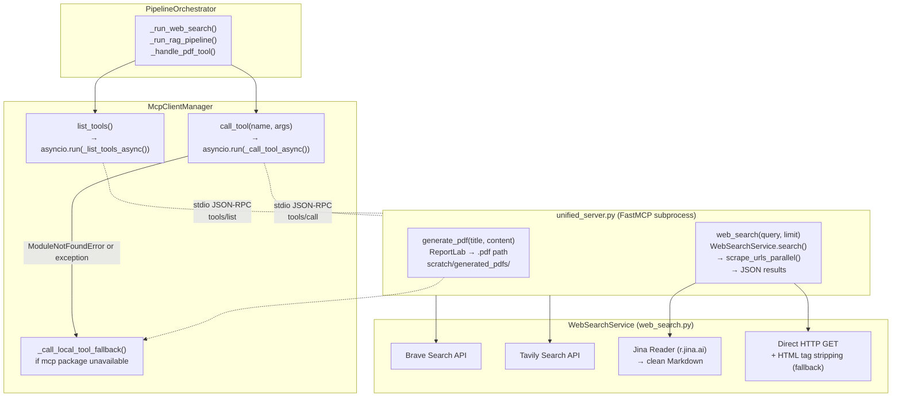
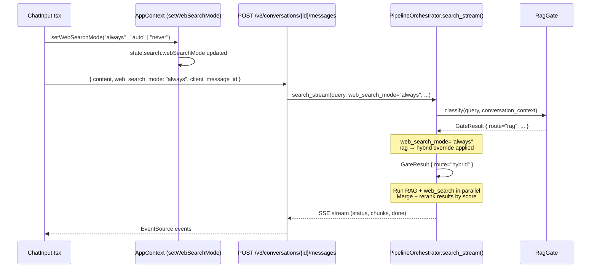
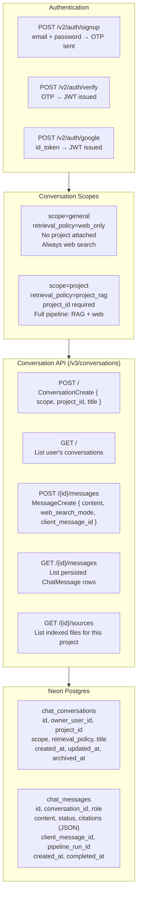
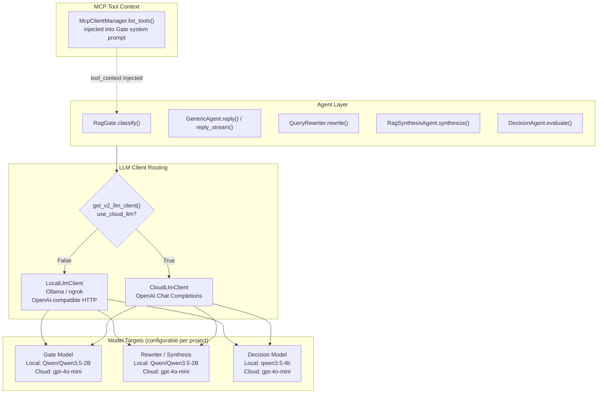
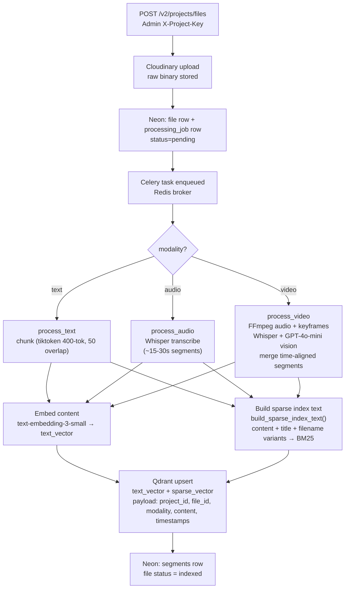

# Scrutinize Architecture Diagrams

Visual reference for the **active stack** — MCP tool-based hybrid search (RAG + web), persistent conversations, project workspaces, multi-modal ingestion, and pipeline observability.

Primary entry points:
- `POST /v3/conversations/{id}/messages` — Streaming SSE chat (current)
- `POST /v2/search` — Non-streaming search (legacy)
- `POST /v2/projects/files` — File ingestion

Orchestrator: `backend/app/services/v2/pipeline_orchestrator.py`

---

## 1. System Context

Complete view of all components and their connections:

```mermaid
flowchart TB
    subgraph Client["Frontend (React + Vite)"]
        UI["ConversationChatView\nChatInput (web_search_mode toggle)\nSidebar (projects + general chats)\nUploadView / LibraryView\nSourceCard (citations)"]
    end

    subgraph API["FastAPI — /v2 + /v3"]
        AUTH["POST /v2/auth/*\nJWT + OTP + Google OAuth"]
        SEARCH["POST /v2/search\nnon-streaming"]
        CONV["POST /v3/conversations/*\npersistent chat + SSE streaming"]
        UPLOAD["POST /v2/projects/files\nfile ingestion"]
        PDF_API["POST /v2/pdf/generate\nGET /v2/pdf/download/:filename"]
    end

    subgraph Orchestration["Agentic Pipeline (v2/services)"]
        ORCH["PipelineOrchestrator\nsearch() / search_stream()"]
        PRE["RetrievalPrecheck\nfast embed + score thresholds"]
        MGR["McpClientManager\nspawns unified_server.py via stdio"]
    end

    subgraph MCP["MCP Tool Layer (FastMCP subprocess)"]
        UNIFIED["unified_server.py\n├── generate_pdf (ReportLab)\n└── web_search → WebSearchService"]
    end

    subgraph WebSearch["Web Search (WebSearchService)"]
        BRAVE["Brave Search API"]
        TAVILY["Tavily API"]
        JINA["Jina Reader / direct HTTP"]
    end

    subgraph Workers["Celery Workers (Redis broker)"]
        WTXT["process_text\nchunk + embed"]
        WAUD["process_audio\nWhisper + embed"]
        WVID["process_video\nFFmpeg + Whisper + GPT-4o-mini + embed"]
    end

    subgraph External["External Services"]
        OPENAI_EMB["OpenAI text-embedding-3-small\nembedding only"]
        OPENAI_MEDIA["OpenAI Whisper + GPT-4o-mini vision\ningestion only"]
        LLM["Gate / Rewriter / Decision LLMs\nOllama (local) or OpenAI (cloud)"]
    end

    subgraph Data["Data Layer"]
        NEON["Neon Postgres\nusers, projects, files, segments, jobs\nchat_conversations, chat_messages\npipeline_runs, pipeline_steps"]
        QDRANT["Qdrant  segments  collection\ndense text_vector + sparse BM25\nproject_id payload filter"]
        CDN["Cloudinary\nraw file storage + CDN playback URLs"]
        REDIS["Redis\nCelery broker + result backend"]
    end

    UI --> AUTH
    UI --> CONV
    UI --> UPLOAD
    UI --> PDF_API
    CONV --> ORCH
    SEARCH --> ORCH
    ORCH --> PRE --> QDRANT
    ORCH --> MGR --> UNIFIED
    UNIFIED --> BRAVE
    UNIFIED --> TAVILY
    UNIFIED --> JINA
    PDF_API --> MGR
    ORCH --> LLM
    ORCH --> OPENAI_EMB
    ORCH --> QDRANT
    ORCH --> NEON

    UPLOAD --> CDN
    UPLOAD --> NEON
    UPLOAD --> REDIS
    REDIS --> WTXT & WAUD & WVID
    WTXT & WAUD & WVID --> OPENAI_EMB
    WVID --> OPENAI_MEDIA
    WAUD --> OPENAI_MEDIA
    WTXT & WAUD & WVID --> QDRANT
    WTXT & WAUD & WVID --> NEON
```

---

## 2. Full Query Pipeline

End-to-end routing from frontend request to SSE response:

```mermaid
flowchart TD
    subgraph API["API — /v3/conversations/{id}/messages"]
        REQ["POST body: { content, web_search_mode, client_message_id }\nSSE response: StreamingResponse"]
    end

    subgraph Memory["ConversationMemory"]
        PREP["prepare()\ntrim to last N exchanges\nUTC timestamps per message\nnot an LLM call"]
    end

    subgraph Precheck["RetrievalPrecheck (fast path)"]
        PRE{"Embed query → Qdrant top-3\nhas_corpus? tool_selected?"}
        PRE_RAG["→ route_rag\nscore ≥ high_threshold (0.025)\nor generate_pdf tool selected"]
        PRE_WEB["→ route_web\nscore ≤ low_threshold (0.012)\nor no corpus + web enabled"]
        PRE_GEN["→ route_generic\nno corpus + web disabled"]
        PRE_GATE["→ call_gate\nscore is ambiguous"]
    end

    subgraph Stage1["Stage 1 — Route (Gate LLM)"]
        GATE{"RagGate.classify()\nquery + conversation context\n+ tool_context\nLLM: Gate Model"}
        WMODE{"web_search_mode\noverride?"}
    end

    subgraph GenericPath["Generic Path"]
        GREPLY["Gate direct reply\nor GenericAgent.reply_stream()\nLLM: Gate Model"]
        GDEC{"DecisionAgent.evaluate()\nLLM: Decision Model\nverdict + confidence + correct_route"}
        GESCALATE["Escalate → RAG\nif correct_route = rag"]
    end

    subgraph WebPath["Web Path"]
        WSEARCH["McpClientManager.call_tool('web_search')\nBrave/Tavily → URLs → Jina Reader"]
        WSOURCES["web_sources as SearchSource[]"]
    end

    subgraph RAGPath["RAG Path (retry loop, max attempts)"]
        RW["QueryRewriter.rewrite()\nkeyword-focused rewrite\nLLM: Rewriter Model\n(skipped if standalone)"]
        RRF["RrfRetriever.retrieve()\nnot an LLM call"]
        DENSE["EmbeddingService\ntext_vector dense prefetch"]
        KW["keyword_search_utils\nnormalize + variants + BM25"]
        HYBRID_Q["VectorStore.search_hybrid()\nproject_id + modality filter"]
        FUSE["fuse_rrf_hits()\nReciprocal Rank Fusion (k=60)"]
        RAGSOURCES["rag_sources as SearchSource[]"]
        EMPTY{"Any chunks retrieved?"}
        NOIDX["Fixed: No indexed content found"]
    end

    subgraph MergeRank["Merge & Rerank (hybrid only)"]
        MERGE["Combine rag_sources + web_sources\nSort by score desc\nBest sources on top"]
    end

    subgraph Synthesis["Synthesis"]
        PDF_CHK{"generate_pdf\ntool requested?"}
        MCP_PDF["McpClientManager.call_tool('generate_pdf')\nReportLab → .pdf filepath"]
        SYN["RagSynthesisAgent.synthesize()\nLLM: Rewriter Model\nfull conversation context\nstreaming chunks via SSE"]
    end

    subgraph Eval["Evaluation"]
        RDEC{"DecisionAgent.evaluate()\nLLM: Decision Model"}
        OK{"verdict=good\nconfidence ≥ 0.7?"}
        RETRY{"Attempts\nremaining?"}
        DISCLAIM["Append low-confidence disclaimer"]
    end

    subgraph Output["Response & Recording"]
        RECORD["ConversationMemory.record_exchange()\nWrite ChatMessage rows to Neon\nappend user + assistant turns"]
        RESP["SSE done event\nanswer, sources, route, confidence, citations"]
    end

    subgraph Observability["Observability (Neon Postgres)"]
        LOG["PipelineLogger\npipeline_runs + pipeline_steps\ngate, rewrite, retrieval, synthesis, evaluation"]
    end

    REQ --> PREP --> PRE
    PRE -->|"score ≥ high"| PRE_RAG --> RW
    PRE -->|"score ≤ low"| PRE_WEB --> WSEARCH
    PRE -->|"no corpus"| PRE_GEN --> GREPLY
    PRE -->|"ambiguous"| PRE_GATE --> GATE

    GATE --> WMODE
    WMODE -->|"always: rag→hybrid, generic→web"| WMODE
    WMODE -->|"never: web/hybrid→rag"| WMODE
    WMODE -->|"route=generic"| GREPLY
    WMODE -->|"route=rag"| RW
    WMODE -->|"route=web"| WSEARCH
    WMODE -->|"route=hybrid"| RW

    GREPLY --> GDEC
    GDEC -->|"correct_route ≠ rag"| RECORD
    GDEC -->|"correct_route = rag"| GESCALATE --> RW

    WSEARCH --> WSOURCES

    RW --> RRF
    RRF --> DENSE & KW --> HYBRID_Q --> FUSE --> EMPTY
    EMPTY -->|"no"| NOIDX --> PDF_CHK
    EMPTY -->|"yes"| RAGSOURCES

    RAGSOURCES -->|"route=hybrid"| MERGE
    WSOURCES -->|"route=hybrid"| MERGE
    MERGE --> PDF_CHK
    RAGSOURCES -->|"route=rag"| PDF_CHK
    WSOURCES -->|"route=web"| PDF_CHK
    NOIDX --> PDF_CHK

    PDF_CHK -->|"yes"| MCP_PDF --> SYN
    PDF_CHK -->|"no"| SYN

    SYN --> RDEC --> OK
    OK -->|"yes"| RECORD
    OK -->|"no"| RETRY
    RETRY -->|"yes"| RW
    RETRY -->|"no"| DISCLAIM --> RECORD
    RECORD --> RESP

    GATE -..-> LOG
    RW -..-> LOG
    RRF -..-> LOG
    SYN -..-> LOG
    RDEC -..-> LOG
    RESP -..-> LOG
```

---

## 3. Hybrid Retrieval (Dense + Keyword)

Both paths search the same Qdrant `segments` collection. Dense uses raw chunk `content`; keyword uses enriched BM25 text built at ingest time.

### Spelling Normalization & Variant Expansion (`keyword_search_utils.py`)

Applied at both ingest and search time for high recall:
- **Normalization**: Lowercase, Unicode NFKC, punctuation → spaces
- **Compound Collapsing**: `open ai` → `openai` (and reverse)
- **Filename Stems**: Strip directory prefixes, extensions, URL encoding
- **Index Enrichment**: `content + title + filename variants` fed to BM25

```mermaid
flowchart LR
    subgraph QueryTime["Query time (RrfRetriever)"]
        Q["Rewritten query"]
        Q --> D_EMB["EmbeddingService\ndense vector"]
        Q --> K_UTIL["keyword_search_utils\nnormalize + variants\ne.g. open ai ↔ openai"]
        K_UTIL --> K_EMB["fastembed Qdrant/bm25\nmerge variant sparse vectors"]
    end

    subgraph Qdrant["VectorStore.search_hybrid()"]
        D_PREF["Dense prefetch\ntext_vector\nlimit = V2_RRF_TOP_K"]
        S_PREF["Keyword prefetch\nsparse_vector\nlimit = V2_RRF_TOP_K"]
        D_EMB --> D_PREF
        K_EMB --> S_PREF
        D_PREF --> RRF["fuse_rrf_hits()\nReciprocal Rank Fusion (k=60)"]
        S_PREF --> RRF
        RRF --> TOP["Top-k fused chunks\n+ semantic/keyword origin flags"]
    end

    subgraph Ingest["Ingest time (VectorStore.upsert_segments)"]
        C["Chunk content"]
        T["Title + filename stem"]
        C --> SPARSE_TEXT["build_sparse_index_text()\ncontent + title + path variants"]
        T --> SPARSE_TEXT
        SPARSE_TEXT --> SPARSE_IDX["BM25 sparse_vector"]
        C --> DENSE_IDX["text-embedding-3-small\ntext_vector"]
    end
```

**Logged per retrieval step** (`pipeline_steps.structured_output.retrieval`): `semantic_prefetch_count`, `keyword_prefetch_count`, `qdrant_retrieved_count`, RRF breakdown (`semantic_only`, `keyword_only`, `both_lists`).

---

## 4. MCP Tool Layer

```mermaid
flowchart TD
    subgraph Orchestrator["PipelineOrchestrator"]
        ORCH_CALL["_run_web_search()\n_run_rag_pipeline()\n_handle_pdf_tool()"]
    end

    subgraph Manager["McpClientManager"]
        LIST["list_tools()\n→ asyncio.run(_list_tools_async())"]
        CALL["call_tool(name, args)\n→ asyncio.run(_call_tool_async())"]
        FALLBACK["_call_local_tool_fallback()\nif mcp package unavailable"]
    end

    subgraph Server["unified_server.py (FastMCP subprocess)"]
        direction LR
        GEN_PDF["generate_pdf(title, content)\nReportLab → .pdf path\nscratch/generated_pdfs/"]
        WEB_SEARCH_T["web_search(query, limit)\nWebSearchService.search()\n→ scrape_urls_parallel()\n→ JSON results"]
    end

    subgraph WebSearchSvc["WebSearchService (web_search.py)"]
        BRAVE_API["Brave Search API"]
        TAVILY_API["Tavily Search API"]
        JINA_R["Jina Reader (r.jina.ai)\n→ clean Markdown"]
        DIRECT["Direct HTTP GET\n+ HTML tag stripping (fallback)"]
    end

    ORCH_CALL --> LIST
    ORCH_CALL --> CALL
    LIST -.-|"stdio JSON-RPC\ntools/list"| Server
    CALL -.-|"stdio JSON-RPC\ntools/call"| Server
    CALL -->|"ModuleNotFoundError or exception"| FALLBACK

    GEN_PDF -.-> FALLBACK
    WEB_SEARCH_T --> JINA_R
    WEB_SEARCH_T --> DIRECT
    Server --> BRAVE_API
    Server --> TAVILY_API
```

**Tool schemas** (injected into Gate LLM system prompt via `tool_context`):

| Tool | Parameters | Returns |
|---|---|---|
| `generate_pdf` | `title: str`, `content: str` | Absolute path to PDF file |
| `web_search` | `query: str`, `limit: int = 3` | JSON list of `{title, url, snippet, content}` |

---

## 5. Web Search Mode — Frontend to Backend Flow

```mermaid
sequenceDiagram
    participant FE as ChatInput.tsx
    participant CTX as AppContext (setWebSearchMode)
    participant API as POST /v3/conversations/{id}/messages
    participant ORCH as PipelineOrchestrator.search_stream()
    participant GATE as RagGate

    FE->>CTX: setWebSearchMode("always" | "auto" | "never")
    CTX->>CTX: state.search.webSearchMode updated
    FE->>API: { content, web_search_mode: "always", client_message_id }
    API->>ORCH: search_stream(query, web_search_mode="always", ...)
    ORCH->>GATE: classify(query, conversation_context)
    GATE-->>ORCH: GateResult { route="rag", ... }
    Note over ORCH: web_search_mode="always"<br/>rag → hybrid override applied
    ORCH->>ORCH: GateResult { route="hybrid" }
    Note over ORCH: Run RAG + web_search in parallel<br/>Merge + rerank results by score
    ORCH-->>API: SSE stream (status, chunks, done)
    API-->>FE: EventSource events
```

---

## 6. V3 Conversation System

```mermaid
flowchart TD
    subgraph UserAuth["Authentication"]
        SIGNUP["POST /v2/auth/signup\nemail + password → OTP sent"]
        VERIFY["POST /v2/auth/verify\nOTP → JWT issued"]
        GOOGLE["POST /v2/auth/google\nid_token → JWT issued"]
    end

    subgraph ConvScopes["Conversation Scopes"]
        GENERAL["scope=general\nretrieval_policy=web_only\nNo project attached\nAlways web search"]
        PROJECT["scope=project\nretrieval_policy=project_rag\nproject_id required\nFull pipeline: RAG + web"]
    end

    subgraph ConvAPI["Conversation API (/v3/conversations)"]
        CREATE["POST /\nConversationCreate { scope, project_id, title }"]
        LIST["GET /\nList user's conversations"]
        SEND["POST /{id}/messages\nMessageCreate { content, web_search_mode, client_message_id }"]
        GET_MSG["GET /{id}/messages\nList persisted ChatMessage rows"]
        SOURCES["GET /{id}/sources\nList indexed files for this project"]
    end

    subgraph Persistence["Neon Postgres"]
        CHATCONV["chat_conversations\nid, owner_user_id, project_id\nscope, retrieval_policy, title\ncreated_at, updated_at, archived_at"]
        CHATMSG["chat_messages\nid, conversation_id, role\ncontent, status, citations (JSON)\nclient_message_id, pipeline_run_id\ncreated_at, completed_at"]
    end

    UserAuth --> ConvScopes
    ConvScopes --> ConvAPI
    ConvAPI --> Persistence
```

**Message lifecycle statuses:** `pending → streaming → completed` (or `failed` / `cancelled`).

**Citations** are stored as JSON on each assistant `ChatMessage` — a list of `SearchSource` objects (file_id, title, url, modality, score, start_time, end_time).

---

## 7. LLM Client Routing

```mermaid
flowchart TD
    subgraph AgentLayer["Agent Layer"]
        GATE_A["RagGate.classify()"]
        GEN_A["GenericAgent.reply() / reply_stream()"]
        RW_A["QueryRewriter.rewrite()"]
        SYN_A["RagSynthesisAgent.synthesize()"]
        DEC_A["DecisionAgent.evaluate()"]
    end

    subgraph ClientRouting["LLM Client Routing"]
        CLIENT{"get_v2_llm_client()\nuse_cloud_llm?"}
        LOCAL["LocalLlmClient\nOllama / ngrok\nOpenAI-compatible HTTP"]
        CLOUD["CloudLlmClient\nOpenAI Chat Completions"]
    end

    subgraph Models["Model Targets (configurable per project)"]
        M_GATE["Gate Model\nLocal: Qwen/Qwen3.5-2B\nCloud: gpt-4o-mini"]
        M_REWRITE["Rewriter / Synthesis\nLocal: Qwen/Qwen3.5-2B\nCloud: gpt-4o-mini"]
        M_DECISION["Decision Model\nLocal: qwen3.5:4b\nCloud: gpt-4o-mini"]
    end

    subgraph ToolContext["MCP Tool Context"]
        MGR_T["McpClientManager.list_tools()\ninjected into Gate system prompt"]
    end

    AgentLayer --> CLIENT
    MGR_T -..->|"tool_context injected"| GATE_A

    CLIENT -->|"False"| LOCAL
    CLIENT -->|"True"| CLOUD

    LOCAL --> M_GATE & M_REWRITE & M_DECISION
    CLOUD --> M_GATE & M_REWRITE & M_DECISION
```

> **Note:** Dense embeddings (`text-embedding-3-small`) and ingestion media APIs (Whisper, GPT-4o-mini vision) always use OpenAI regardless of `use_cloud_llm`.

---

## 8. Ingestion Pipeline

```mermaid
flowchart TD
    UP["POST /v2/projects/files\nAdmin X-Project-Key"] --> CDN["Cloudinary upload\nraw binary stored"]
    CDN --> JOB["Neon: file row + processing_job row\nstatus=pending"]
    JOB --> CELERY["Celery task enqueued\nRedis broker"]

    CELERY --> DETECT{"modality?"}
    DETECT -->|"text"| TXT["process_text\nchunk (tiktoken 400-tok, 50 overlap)"]
    DETECT -->|"audio"| AUD["process_audio\nWhisper transcribe\n(~15-30s segments)"]
    DETECT -->|"video"| VID["process_video\nFFmpeg audio + keyframes\nWhisper + GPT-4o-mini vision\nmerge time-aligned segments"]

    TXT & AUD & VID --> EMBED["Embed content\ntext-embedding-3-small → text_vector"]
    TXT & AUD & VID --> SPARSE["Build sparse index text\nbuild_sparse_index_text()\ncontent + title + filename variants → BM25"]

    EMBED & SPARSE --> UPSERT["Qdrant upsert\ntext_vector + sparse_vector\npayload: project_id, file_id, modality, content, timestamps"]
    UPSERT --> SEG["Neon: segments row\nfile status = indexed"]
```

---

## 9. Component Map

| Module | Role | LLM / External |
|---|---|---|
| `pipeline_orchestrator.py` | Hub: wires precheck → gate → routing paths; web_search_mode override; SSE emission; logging | — |
| `retrieval_precheck.py` | Fast Qdrant probe to bypass gate LLM for unambiguous routing | EmbeddingService + Qdrant |
| `conversation_memory.py` | Rolling chat snapshot (default 10 exchanges, UTC timestamps) | — |
| `conversation_format.py` | Standalone greeting check; context formatting for LLM inputs | — |
| `rag_gate.py` | Route `rag \| web \| hybrid \| generic`; optional cached reply; tool_context injection | Gate Model |
| `query_rewriter.py` | Keyword-focused rewrite; retry feedback incorporated | Rewriter Model |
| `generic_agent.py` | Fallback conversational reply with streaming support | Gate Model |
| `rrf_retriever.py` | Dense + keyword retrieval orchestration; returns `SearchSource[]` | EmbeddingService + Qdrant |
| `retrieval_utils.py` | `fuse_rrf_hits()` RRF, `SearchSource` mapping, retrieval stats | — |
| `keyword_search_utils.py` | NFKC normalization, compound collapsing, BM25 sparse index text | fastembed BM25 |
| `vector_store.py` | Qdrant upsert / `search_hybrid()` with project + modality filter | Qdrant |
| `embedding_service.py` | Dense embeddings for ingest and query | OpenAI |
| `rag_synthesis_agent.py` | Cited, grounded answer from top-k sources (RAG, web, or hybrid) | Rewriter Model |
| `decision_agent.py` | Quality scoring; retry or generic→RAG escalation | Decision Model |
| `pipeline_logger.py` | `pipeline_runs` + `pipeline_steps` in Neon Postgres | Neon Postgres |
| `mcp_manager.py` | `McpClientManager` — spawns `unified_server.py` via stdio; fallback to local functions | FastMCP SDK |
| `mcp_servers/unified_server.py` | FastMCP server: `generate_pdf` (ReportLab) + `web_search` tool | FastMCP |
| `web_search.py` | `WebSearchService` — Brave/Tavily search + Jina Reader content scraping | Brave / Tavily / Jina |
| `json_utils.py` | Robust JSON extraction from LLM responses (handles code fences) | — |
| `llm_clients/base.py` | `BaseLlmClient` abstract class + `LlmResponse` | — |
| `llm_clients/local.py` | OpenAI-compatible local HTTP client (Ollama / ngrok) | Ollama |
| `llm_clients/cloud.py` | OpenAI Chat Completions | OpenAI |
| `auth_service.py` | Signup, OTP verify, login, Google OAuth | Resend email |
| `conversation_service.py` | CRUD for `ChatConversation` + `ChatMessage` | Neon Postgres |
| `project_service.py` | Project keys, per-project model overrides | Neon Postgres |
| `job_orchestrator.py` | Enqueue Celery tasks; poll job status | Redis + Celery |
| `fly_scaler.py` | Trigger Fly.io worker machine wakeup on upload; idle shutdown monitor | Fly Machines API |

---

## 10. API Surface

| Method | Path | Auth | Purpose |
|---|---|---|---|
| `POST` | `/v2/auth/signup` | — | Register (sends OTP) |
| `POST` | `/v2/auth/verify` | — | Verify OTP → JWT |
| `POST` | `/v2/auth/login` | — | Email/password → JWT |
| `POST` | `/v2/auth/google` | — | Google id_token → JWT |
| `GET` | `/v2/llm-health` | — | Probe gate LLM reachability |
| `POST` | `/v2/search` | Optional `X-Project-Key` | Non-streaming agentic search (legacy) |
| `GET/POST` | `/v2/projects/…` | Admin key | Project management and model config |
| `POST` | `/v2/projects/files` | Admin key | Upload + enqueue ingestion |
| `POST` | `/v2/pdf/generate` | Optional key | Compile Markdown to PDF via MCP |
| `GET` | `/v2/pdf/download/{filename}` | — | Download compiled PDF |
| `POST` | `/v3/conversations` | JWT | Create conversation (general or project) |
| `GET` | `/v3/conversations` | JWT | List user's conversations |
| `GET` | `/v3/conversations/{id}` | JWT | Get conversation details |
| `PATCH` | `/v3/conversations/{id}` | JWT | Rename or archive |
| `GET` | `/v3/conversations/{id}/messages` | JWT | List persisted messages |
| `POST` | `/v3/conversations/{id}/messages` | JWT | Send message → SSE stream |
| `GET` | `/v3/conversations/{id}/sources` | JWT | List indexed files for project |
| `POST` | `/v3/conversations/{id}/files` | JWT | Upload file to conversation's project |

---

## 11. Configuration Defaults

| Setting | Default | Purpose |
|---|---|---|
| `use_cloud_llm` | `false` | Route LLM calls to OpenAI (true) or local Ollama (false) |
| `v2_rrf_top_k` | `5` | Fused segments returned from Qdrant |
| `v2_rrf_k` | `60` | RRF smoothing constant |
| `v2_max_pipeline_attempts` | `2` | RAG retry loop cap |
| `v2_confidence_threshold` | `0.7` | Decision agent pass threshold |
| `v2_conversation_window_size` | `10` | Chat exchanges kept in rolling memory |
| `v2_retrieval_precheck_high_score` | `0.025` | Score ≥ this → skip gate, route RAG |
| `v2_retrieval_precheck_low_score` | `0.012` | Score ≤ this → skip gate, route web/generic |
| `embedding_model` | `text-embedding-3-small` | Dense vectors (1536-d) |
| `qdrant_collection` | `segments` | Hybrid vector collection |
| `enable_web_search` | `true` | Master switch for all web search paths |
| `web_search_engine` | `brave` | `"brave"` or `"tavily"` |
| `mcp_pdf_server_enabled` | `true` | Enables FastMCP tool subprocess |
| `jwt_expiry_minutes` | `1440` | JWT token TTL (24 hours) |
| `otp_expiry_minutes` | `15` | Email OTP TTL |
