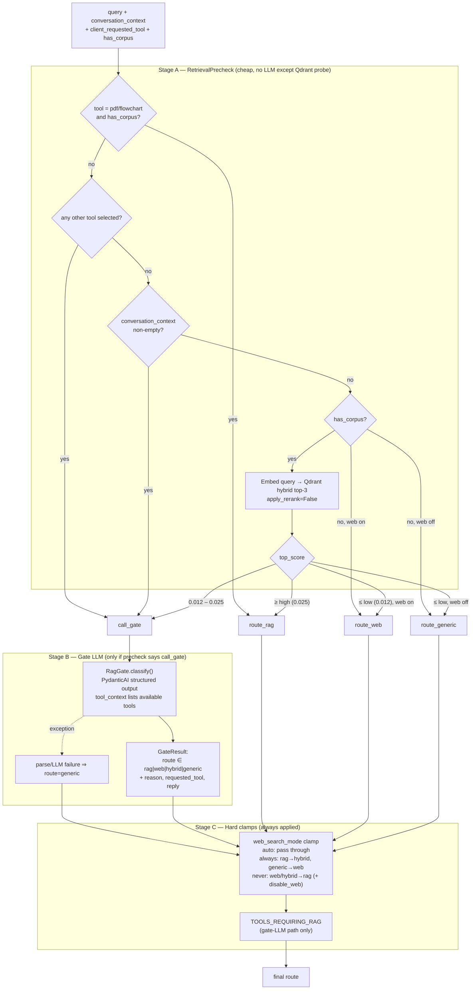
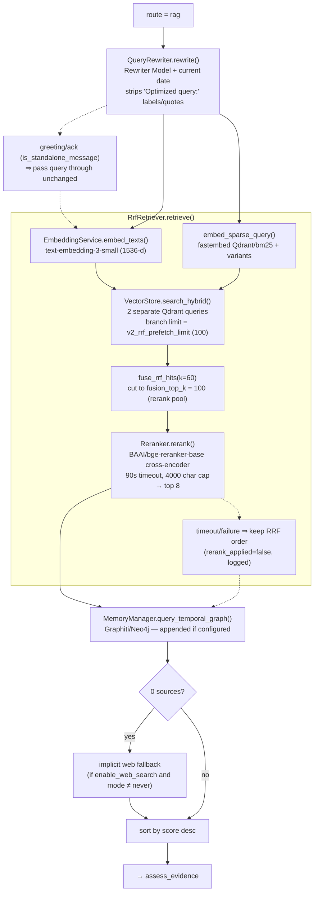
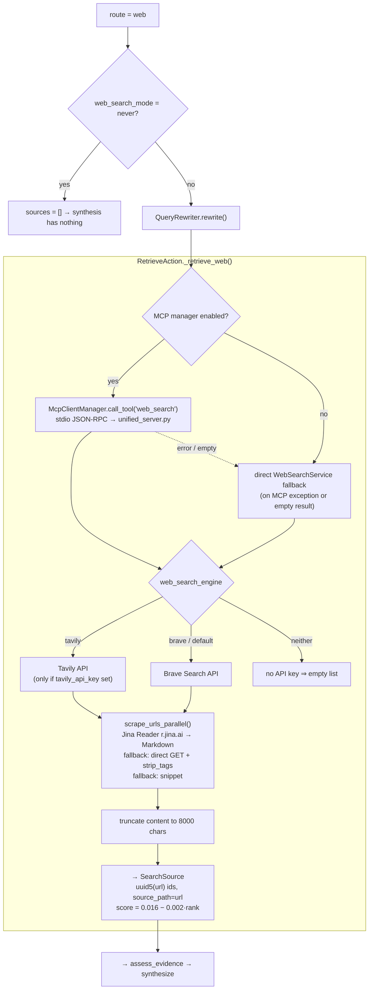
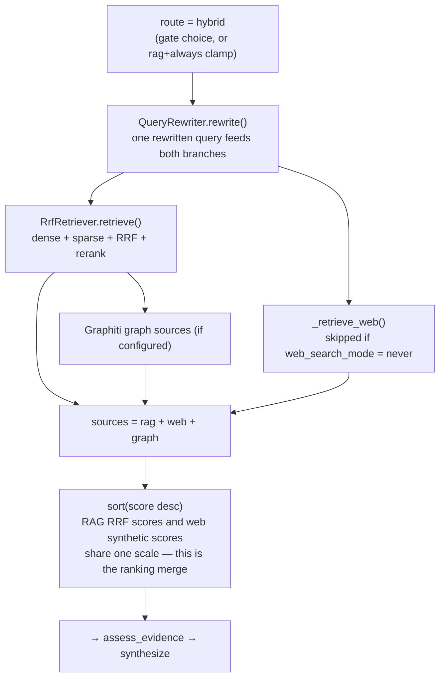
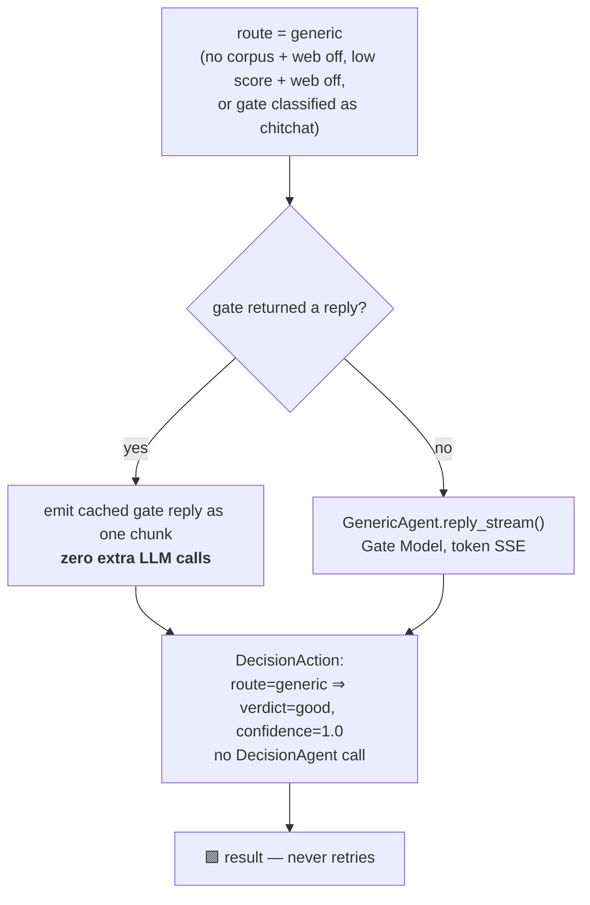
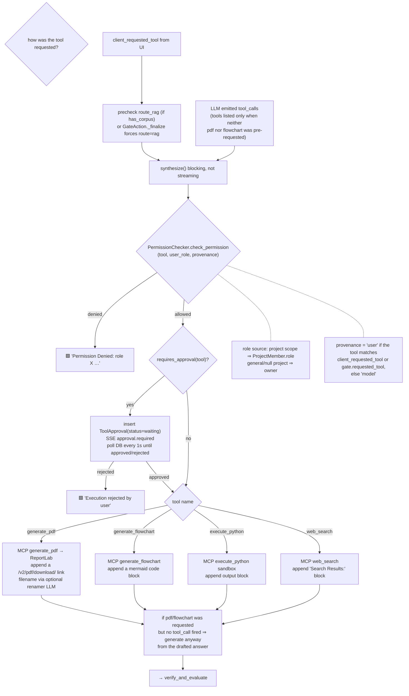
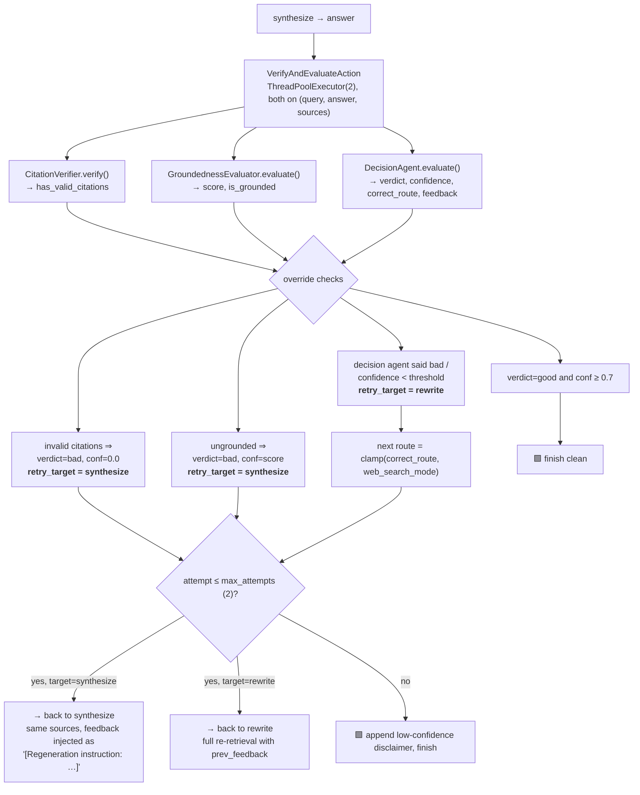
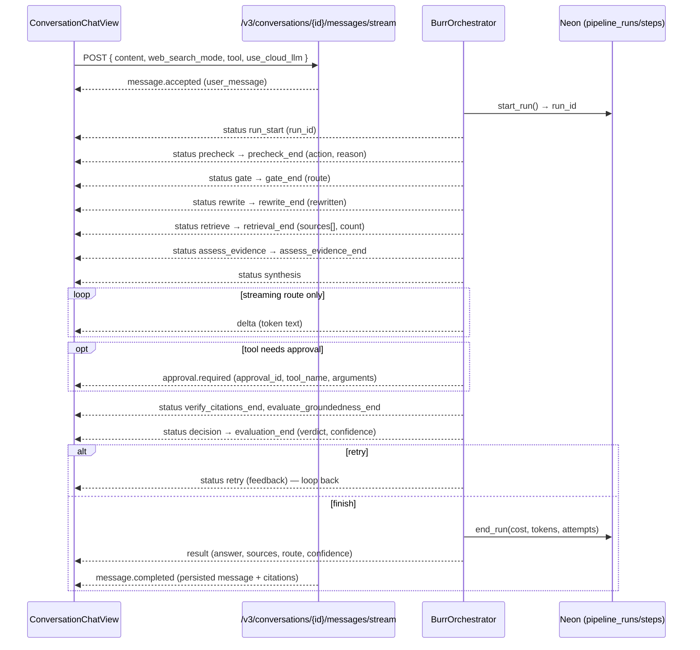

```mermaid
flowchart TD
    START["POST /v3/conversations/{id}/messages/stream<br/>{ content, web_search_mode, tool, use_cloud_llm }"]

    POLICY{"conversation.retrieval_policy"}
    POLICY_WEB["scope=general → web_only<br/>web_search_mode: auto ⇒ <b>always</b>"]
    POLICY_PROJ["scope=project → project_rag<br/>web_search_mode passed through"]

    MEM["ConversationMemory.prepare()<br/>last 10 exchanges, UTC stamps<br/>+ Letta user memory prepended (if configured)"]

    PRE{"PrecheckAction<br/>retrieval_precheck.evaluate()"}
    P1["tool = generate_pdf/generate_flowchart<br/>AND has_corpus"]
    P2["any other client tool selected"]
    P3["conversation_context non-empty"]
    P4["has_corpus = false"]
    P5["Qdrant top-3 probe (no rerank)<br/>top_score"]

    GATE{"GateAction"}
    GATE_SKIP["route already set by precheck<br/><b>no LLM call</b>"]
    GATE_LLM["RagGate.classify() — PydanticAI<br/>Gate Model + <b>mode-aware tool_context</b><br/>+ <b>policy_directive</b> (appended last, outranks overrides)<br/>→ route | reason | requested_tool | reply"]
    CLAMP["constrain_route_for_web_search_mode()<br/>always: rag→hybrid, generic→web<br/>never: web→rag, hybrid→rag<br/>+ sanitize_requested_tool (never ⇒ web_search→null)"]
    FORCE["TOOLS_REQUIRING_RAG<br/>pdf/flowchart ⇒ force route=rag<br/><b>then re-clamp</b> so always ⇒ hybrid"]

    ROUTE{"route"}

    GEN["GenericAction<br/>gate.reply if cached,<br/>else GenericAgent.reply_stream()"]

    RW["RewriteAction — QueryRewriter.rewrite()<br/>skipped for greetings (is_standalone_message)<br/>carries prev_feedback on retry"]
    RET{"RetrieveAction<br/>always + route=rag ⇒ upgrade to hybrid<br/>branch on route"}
    R_WEB["<b>web</b>: web only"]
    R_RAG["<b>rag</b>: RRF retrieve"]
    R_HYB["<b>hybrid</b>: RRF + web"]
    R_FALL["rag returned 0 sources<br/>AND enable_web_search<br/>⇒ implicit web fallback"]
    GRAPH["+ Graphiti temporal graph sources<br/>(rag/hybrid, if Neo4j configured)"]
    SORT["sources.sort(score desc)"]

    ASSESS{"AssessEvidenceAction<br/>EvidenceAssessor.evaluate()"}
    ABSTAIN["🟩 InsufficientEvidenceError<br/>SSE error: insufficient_evidence<br/>message status = abstained"]

    SYN{"SynthesizeAction<br/>sources empty?"}
    SYN_NONE["'No matching indexed content found.'"]
    SYN_DOC["pdf/flowchart requested with 0 sources<br/>→ draft content from LLM, then attach artifact"]
    SYN_TOOL["tools available or pdf/flowchart requested<br/>→ blocking synthesize() with tool calling<br/><b>never ⇒ web_search schema withheld</b><br/>+ synthesis policy_directive"]
    SYN_STREAM["→ synthesize_stream()<br/>token-by-token SSE chunks"]
    TOOLCALL["tool_calls returned?<br/>permission + approval gate<br/>generate_pdf | generate_flowchart<br/>execute_python | web_search"]

    VER["VerifyAndEvaluateAction (parallel threads)<br/>CitationVerifier · GroundednessEvaluator"]

    DEC{"DecisionAction"}
    DEC_GEN["route=generic ⇒ auto verdict=good, conf=1.0"]
    DEC_LLM["DecisionAgent.evaluate()<br/>verdict · confidence · correct_route"]
    DEC_OVR["citations invalid ⇒ bad, retry_target=synthesize<br/>ungrounded ⇒ bad, retry_target=synthesize"]
    OK{"verdict=good<br/>AND confidence ≥ 0.7?"}
    MORE{"attempt ≤ max_attempts (2)?"}
    TGT{"retry_target"}

    DONE["🟩 SSE result + message.completed<br/>persist ChatMessage + citations<br/>update Letta memory<br/>pipeline_runs.end_run()"]
    DISC["🟩 Append low-confidence disclaimer<br/>then persist + result"]
    BUDGET["🟩 BudgetExceededError<br/>attempts/llm_calls/web_searches/tools/<br/>tokens/cost caps → SSE error"]
    FAIL["🟩 Exception → execution_failed<br/>client disconnect → cancelled"]

    START --> POLICY
    POLICY --> POLICY_WEB --> MEM
    POLICY --> POLICY_PROJ --> MEM
    MEM --> PRE

    PRE --> P1 -->|route_rag| GATE_SKIP
    PRE --> P2 -->|call_gate| GATE_LLM
    PRE --> P3 -->|call_gate| GATE_LLM
    PRE --> P4 -->|"web on → route_web<br/>web off → route_generic"| GATE_SKIP
    PRE --> P5
    P5 -->|"≥ 0.025 → route_rag"| GATE_SKIP
    P5 -->|"≤ 0.012 → route_web / route_generic"| GATE_SKIP
    P5 -->|"between → call_gate"| GATE_LLM

    GATE_SKIP --> CLAMP
    GATE_LLM --> CLAMP --> FORCE --> ROUTE
    GATE --- GATE_SKIP

    ROUTE -->|generic| GEN --> DEC
    ROUTE -->|rag / web / hybrid| RW --> RET

    RET --> R_WEB --> SORT
    RET --> R_RAG --> R_FALL --> SORT
    RET --> R_HYB --> SORT
    R_RAG --> GRAPH --> SORT
    R_HYB --> GRAPH
    SORT --> ASSESS

    ASSESS -->|is_sufficient=false| ABSTAIN
    ASSESS -->|sufficient / no assessor| SYN

    SYN -->|yes, plain| SYN_NONE --> VER
    SYN -->|yes, doc tool| SYN_DOC --> VER
    SYN -->|no| SYN_TOOL --> TOOLCALL --> VER
    SYN -->|no| SYN_STREAM --> VER

    VER --> DEC
    DEC --> DEC_GEN --> OK
    DEC --> DEC_LLM --> DEC_OVR --> OK

    OK -->|yes| DONE
    OK -->|no| MORE
    MORE -->|no| DISC
    MORE -->|yes| TGT
    TGT -->|synthesize<br/>citation/groundedness only| SYN
    TGT -->|rewrite<br/>bad retrieval/routing| RW

    PRE -.->|any step| BUDGET
    SYN -.-> FAIL

    classDef term fill:#1b4332,stroke:#2d6a4f,color:#fff
    class DONE,DISC,ABSTAIN,BUDGET,FAIL term
```

```mermaid
flowchart TD
    Q["query + conversation_context<br/>+ client_requested_tool + has_corpus"]

    subgraph PC["Stage A — RetrievalPrecheck (cheap, no LLM except Qdrant probe)"]
        direction TB
        A1{"tool = pdf/flowchart<br/>and has_corpus?"}
        A2{"any other tool selected?"}
        A3{"conversation_context<br/>non-empty?"}
        A4{"has_corpus?"}
        A5["Embed query → Qdrant hybrid top-3<br/>apply_rerank=False"]
        A6{"top_score"}
    end

    subgraph GT["Stage B — Gate LLM (only if precheck says call_gate)"]
        B1["RagGate.classify()<br/>PydanticAI structured output<br/>tool_context lists available tools"]
        B2["GateResult:<br/>route ∈ rag|web|hybrid|generic<br/>+ reason, requested_tool, reply"]
        B3["parse/LLM failure ⇒ route=generic"]
    end

    subgraph CL["Stage C — Hard clamps (always applied)"]
        C1["web_search_mode clamp<br/>auto: pass through<br/>always: rag→hybrid, generic→web<br/>never: web/hybrid→rag (+ disable_web)"]
        C2["TOOLS_REQUIRING_RAG<br/>(gate-LLM path only)"]
    end

    OUT["final route"]

    Q --> A1
    A1 -->|yes| RAG1["route_rag"]
    A1 -->|no| A2
    A2 -->|yes| CALL["call_gate"]
    A2 -->|no| A3
    A3 -->|yes| CALL
    A3 -->|no| A4
    A4 -->|no, web on| WEB1["route_web"]
    A4 -->|no, web off| GEN1["route_generic"]
    A4 -->|yes| A5 --> A6
    A6 -->|"≥ high (0.025)"| RAG1
    A6 -->|"≤ low (0.012), web on"| WEB1
    A6 -->|"≤ low, web off"| GEN1
    A6 -->|"0.012 – 0.025"| CALL

    CALL --> B1 --> B2
    B1 -.->|exception| B3 --> C1
    B2 --> C1
    RAG1 & WEB1 & GEN1 --> C1
    C1 --> C2 --> OUT
```

```mermaid
flowchart TD
    IN["route = rag"]
    RW["QueryRewriter.rewrite()<br/>Rewriter Model + current date<br/>strips 'Optimized query:' labels/quotes"]
    SKIP["greeting/ack (is_standalone_message)<br/>⇒ pass query through unchanged"]

    subgraph RRF["RrfRetriever.retrieve()"]
        E1["EmbeddingService.embed_texts()<br/>text-embedding-3-small (1536-d)"]
        E2["embed_sparse_query()<br/>fastembed Qdrant/bm25 + variants"]
        VS["VectorStore.search_hybrid()<br/>2 separate Qdrant queries<br/>branch limit = v2_rrf_prefetch_limit (100)"]
        FUSE["fuse_rrf_hits(k=60)<br/>cut to fusion_top_k = 100 (rerank pool)"]
        RR["Reranker.rerank()<br/>BAAI/bge-reranker-base cross-encoder<br/>90s timeout, 4000 char cap<br/>→ top 8"]
        FBK["timeout/failure ⇒ keep RRF order<br/>(rerank_applied=false, logged)"]
    end

    GRAPH["MemoryManager.query_temporal_graph()<br/>Graphiti/Neo4j — appended if configured"]
    NOSRC{"0 sources?"}
    WEBFB["implicit web fallback<br/>(if enable_web_search and mode ≠ never)"]
    SORT["sort by score desc"]
    NEXT["→ assess_evidence"]

    IN --> RW
    RW -.-> SKIP -.-> E1
    RW --> E1 & E2
    E1 & E2 --> VS --> FUSE --> RR --> GRAPH
    RR -.-> FBK -.-> GRAPH
    GRAPH --> NOSRC
    NOSRC -->|yes| WEBFB --> SORT
    NOSRC -->|no| SORT --> NEXT
```

```mermaid
flowchart TD
    IN["route = web"]
    NEVER{"web_search_mode = never?"}
    EMPTY["sources = [] → synthesis has nothing"]
    RW["QueryRewriter.rewrite()"]

    subgraph WS["RetrieveAction._retrieve_web()"]
        M1{"MCP manager enabled?"}
        MCP["McpClientManager.call_tool('web_search')<br/>stdio JSON-RPC → unified_server.py"]
        DIRECT["direct WebSearchService fallback<br/>(on MCP exception or empty result)"]
        ENG{"web_search_engine"}
        BRAVE["Brave Search API"]
        TAVILY["Tavily API<br/>(only if tavily_api_key set)"]
        NONE["no API key ⇒ empty list"]
        SCRAPE["scrape_urls_parallel()<br/>Jina Reader r.jina.ai → Markdown<br/>fallback: direct GET + strip_tags<br/>fallback: snippet"]
        CAP["truncate content to 8000 chars"]
        MAP["→ SearchSource<br/>uuid5(url) ids, source_path=url<br/>score = 0.016 − 0.002·rank"]
    end

    NEXT["→ assess_evidence → synthesize"]

    IN --> NEVER
    NEVER -->|yes| EMPTY
    NEVER -->|no| RW --> M1
    M1 -->|yes| MCP --> ENG
    M1 -->|no| DIRECT --> ENG
    MCP -.->|error / empty| DIRECT
    ENG -->|tavily| TAVILY --> SCRAPE
    ENG -->|brave / default| BRAVE --> SCRAPE
    ENG -->|neither| NONE
    SCRAPE --> CAP --> MAP --> NEXT
```

```mermaid
flowchart TD
    IN["route = hybrid<br/>(gate choice, or rag+always clamp)"]
    RW["QueryRewriter.rewrite()<br/>one rewritten query feeds both branches"]
    RAGB["RrfRetriever.retrieve()<br/>dense + sparse + RRF + rerank"]
    WEBB["_retrieve_web()<br/>skipped if web_search_mode = never"]
    GRAPH["Graphiti graph sources (if configured)"]
    CONCAT["sources = rag + web + graph"]
    SORT["sort(score desc)<br/>RAG RRF scores and web synthetic scores<br/>share one scale — this is the ranking merge"]
    NEXT["→ assess_evidence → synthesize"]

    IN --> RW
    RW --> RAGB --> CONCAT
    RW --> WEBB --> CONCAT
    RAGB --> GRAPH --> CONCAT
    CONCAT --> SORT --> NEXT
```

```mermaid
flowchart TD
    IN["route = generic<br/>(no corpus + web off, low score + web off,<br/>or gate classified as chitchat)"]
    CACHE{"gate returned a reply?"}
    USE["emit cached gate reply as one chunk<br/><b>zero extra LLM calls</b>"]
    STREAM["GenericAgent.reply_stream()<br/>Gate Model, token SSE"]
    DEC["DecisionAction:<br/>route=generic ⇒ verdict=good, confidence=1.0<br/>no DecisionAgent call"]
    DONE["🟩 result — never retries"]

    IN --> CACHE
    CACHE -->|yes| USE --> DEC
    CACHE -->|no| STREAM --> DEC --> DONE
```

```mermaid
flowchart TD
    ENTRY{"how was the tool requested?"}
    UI["client_requested_tool from UI"]
    MODEL["LLM emitted tool_calls<br/>(tools listed only when neither<br/>pdf nor flowchart was pre-requested)"]

    UI --> FORCE["precheck route_rag (if has_corpus)<br/>or GateAction._finalize forces route=rag"]
    FORCE --> BLOCK["synthesize() blocking, not streaming"]
    MODEL --> BLOCK

    BLOCK --> PERM{"PermissionChecker.check_permission<br/>(tool, user_role, provenance)"}
    PERM -->|denied| DENY["🟩 'Permission Denied: role X …'"]
    PERM -->|allowed| APPR{"requires_approval(tool)?"}

    APPR -->|yes| WAIT["insert ToolApproval(status=waiting)<br/>SSE approval.required<br/>poll DB every 1s until approved/rejected"]
    WAIT -->|rejected| REJ["🟩 'Execution rejected by user'"]
    WAIT -->|approved| EXEC
    APPR -->|no| EXEC

    EXEC{"tool name"}
    EXEC -->|generate_pdf| PDF["MCP generate_pdf → ReportLab<br/>append a /v2/pdf/download/ link<br/>filename via optional renamer LLM"]
    EXEC -->|generate_flowchart| FLOW["MCP generate_flowchart<br/>append a mermaid code block"]
    EXEC -->|execute_python| PY["MCP execute_python sandbox<br/>append output block"]
    EXEC -->|web_search| WST["MCP web_search<br/>append 'Search Results:' block"]

    PDF & FLOW & PY & WST --> BACKSTOP["if pdf/flowchart was requested<br/>but no tool_call fired ⇒ generate anyway<br/>from the drafted answer"]
    BACKSTOP --> VER["→ verify_and_evaluate"]

    ROLEBOX["role source: project scope ⇒ ProjectMember.role<br/>general/null project ⇒ owner"]
    PROVBOX["provenance = 'user' if the tool matches<br/>client_requested_tool or gate.requested_tool,<br/>else 'model'"]
    PERM -.- ROLEBOX
    PERM -.- PROVBOX
```

```mermaid
flowchart TD
    SYN["synthesize → answer"]
    VER["VerifyAndEvaluateAction<br/>ThreadPoolExecutor(2), both on (query, answer, sources)"]
    CV["CitationVerifier.verify()<br/>→ has_valid_citations"]
    GE["GroundednessEvaluator.evaluate()<br/>→ score, is_grounded"]
    DA["DecisionAgent.evaluate()<br/>→ verdict, confidence, correct_route, feedback"]

    OVR{"override checks"}
    BAD_CITE["invalid citations ⇒<br/>verdict=bad, conf=0.0<br/><b>retry_target = synthesize</b>"]
    BAD_GRND["ungrounded ⇒<br/>verdict=bad, conf=score<br/><b>retry_target = synthesize</b>"]
    BAD_DEC["decision agent said bad /<br/>confidence < threshold<br/><b>retry_target = rewrite</b>"]
    GOOD["verdict=good and conf ≥ 0.7"]

    CLAMP2["next route = clamp(correct_route, web_search_mode)"]
    CAP{"attempt ≤ max_attempts (2)?"}

    LOOP_S["→ back to synthesize<br/>same sources, feedback injected as<br/>'[Regeneration instruction: …]'"]
    LOOP_R["→ back to rewrite<br/>full re-retrieval with prev_feedback"]
    DISC["🟩 append low-confidence disclaimer, finish"]
    DONE["🟩 finish clean"]

    SYN --> VER
    VER --> CV --> OVR
    VER --> GE --> OVR
    VER --> DA --> OVR
    OVR --> BAD_CITE --> CAP
    OVR --> BAD_GRND --> CAP
    OVR --> BAD_DEC --> CLAMP2 --> CAP
    OVR --> GOOD --> DONE
    CAP -->|yes, target=synthesize| LOOP_S
    CAP -->|yes, target=rewrite| LOOP_R
    CAP -->|no| DISC
```

```mermaid
flowchart TD
    Q["query in flight"]
    O1["🟩 Clean answer<br/>verdict=good, confidence ≥ 0.7<br/>SSE result → message.completed<br/>status: completed"]
    O2["🟩 Low-confidence answer<br/>retries exhausted<br/>disclaimer appended<br/>status: completed"]
    O3["🟩 No indexed content<br/>0 sources, no doc tool<br/>status: completed"]
    O4["🟩 Abstention<br/>EvidenceAssessor.is_sufficient=false<br/>SSE error insufficient_evidence<br/>status: abstained"]
    O5["🟩 Budget exceeded<br/>any run_budget_* cap hit<br/>SSE error budget_exceeded<br/>status: budget_exceeded"]
    O6["🟩 Permission denied<br/>PermissionChecker rejects tool<br/>status: completed"]
    O7["🟩 Approval rejected<br/>user rejects ToolApproval<br/>status: completed"]
    O8["🟩 Cancelled<br/>client disconnects mid-stream<br/>status: cancelled"]
    O9["🟩 Failure<br/>any other exception<br/>SSE error execution_failed (retryable)<br/>status: execution_failed"]

    Q --> O1
    Q --> O2
    Q --> O3
    Q --> O4
    Q --> O5
    Q --> O6
    Q --> O7
    Q --> O8
    Q --> O9

    classDef term fill:#1b4332,stroke:#2d6a4f,color:#fff
    class O1,O2,O3,O4,O5,O6,O7,O8,O9 term
```

```mermaid
flowchart TD
    MODE["web_search_mode from ChatInput toggle<br/>auto | always | never"]

    subgraph E1["Checkpoint 1 — PrecheckAction"]
        C1A["enable_web_search AND web_search_allowed(mode)<br/>never ⇒ precheck picks route_generic, not route_web"]
    end

    subgraph E2["Checkpoint 2 — Gate prompt construction (realtime)"]
        C2A["build_tool_context()<br/>never ⇒ web_search tool NOT listed<br/>the model cannot request what it never saw"]
        C2B["build_gate_policy_directive()<br/>never ⇒ 'route web/hybrid FORBIDDEN'<br/>always ⇒ 'route rag/generic FORBIDDEN'<br/>appended last, outranks project overrides"]
    end

    subgraph E3["Checkpoint 3 — Route + tool clamp"]
        C3A["constrain_route_for_web_search_mode()"]
        C3B["sanitize_requested_tool()<br/>never ⇒ requested_tool web_search → null"]
        C3C["re-clamp AFTER TOOLS_REQUIRING_RAG forcing<br/>fixes: always + PDF silently dropping web"]
    end

    subgraph E4["Checkpoint 4 — RetrieveAction"]
        C4A["never ⇒ disable_web:<br/>no web branch, no empty-RAG web fallback"]
        C4B["always ⇒ leftover rag upgraded to hybrid<br/>gate_result.route synced so UI shows HYBRID"]
    end

    subgraph E5["Checkpoint 5 — SynthesizeAction capability"]
        C5A["filter_tools_for_web_search_mode()<br/>never ⇒ web_search schema stripped from MCP tool list"]
        C5B["build_synthesis_policy_directive()<br/>never ⇒ 'you have no internet access'"]
    end

    subgraph E6["Checkpoint 6 — Execution guard"]
        C6A["web_search tool_call arrives anyway ⇒ refused + logged"]
    end

    OUT["🟩 user's toggle honoured end-to-end"]

    MODE --> E1 --> E2 --> E3 --> E4 --> E5 --> E6 --> OUT

    classDef term fill:#1b4332,stroke:#2d6a4f,color:#fff
    class OUT term
```

```mermaid
sequenceDiagram
    participant FE as ConversationChatView
    participant API as /v3/conversations/{id}/messages/stream
    participant B as BurrOrchestrator
    participant DB as Neon (pipeline_runs/steps)

    FE->>API: POST { content, web_search_mode, tool, use_cloud_llm }
    API-->>FE: message.accepted (user_message)
    B->>DB: start_run() → run_id
    B-->>FE: status run_start (run_id)
    B-->>FE: status precheck → precheck_end (action, reason)
    B-->>FE: status gate → gate_end (route)
    B-->>FE: status rewrite → rewrite_end (rewritten)
    B-->>FE: status retrieve → retrieval_end (sources[], count)
    B-->>FE: status assess_evidence → assess_evidence_end
    B-->>FE: status synthesis
    loop streaming route only
        B-->>FE: delta (token text)
    end
    opt tool needs approval
        B-->>FE: approval.required (approval_id, tool_name, arguments)
    end
    B-->>FE: status verify_citations_end, evaluate_groundedness_end
    B-->>FE: status decision → evaluation_end (verdict, confidence)
    alt retry
        B-->>FE: status retry (feedback) — loop back
    else finish
        B->>DB: end_run(cost, tokens, attempts)
        B-->>FE: result (answer, sources, route, confidence)
        API-->>FE: message.completed (persisted message + citations)
    end
```
