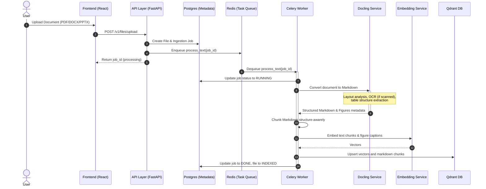

# Integrating IBM Docling for Document Ingestion

This document details the architectural plan, benefits, and implementation details for integrating **IBM Docling** into Scrutinize to replace or augment the legacy PDF processing pipeline.

---

## 1. Benefits of Docling

Integrating IBM Docling brings several key advantages over the legacy PyPDF-based parser:

| Benefit | Legacy Pipeline (PyPDF) | Modern Pipeline (Docling) | Impact on App |
| :--- | :--- | :--- | :--- |
| **Layout Awareness** | Processes pages as streams of characters; loses columns, headers, footers, and text flow. | Uses deep learning layout models to detect reading order, columns, and structural blocks. | **Higher RAG Accuracy**: Avoids stitching unrelated columns together. |
| **Table Extraction** | Tables are parsed as raw, jumbled strings, losing row/column associations. | Extracts tables and renders them as valid Markdown/HTML tables. | **Structured Retrieval**: LLMs can now answer questions about tabular data. |
| **Multi-Format Support** | Limited to `.pdf` (text and markdown files read as raw text). | Natively supports `.pdf`, `.docx`, `.pptx`, `.xlsx`, `.html`, and `.ascii`. | **Wider Ingestion Support**: Users can upload office documents directly. |
| **Embedded Figures** | Requires manual iteration of page image objects, often returning raw mask files or layout icons. | Segments figures, tables, and text sections logically. | **Improved Image Captioning**: Only captions actual figures and diagrams. |
| **Advanced Chunking** | Simple token-window chunking (`tiktoken`-based overlapping split). | Hierarchy/structure-aware chunking (e.g., chunk by sections, list items, or tables). | **No Context Fragmentation**: Keeps paragraphs and tables intact. |

---

## 2. Ingestion Flow (Before vs. After)

### Legacy Ingestion
```
Uploaded PDF ──> resolve_media_source() ──> PyPDF (extract_text) ──> Token Chunking ──> Embed & Index
```

### Proposed Docling Ingestion
```
Uploaded Document ──> resolve_media_source() ──> Docling Converter ──> Markdown/JSON Output ──> Structure Chunking ──> Embed & Index
```

---

## 3. New Backend Ingestion Architecture

The following diagram illustrates how the FastAPI API layer, Celery Worker, and Docling converter interact inside the processing layer:



---

## 4. Implementation Plan

### Step 1: Package & Dependencies Update
- Add `docling` and `docling-core` to `backend/pyproject.toml` or `requirements.txt`.
- Note: Docling downloads model weights on first run (layout, table, OCR models). We will configure caching via `HF_HOME` or custom local cache directories in `docker-compose.yml` to prevent downloading weights on every container start.

### Step 2: Create `DoclingService`
- File: [docling_service.py](file:///c:/Programming/Projects/01_ACTIVE/ai_news/Scrutinize/backend/app/services/docling_service.py) [NEW]
- Expose a clean interface for extracting text/markdown and images from rich document formats.
- Provide a fallback to PyPDF in case of high memory/resource exhaustion or weight-loading failures (useful for low-resource dev/test environments).

### Step 3: Update `TextProcessor`
- File: [text_processor.py](file:///c:/Programming/Projects/01_ACTIVE/ai_news/Scrutinize/backend/app/services/text_processor.py) [MODIFY]
- Support new formats: `.docx`, `.pptx`, `.xlsx` by updating `TEXT_EXTENSIONS`.
- Integrate `DoclingService` into the extraction flow:
  ```python
  if is_pdf or is_rich_doc:
      markdown_content, images = docling_service.convert(temp_filepath)
      # Chunk markdown instead of plain text
  ```

### Step 4: Add Configuration Settings
- File: [config.py](file:///c:/Programming/Projects/01_ACTIVE/ai_news/Scrutinize/backend/app/core/config.py) [MODIFY]
- Add config variables:
  - `use_docling: bool = True` (Toggle fallback option)
  - `docling_ocr_enabled: bool = True` (Toggle OCR capabilities)
  - `docling_model_cache_dir: str = "/tmp/docling_cache"`

### Step 5: Verification & Tests
- Create unit tests verifying Docling extraction on small sample PDFs, DOCX, and PPTX files.
- Verify structure-aware chunking outputs correctly.
