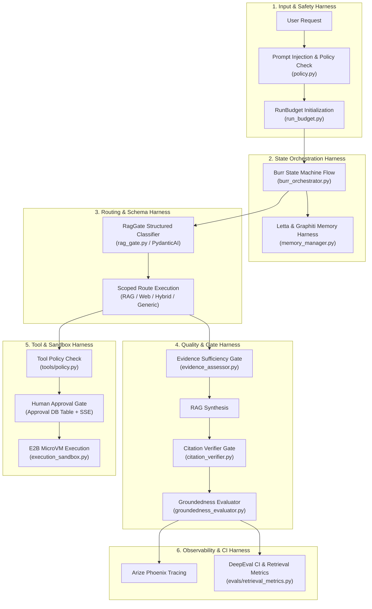

# Harness Engineering in Scrutinize

**Document Version:** 1.0  
**Status:** Active / Architectural Standard  
**Target Repository:** Scrutinize  
**Author:** AI Architecture Team  

---

## 1. What is "Harness Engineering" and Why Is It Called a Harness?

### 1.1 Why Call It a "Harness"?
In physical engineering, a **harness** (such as a safety harness, wiring harness, or horse harness) is a structural framework that constrains, directs, secures, and channels raw power into predictable, controlled work.

In modern generative AI and agentic software (particularly across Scrutinize V4 and V5):
> **Harness Engineering** is the design pattern of building a strict, deterministic, policy-controlled, and observable safety & validation framework *around* non-deterministic Large Language Models (LLMs) and tools.

Instead of letting an LLM run directly as a loose, unpredictable chatbot (where bad outputs, hallucinated citations, prompt injections, or infinite loops can break the system), the LLM operates inside an **engineered software harness**. 

The harness acts as a **containment vessel**:
1. **Constrains inputs**: Scans and sanitizes user queries and retrieved context before the LLM sees them.
2. **Structures orchestration**: Enforces explicit state machine transitions (Apache Burr) instead of unmonitored recursive agent calls.
3. **Validates outputs**: Subjects model drafts to automated evidence, citation, and groundedness gates before sending data to the client.
4. **Controls execution**: Enforces strict run budgets, role-based tool permission policies, and human-in-the-loop approval gates.
5. **Isolates risk**: Executes untrusted code inside Firecracker MicroVM sandboxes (E2B).

---

## 2. Comprehensive Trace of Harness Engineering Across the Codebase

Harness engineering principles are embedded deeply across Scrutinize's backend, middleware, database, and evaluation layers. Below is a structured trace of how harness engineering is realized in code.

---

### 2.1 State Orchestration & State Machine Harness
- **Location:** [burr_orchestrator.py](file:///c:/Programming/Projects/01_ACTIVE/ai_news/Scrutinize/backend/app/services/v4/burr_orchestrator.py)
- **Harness Mechanism:** 
  Rather than writing arbitrary async LLM loops, the entire query lifecycle is compiled into an **Apache Burr** state machine. 
- **Why it matters:** 
  Burr provides explicit state transitions (`input_validated` → `routed` → `retrieved` → `validated_citations` → `responded`). State is immutable, step execution is deterministic, and execution can be paused for user interaction.

---

### 2.2 Input Safety & Injection Containment Harness
- **Location:** [policy.py](file:///c:/Programming/Projects/01_ACTIVE/ai_news/Scrutinize/backend/app/tools/policy.py)
- **Harness Mechanism:** 
  Validates incoming text and tool call actions against security rules prior to pipeline execution.
- **Why it matters:** 
  Retrieved web content or user prompts can contain prompt injection attacks ("ignore previous instructions"). The input harness acts as a security firewall.

---

### 2.3 Type Safety & Schema Harness
- **Location:** [rag_gate.py](file:///c:/Programming/Projects/01_ACTIVE/ai_news/Scrutinize/backend/app/services/v4/rag_gate.py)
- **Harness Mechanism:** 
  Uses **PydanticAI** and strict Pydantic schemas for classification and agent output parsing.
- **Why it matters:** 
  LLMs natively output loose string tokens. By wrapping prompts with Pydantic schemas, the harness enforces strict JSON output contracts. If the LLM generates invalid fields, PydanticAI automatically catches the validation error and prompts the LLM to auto-correct.

---

### 2.4 Deterministic Quality Gates (Evidence, Citations, Groundedness)
The core of Scrutinize's RAG trust model relies on three sequential downstream quality gates:

1. **Evidence Sufficiency Gate**
   - **Location:** [evidence_assessor.py](file:///c:/Programming/Projects/01_ACTIVE/ai_news/Scrutinize/backend/app/services/v4/evidence_assessor.py)
   - **Mechanism:** Evaluates retrieved vector search chunks before synthesis. If retrieved facts do not actually contain the answer, the harness forces an immediate **abstention flow** instead of allowing the LLM to hallucinate.
2. **Citation Verifier Gate**
   - **Location:** [citation_verifier.py](file:///c:/Programming/Projects/01_ACTIVE/ai_news/Scrutinize/backend/app/services/v4/citation_verifier.py)
   - **Mechanism:** Parses claims and claim source IDs `[doc_id]`. Deterministically validates whether the cited chunk exists and semantically supports the claim. If invalid, it triggers targeted regeneration.
3. **Groundedness Evaluator Gate**
   - **Location:** [groundedness_evaluator.py](file:///c:/Programming/Projects/01_ACTIVE/ai_news/Scrutinize/backend/app/services/v4/groundedness_evaluator.py)
   - **Mechanism:** Computes a numerical groundedness score (0.0 to 1.0). If the score falls below threshold (`0.90`), the harness rejects the response draft and loops back to synthesis.

---

### 2.5 Resource & Budget Limitation Harness
- **Location:** [run_budget.py](file:///c:/Programming/Projects/01_ACTIVE/ai_news/Scrutinize/backend/app/services/v4/run_budget.py)
- **Harness Mechanism:** 
  Tracks max iterations, maximum token budgets, cost limits, and wall-clock execution time per run.
- **Why it matters:** 
  Prevents runaway agent loops, accidental high API bills, or infinite retry loops during failure states.

---

### 2.6 Sandboxed Execution & Approval Harness
- **Location:** [execution_sandbox.py](file:///c:/Programming/Projects/01_ACTIVE/ai_news/Scrutinize/backend/app/tools/execution_sandbox.py) & [policy.py](file:///c:/Programming/Projects/01_ACTIVE/ai_news/Scrutinize/backend/app/tools/policy.py)
- **Harness Mechanism:** 
  Sensitive tool invocations require approval entries in PostgreSQL and SSE notification to the client. Executable code generated by LLMs runs exclusively inside **E2B Sandboxes** (isolated Firecracker MicroVMs).
- **Why it matters:** 
  Ensures that generated Python code or web execution cannot access system memory, environment variables, or private networks on the host backend server.

---

### 2.7 Temporal Memory & Context Boundary Harness
- **Location:** [memory_manager.py](file:///c:/Programming/Projects/01_ACTIVE/ai_news/Scrutinize/backend/app/services/v4/memory_manager.py)
- **Harness Mechanism:** 
  Integrates **Letta** (Core and Archival Memory) and **Graphiti** (Temporal Knowledge Graphs).
- **Why it matters:** 
  Instead of dumping unformatted chat histories into context windows (which degrades model performance and introduces stale facts), the memory harness structures evolving project knowledge deterministically across temporal state graphs.

---

### 2.8 Evaluation & Benchmark Harness
- **Location:** [retrieval_metrics.py](file:///c:/Programming/Projects/01_ACTIVE/ai_news/Scrutinize/backend/app/evals/retrieval_metrics.py), `Makefile` (eval harness commands), `DeepEval`, and `Promptfoo` integrations.
- **Harness Mechanism:** 
  Defines standardized measurement pipelines for NDCG@k, MRR, Hit Rate, precision, recall, and adversarial security testing.
- **Why it matters:** 
  Allows developers to run CI/CD regression tests against retrieval quality and system prompts before deploying updates to production.

---

## 3. Summary Matrix of Harness Controls

| Harness Layer | Primary Implementation File(s) | Primary Purpose / Control |
|---|---|---|
| **State Machine Harness** | [burr_orchestrator.py](file:///c:/Programming/Projects/01_ACTIVE/ai_news/Scrutinize/backend/app/services/v4/burr_orchestrator.py) | Explicit step-by-step state machine execution via Burr |
| **Type & Schema Harness** | [rag_gate.py](file:///c:/Programming/Projects/01_ACTIVE/ai_news/Scrutinize/backend/app/services/v4/rag_gate.py) | PydanticAI type enforcement and self-correcting JSON outputs |
| **Evidence Gate Harness** | [evidence_assessor.py](file:///c:/Programming/Projects/01_ACTIVE/ai_news/Scrutinize/backend/app/services/v4/evidence_assessor.py) | Pre-synthesis retrieval relevance check & forced abstention |
| **Citation Verification Harness** | [citation_verifier.py](file:///c:/Programming/Projects/01_ACTIVE/ai_news/Scrutinize/backend/app/services/v4/citation_verifier.py) | Factual claim-level verification against vector sources |
| **Groundedness Harness** | [groundedness_evaluator.py](file:///c:/Programming/Projects/01_ACTIVE/ai_news/Scrutinize/backend/app/services/v4/groundedness_evaluator.py) | Faithfulness scoring and rejection threshold (>= 0.90) |
| **Budget Control Harness** | [run_budget.py](file:///c:/Programming/Projects/01_ACTIVE/ai_news/Scrutinize/backend/app/services/v4/run_budget.py) | Token count, cost limit, iteration count, and timeout limits |
| **Security & Sandbox Harness** | [execution_sandbox.py](file:///c:/Programming/Projects/01_ACTIVE/ai_news/Scrutinize/backend/app/tools/execution_sandbox.py), [policy.py](file:///c:/Programming/Projects/01_ACTIVE/ai_news/Scrutinize/backend/app/tools/policy.py) | E2B Firecracker MicroVM execution & sensitive action approvals |
| **Memory State Harness** | [memory_manager.py](file:///c:/Programming/Projects/01_ACTIVE/ai_news/Scrutinize/backend/app/services/v4/memory_manager.py) | Letta permanent memory state and Graphiti temporal fact graphs |
| **Evaluation & Eval Harness** | [retrieval_metrics.py](file:///c:/Programming/Projects/01_ACTIVE/ai_news/Scrutinize/backend/app/evals/retrieval_metrics.py) | Automated metrics (NDCG@k, Hit Rate, MRR) and DeepEval CI benchmarks |

---

## 4. Architectural Conclusion

In Scrutinize, **Harness Engineering** is not just an auxiliary testing framework—it is the **primary runtime control architecture**. It transforms probabilistic LLM generations into deterministic enterprise software by placing safety, verification, memory, budget, and execution harnesses around every generative call.
