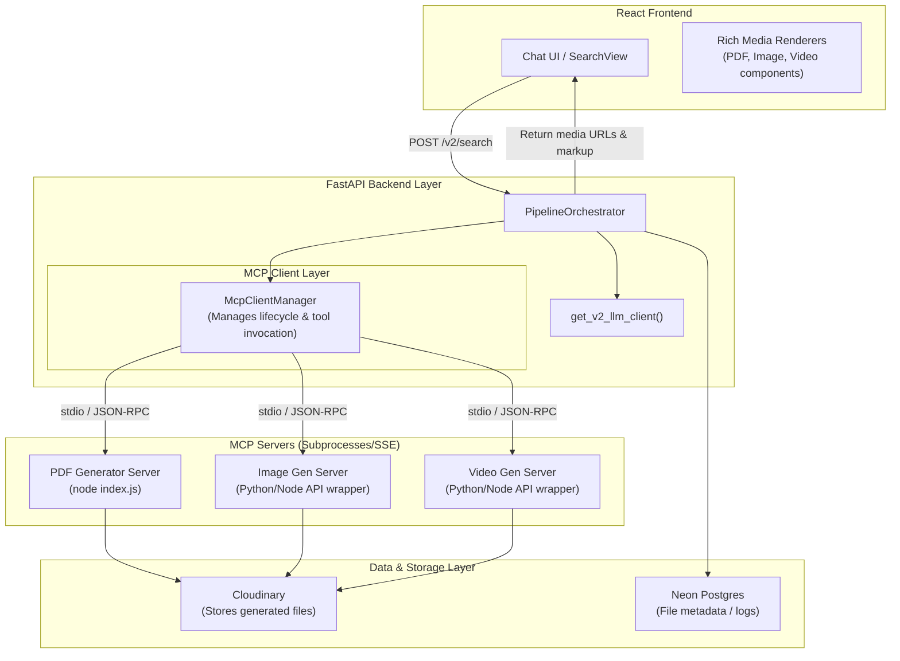

# Model Context Protocol (MCP) Integration Plan — Scrutinize

This document outlines the design and steps required to integrate open-source and custom **Model Context Protocol (MCP) Servers** (such as PDF generators, image generators, and video generators) into the **Scrutinize** v2 agentic architecture.

---

## 1. Feasibility & Concept

**Yes, integrating MCP servers into Scrutinize is highly feasible.** 

The Model Context Protocol (developed by Anthropic) allows LLM applications to connect to external systems using a client-server architecture:
- **MCP Servers** expose tools, resources, and prompts via JSON-RPC.
- **MCP Clients** (in this case, the Scrutinize FastAPI backend) orchestrate connections, discover available tools, and execute them on behalf of the LLM.

### Target MCP Servers
1. **PDF Generator**: E.g., a Puppeteer/Playwright node-based server or a Python-based pdfkit wrapper that converts HTML/Markdown into formatted PDFs.
2. **Image Generator**: E.g., an MCP server wrapping OpenAI DALL-E, Stability AI (Stable Diffusion), or Replicate.
3. **Video Generator**: E.g., an MCP server wrapping Replicate (HunyuanVideo, Luma Dream Machine) or Kling AI.

---

## 2. Updated Architecture with MCP

With the integration of MCP, the FastAPI backend will run an **MCP Client Manager** that boots and communicates with configured MCP servers.



---

## 3. Step-by-Step Implementation Guide

To integrate MCP servers into Scrutinize, follow these 7 implementation steps:

### Step 1: Add Python MCP SDK Dependency
Add the official `mcp` SDK to the backend dependencies inside [pyproject.toml](file:///c:/Programming/Projects/01_ACTIVE/ai_news/Scrutinize/backend/pyproject.toml):

```toml
dependencies = [
    # ... existing dependencies
    "mcp>=1.0.0",
]
```

### Step 2: Configure MCP Servers in Settings
Define the MCP servers in the configuration layer ([config.py](file:///c:/Programming/Projects/01_ACTIVE/ai_news/Scrutinize/backend/app/core/config.py)) and configure their paths or credentials in `.env`:

```python
# app/core/config.py
class Settings(BaseSettings):
    # ...
    mcp_servers: dict[str, dict] = {
        "pdf-generator": {
            "command": "node",
            "args": ["c:/Programming/Projects/01_ACTIVE/ai_news/Scrutinize/mcp-servers/pdf-gen/index.js"],
            "env": {}
        },
        "image-generator": {
            "command": "python",
            "args": ["c:/Programming/Projects/01_ACTIVE/ai_news/Scrutinize/mcp-servers/image-gen/server.py"],
            "env": {"REPLICATE_API_TOKEN": ""}
        }
    }
```

### Step 3: Implement the MCP Client Manager
Create a new service `app/services/mcp_manager.py` that handles spawning MCP servers via `stdio` transport, maintaining connection sessions, and listing/calling tools.

```python
# app/services/mcp_manager.py
import asyncio
from mcp import ClientSession, StdioServerParameters
from mcp.client.stdio import stdio_client

class McpClientManager:
    def __init__(self, server_configs: dict):
        self.server_configs = server_configs
        self.active_sessions = {}

    async def start_servers(self):
        for name, cfg in self.server_configs.items():
            params = StdioServerParameters(
                command=cfg["command"],
                args=cfg["args"],
                env=cfg.get("env")
            )
            # Setup stdio connection and initialize session
            # Store sessions in self.active_sessions

    async def get_all_tools(self) -> list[dict]:
        """Fetch tools from all active MCP servers and format for OpenAI tool-calling."""
        all_tools = []
        for name, session in self.active_sessions.items():
            tools_response = await session.list_tools()
            for tool in tools_response.tools:
                all_tools.append({
                    "type": "function",
                    "function": {
                        "name": f"{name}__{tool.name}",
                        "description": tool.description,
                        "parameters": tool.inputSchema
                    }
                })
        return all_tools

    async def call_tool(self, namespaced_name: str, arguments: dict) -> str:
        server_name, tool_name = namespaced_name.split("__", 1)
        session = self.active_sessions[server_name]
        result = await session.call_tool(tool_name, arguments)
        return result.content
```

### Step 4: Add Tool-Calling support to LLM Clients
Extend `BaseLlmClient` and its implementations ([cloud.py](file:///c:/Programming/Projects/01_ACTIVE/ai_news/Scrutinize/backend/app/services/v2/llm_clients/cloud.py) and [local.py](file:///c:/Programming/Projects/01_ACTIVE/ai_news/Scrutinize/backend/app/services/v2/llm_clients/local.py)) to accept the `tools` parameter and return tool calls in `LlmResponse`.

```python
# In app/services/v2/llm_clients/base.py
@dataclass(frozen=True)
class ToolCall:
    id: str
    name: str
    arguments: dict

@dataclass(frozen=True)
class LlmResponse:
    content: str
    model_name: str
    prompt_system: str
    prompt_user: str
    tool_calls: list[ToolCall] = None  # Added tool call field
    # ...
```

### Step 5: Integrate Tool Execution Loop in PipelineOrchestrator
Modify [pipeline_orchestrator.py](file:///c:/Programming/Projects/01_ACTIVE/ai_news/Scrutinize/backend/app/services/v2/pipeline_orchestrator.py) to manage the tool-calling loop:

```python
# Inside PipelineOrchestrator
async def _execute_with_tools(self, system: str, user: str, model: str) -> str:
    # 1. Fetch available tools from McpClientManager
    tools = await self._mcp_manager.get_all_tools()
    
    # 2. Call LLM with tools
    response = self._llm_client.generate(model, system, user, tools=tools)
    
    # 3. If model requests a tool call, execute it
    while response.tool_calls:
        tool_outputs = []
        for tool_call in response.tool_calls:
            # Execute tool through MCP
            output = await self._mcp_manager.call_tool(tool_call.name, tool_call.arguments)
            tool_outputs.append({
                "role": "tool",
                "tool_call_id": tool_call.id,
                "content": output
            })
        
        # 4. Feed tool outputs back to LLM for final/next generation
        # (This requires passing full chat history/messages to LLM client)
        response = self._llm_client.generate_with_history(messages)
        
    return response.content
```

### Step 6: File Storage Integration (Cloudinary)
Ensure MCP tools return storage links rather than raw local file paths.
- E.g., the PDF generator tool creates the PDF locally, uploads it to **Cloudinary** via `CloudinaryStorageService`, and returns the CDN-backed URL.
- Register generated assets in the Postgres `files` and `segments` database schemas if users want them to be searchable/indexed later.

### Step 7: Frontend Rich Media Support
Update the React frontend to detect media payloads:
- In `SearchView.tsx`, if the model's message contains markdown matching `.pdf`, images, or video players, render interactive widgets:
  - For **PDFs**: A centered preview iframe or download card.
  - For **Images**: Standard image block with lightbox zoom.
  - For **Videos**: Native HTML5 `<video>` tag with Cloudinary streaming.

---

## 4. Updates Required in Existing Documentation Files

To incorporate the MCP design into the existing architecture files, follow these guidelines:

### Modifications to [architecture.md](file:///c:/Programming/Projects/01_ACTIVE/ai_news/Scrutinize/docs/architecture/architecture.md)

1. **Section 1. Overview**: Add **MCP Tool Integration Layer** as a sub-point under the API Layer or Processing Layer.
2. **Section 3. Component Breakdown**: Add `mcp_manager.py` to the table:
   | Module | Role | LLM / External dependency |
   |---|---|---|
   | `mcp_manager.py` | Orchestrates local and cloud MCP servers, discovering and running tool integrations (PDF, images, video). | External MCP Server processes (stdio/SSE) |
3. **Section 4. Tech Stack & Rationale**: Add a new sub-section **4.7 Model Context Protocol (MCP)** explaining the transport (stdio connection over JSON-RPC) and utility (decoupling tool scripts from python business logic).

### Modifications to [diagram.md](file:///c:/Programming/Projects/01_ACTIVE/ai_news/Scrutinize/docs/architecture/diagram.md)

1. **Section 1. System context**: Update the mermaid diagram to include the `MCP Client Layer` inside the backend FastAPI block, and connect it to `MCP Servers` in the external services block.
2. **Section 2. Search pipeline**: Update the mermaid flowchart to show that if the `PipelineOrchestrator` receives tool call requests from the synthesis model, it performs a **Tool execution loop** (McpManager → Run Tool → Append Result → Resume Synthesis).
3. **Section 5. LLM client routing**: Show how tools flow into `BaseLlmClient` alongside system and user prompts.
