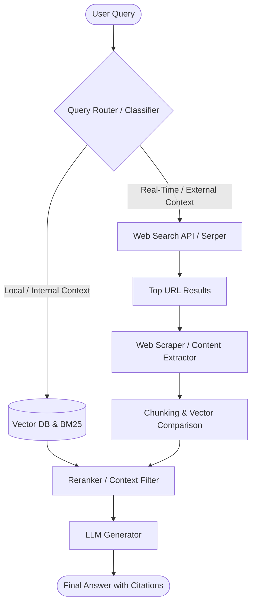

# Web Search in Retrieval-Augmented Generation (RAG)

This document explains the concept of web search integration in Retrieval-Augmented Generation (RAG) systems, details specific use cases where it significantly improves retrieval performance, and outlines the architectural pipeline.

---

## 1. What is Web Search in RAG?

In a standard RAG pipeline, the system retrieves relevant documents from a **static local knowledge base** (e.g., a vector database containing pre-embedded company PDFs, wikis, or database records) to answer user queries.

**Web Search in RAG** extends this retrieval mechanism by dynamically querying external web search engines (such as Google, Bing, Brave Search, or Serper) during query processing. Rather than relying solely on the static internal corpus, the system:
1. Translates the user query into a search engine friendly search query.
2. Executes the search against the live internet.
3. Fetches the text content of the top-ranking web pages.
4. Reranks or filters these web results.
5. Injects the fresh context directly into the LLM's prompt window.

---

## 2. When Does Web Search Help in Retrieval?

Web search is not a complete replacement for local vector databases, but rather a powerful complement. It is particularly effective in the following scenarios:

### A. Real-Time and Time-Sensitive Queries
* **Problem**: Local vector databases are snapshots in time. Re-indexing entire datasets to keep up with daily or hourly updates is computationally expensive.
* **Web Search Benefit**: It retrieves information published minutes or hours ago (e.g., *"What were the key highlights from today's tech conference?"* or *"What is the current stock price of Company X?"*).

### B. Handling Out-of-Distribution (OOD) Queries
* **Problem**: When users ask questions completely outside the scope of the local database, standard RAG retrieves irrelevant local files (due to vector similarity hallucination).
* **Web Search Benefit**: It acts as a fallback to fetch general knowledge, preventing the model from hallucinating or failing when the answer does not exist in local documents.

### C. Fact Verification and Knowledge Updates
* **Problem**: Information in the local database may become outdated or conflicting (e.g., old API documentation or deprecated regulations).
* **Web Search Benefit**: It cross-references static internal knowledge with live sources to verify facts or fetch the latest versions of documentations, guidelines, or software releases.

### D. Niche or Long-Tail Queries
* **Problem**: Curated enterprise documents might not cover specific edge cases, niche developer libraries, or highly granular public facts.
* **Web Search Benefit**: The global web index contains answers to millions of long-tail queries that would never make it into a curated enterprise vector store.

---

## 3. Retrieval Flow with Web Search

Below is a flow diagram illustrating how a hybrid RAG system routes queries between local vector search and live web search.

