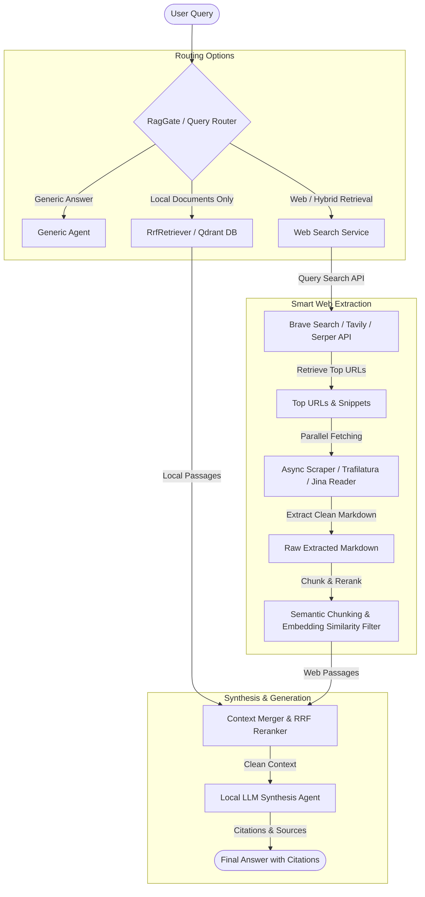

# Web Search Architecture in Scrutinize

This document details the architectural design, implementation strategy, benefits, and key trade-offs for integrating Web Search into Scrutinize. It focuses on maximizing accuracy with local LLMs under constraints like latency, cost, and API rate limits.

---

## 1. System Architecture

Below is the workflow showing how web search routes queries, fetches pages, extracts high-signal content, and fuses it with local vector context for synthesis by local LLMs.

---

## 2. Scraping Strategy: Is Scraping Required? At What Level?

### Yes, Scraping is Required.
Simply relying on raw search engine API snippets (e.g., Google or Bing search summaries) is **insufficient** for the following reasons:
1. **Low Signal-to-Noise Ratio**: Snippets are short (1-2 sentences) and designed for human readers, often missing specific facts, code snippets, or tables.
2. **Local LLM Sensitivity**: Local LLMs (e.g., Llama-3-8B) have less reasoning power than large commercial LLMs. They require cohesive, high-quality, and complete source paragraphs to construct accurate responses without hallucinating.

### Extraction Levels:
* **Level 1 (Not Recommended)**: Direct Raw HTML GET. Fetches entire pages but includes navigation, footers, sidebars, and ads, bloating the context window and confusing the model.
* **Level 2 (Good / Cost-effective)**: Async HTML GET + Clean Text Extraction (using libraries like `trafilatura` or `readability-lxml`). Strips boilerplate, leaving only main article text.
* **Level 3 (Recommended - Smart)**: API-based Extraction (e.g., Tavily or Jina Reader `https://r.jina.ai/`). Automatically handles JavaScript rendering (SPAs), Cloudflare bypasses, and returns formatted Markdown.

### Smart Scraping implementation Rules:
1. **Parallelism**: Scraping top 3–5 URLs sequentially adds 5–10 seconds of latency. We must fetch pages concurrently using asynchronous requests (`httpx` + `asyncio.gather`).
2. **Filtering**: After converting pages to clean Markdown, we chunk them and calculate embedding similarity against the user query. We discard chunks with low similarity to keep the context window small and dense.
3. **Caching**: Store scraped content in a short-lived Redis/database cache (e.g., 1 hour TTL) to avoid scraping the same URL repeatedly for subsequent conversation turns.

---

## 3. How Web Search Benefits the App

1. **Zero-shot Knowledge Updates**: The application doesn't need to re-ingest and re-embed documents to know about the latest AI models, news, or releases.
2. **Out-of-Distribution Fallback**: Prevents "no documents found" failures when users ask general tech/news questions that are not present in the local database.
3. **Fact Verification**: Helps the user cross-verify statements in local PDFs against current public consensus on the internet.
4. **Perplexity-style Experience**: Empowers users to use Scrutinize as a research assistant that can generate comprehensive reports using both internal company papers and live web data.

---

## 4. Implementation Plan

### Phase 1: Search Engine Integration
* Register for Brave Search API or Tavily (offering generous free tiers).
* Implement `WebSearchService` in `backend/app/services/web_search.py`.
* Expose configurable environment variables (`BRAVE_SEARCH_API_KEY`, `TAVILY_API_KEY`).

### Phase 2: Async Scraper and Text Parser
* Implement `AsyncWebScraper` utilizing `httpx` and `trafilatura` (a high-performance boilerplate remover) or a call to Jina Reader `https://r.jina.ai/` as a fallback.
* Create a text-chunker and embedding similarity filter to isolate high-relevance paragraphs.

### Phase 3: Routing and Orchestration
* Update `RagGate` to support `web` and `hybrid` routes in addition to `rag` and `generic`.
* Enhance `PipelineOrchestrator` to run web retrieval in parallel to vector retrieval, merging results into a unified context before synthesis.

### Phase 4: UI Enhancements
* Add a "Search Web" toggle/button in the UI.
* Add web sources/citations with site favicons in the chat stream.
