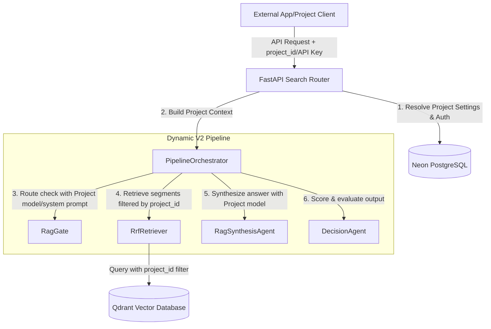

# Architecture Decision Record: Plug-and-Play Multi-Project Chatbot Integration

* **Status:** Proposed
* **Date:** 2026-06-27
* **Author:** Antigravity AI
* **File Reference:** [001_plug_and_play.md](file:///c:/Programming/Projects/01_ACTIVE/Scrutinize/docs/decisions/001_plug_and_play.md)

---

## Context & Problem Statement
We currently have a highly functional chatbot search pipeline (v2) consisting of a routing gate, query rewriter, vector retriever, answer synthesizer, and quality evaluation agent. However, this pipeline is configured globally via `.env` settings and is tightly coupled to a single corpus of files and a static set of models and parameters.

As our workload grows, we want to integrate this chatbot pipeline into **multiple external projects/apps** smoothly. Each project must satisfy the following criteria:
1. **Isolated Document Search:** The chatbot must only search and read documents/files belonging to the specific project from which the query originated.
2. **Project-Specific Customization:** Each project needs custom settings, including LLM model selection (e.g. gateway model, decision model, cloud vs. local), pipeline thresholds (e.g. confidence threshold, max attempts), and custom system instructions.
3. **Low Integration Friction:** The interface must be "plug-and-play," enabling easy integration via clean APIs and SDK/client headers without over-complicating the core orchestration logic.

---

## High-Level Architecture

We propose a **multi-tenant project mapping layer** that sits between incoming API requests and the pipeline orchestration. Rather than hard-coding model configurations, we resolve the project identity first, load its settings, and pass a dynamic context through the agents.



---

## Core Pillars of Design

We align this design directly with the three pillars of software construction:

### 1. Modularity
* **Decoupled Configuration:** Model selections, prompt templates, and pipeline parameters are decoupled from global environment variables into a database-backed config engine.
* **Component Autonomy:** Individual pipeline agents (`RagGate`, `QueryRewriter`, `RagSynthesisAgent`, `DecisionAgent`) receive configuration dynamically per call, allowing them to remain completely stateless.
* **Service Independence:** Ingestion and processing tasks operate independently of the search endpoints, communicating only via clean entities in the database and Qdrant.

### 2. Scalability
* **Efficient Qdrant Filtering:** Instead of creating separate Qdrant collections per project (which is resource-intensive and hard to manage), we use a single collection and partition data using an indexed payload field: `project_id`.
* **Zero-Lock Retrieval:** Filtering search requests in Qdrant by `project_id` utilizes pre-computed payload indexes, ensuring query response times do not degrade as the number of projects scale.
* **Asynchronous Document Processing:** Document upload and indexing remain background jobs (managed via Celery or local threadpools) and are isolated per project to prevent one project's uploads from blocking another's queries.

### 3. Flexibility
* **Context Dependency Injection:** We pass a `ProjectContext` object through the pipeline. This makes it trivial to change model settings, temperature parameters, and instructions dynamically at runtime without restarting servers or modifying pipeline code.
* **Fallback Strategy:** If a project does not specify a custom model or system prompt, the orchestrator automatically falls back to global default configurations.

---

## Detailed Technical Changes

### A. Database Schema Updates (PostgreSQL via SQLModel)
We introduce a `Project` table to manage client apps, credentials, and settings. We also associate uploaded `File` items and `Segment` records with their parent project.

```python
from datetime import UTC, datetime
from uuid import UUID, uuid4
from sqlmodel import Field, SQLModel, Column, JSON

class Project(SQLModel, table=True):
    __tablename__ = "projects"

    id: UUID = Field(default_factory=uuid4, primary_key=True)
    name: str = Field(unique=True, index=True)
    api_key: str = Field(unique=True, index=True)  # Simple authorization header
    
    # Store settings in JSON format (e.g. models, prompts, weights, thresholds)
    settings: dict = Field(default_factory=dict, sa_column=Column(JSON))
    created_at: datetime = Field(default_factory=lambda: datetime.now(UTC))

class File(SQLModel, table=True):
    __tablename__ = "files"
    
    id: UUID = Field(default_factory=uuid4, primary_key=True)
    project_id: UUID = Field(foreign_key="projects.id", index=True) # <-- NEW: Link to project
    filename: str
    modality: FileModality
    storage_path: str
    status: FileStatus = Field(default=FileStatus.UPLOADED)
    uploaded_at: datetime = Field(default_factory=lambda: datetime.now(UTC))

class Segment(SQLModel, table=True):
    __tablename__ = "segments"
    
    id: UUID = Field(default_factory=uuid4, primary_key=True)
    file_id: UUID = Field(foreign_key="files.id", index=True)
    project_id: UUID = Field(foreign_key="projects.id", index=True) # <-- NEW: Link to project for quick DB queries
    modality: FileModality
    content: str
    start_time: float | None = None
    end_time: float | None = None
    created_at: datetime = Field(default_factory=lambda: datetime.now(UTC))
```

### B. Vector Database Ingestion & Search (Qdrant & VectorStore)
During ingestion, vector points are upserted with a `project_id` payload attribute. 

```python
# 1. Update VectorSegment schema
@dataclass(frozen=True)
class VectorSegment:
    id: UUID
    vector: list[float]
    file_id: UUID
    project_id: UUID  # <-- NEW: Track project ownership
    modality: str
    content: str
    source_path: str
    title: str
    # ...
```

In `VectorStore`, we register a keyword payload index on `project_id` and include it in search queries:

```python
# 2. Update VectorStore payload indexing
def _ensure_payload_indexes(self) -> None:
    if not self.collection_exists():
        return
    for field_name in ("file_id", "modality", "project_id"):  # <-- NEW: index project_id
        self._client.create_payload_index(
            collection_name=self._collection,
            field_name=field_name,
            field_schema=PayloadSchemaType.KEYWORD,
        )

# 3. Update VectorStore search filter
def search(
    self,
    query_vector: list[float],
    *,
    project_id: UUID,  # <-- NEW: Mandatory project filter
    top_k: int = 10,
    modality: str | None = None,
) -> list[dict[str, Any]]:
    self.ensure_collection()
    must_conditions = [
        FieldCondition(key="project_id", match=MatchValue(value=str(project_id)))
    ]
    if modality is not None:
        must_conditions.append(
            FieldCondition(key="modality", match=MatchValue(value=modality))
        )

    query_filter = Filter(must=must_conditions)

    response = self._client.query_points(
        collection_name=self._collection,
        query=query_vector,
        using=self.TEXT_VECTOR_NAME,
        limit=top_k,
        query_filter=query_filter,
    )
    return [
        {"id": point.id, "score": point.score, "payload": point.payload}
        for point in response.points
    ]
```

### C. Dynamic Context Injection in the Pipeline
To keep agents flexible and simple without overloading them, we pass a `ProjectContext` through the orchestrator.

```python
# app/schemas/v2/project.py
class ProjectContext(BaseModel):
    project_id: UUID
    gate_model: str
    rewriter_model: str
    synthesis_model: str
    decision_model: str
    confidence_threshold: float
    max_attempts: int
    system_prompt_overrides: dict[str, str] = Field(default_factory=dict)
```

In `PipelineOrchestrator`, we refactor search to require the context:
```python
def search(
    self,
    query: str,
    *,
    project_ctx: ProjectContext,  # <-- NEW: Pass project parameters
    modality_filter: FileModality | None = None,
    conversation: ConversationState | None = None,
) -> SearchV2Response:
    # ...
    # Pass down specific settings resolved from context to individual agent calls
    gate_result = self._gate.classify(
        stripped,
        model=project_ctx.gate_model,
        system_override=project_ctx.system_prompt_overrides.get("gate"),
        conversation_context=conversation_context,
    )
    # ...
```

---

## API Endpoints Design
We provide a simple client interface where external apps integrate using standard endpoints.

#### 1. Register a Project
```http
POST /api/v2/projects
Content-Type: application/json

{
  "name": "E-Commerce Support Portal",
  "settings": {
    "gate_model": "gpt-4o-mini",
    "rewriter_model": "Qwen/Qwen3.5-2B",
    "synthesis_model": "gpt-4o-mini",
    "decision_model": "qwen3.5:4b",
    "confidence_threshold": 0.8,
    "max_attempts": 2,
    "system_prompt_overrides": {
      "synthesis": "You are a customer support agent. Answer questions concisely based on context."
    }
  }
}

Response (201 Created):
{
  "project_id": "8e3c49ab-76db-4876-b9b5-4b07548b26bc",
  "api_key": "scrutinize_prj_live_9201948ba2849"
}
```

#### 2. Ingest Project Documents
The documents are stored and segmented under the correct tenant:
```http
POST /api/v2/projects/files
Header: X-Project-Key: scrutinize_prj_live_9201948ba2849
Content-Type: multipart/form-data

file: [upload document binary]
modality: "text"
```

#### 3. Ask the Chatbot
The query is scoped to the project automatically based on the API Key:
```http
POST /api/v2/search
Header: X-Project-Key: scrutinize_prj_live_9201948ba2849
Content-Type: application/json

{
  "query": "How do I process a refund?",
  "conversation": {
     "messages": [...]
  }
}
```

---

## Security & Integration Design (Anti-Abuse & Tenancy)

To safeguard LLM resources and ensure secure client-side embed integration, we define the following security rules:

### A. Dual Key Strategy (Admin vs. Client)
To prevent leakage of admin credentials, each project generates two API keys:
1. **Private Admin Key (`api_key`):** Prefix `scrutinize_sk_...`. Used for back-office tasks (uploading files, deleting files, changing model settings). **Never exposed to frontends.**
2. **Public Client Key (`client_key`):** Prefix `scrutinize_pk_...`. Used strictly for query and chat endpoints (`POST /api/v2/search`). Safe to expose in HTML widgets and scripts.

### B. CORS Domain Whitelisting
To prevent unauthorized websites from copying a project's `client_key` and using it on their own domains, the backend implements strict CORS validation:
* Projects can whitelist a set of domains (e.g. `['https://clientapp.com']`).
* The search API checks the `Origin` header of incoming requests against this whitelist before responding.

### C. Rate Limiting per Session / Client IP
* Chatbot endpoints will have strict token-bucket rate limits per client IP or `session_id` to prevent malicious scraping or denial-of-service (DoS) loops that drain API funds.

### D. Session & Citations Response Payload
To provide continuity and source transparency without complicating the frontend, the response schema includes:
* **Session ID mapping:** Storing and retrieving message history per end-user.
* **Citations & References:** A simplified list of source document names and page/segment references that the frontend widget can render below the text reply.

---

## Verification Plan

### Automated Verification
1. **Unit Tests:**
   * Verify that `VectorStore.search` filters results strictly using the `project_id` payload condition.
   * Verify that agent calls fallback gracefully to environment variables if project-specific values are empty in `ProjectContext`.
2. **Integration Tests:**
   * Spin up a temporary Qdrant collection, insert mock segments for `Project A` and `Project B`. Querying under `Project A`'s key must return zero documents from `Project B`.

### Manual Testing
1. Deploy updated schemas to development DB.
2. Register two test projects (`App Alpha` and `App Beta`).
3. Upload custom product documentation specific to `App Alpha`.
4. Run queries on `App Beta` and verify that no answers contain information from `App Alpha`'s documents.
