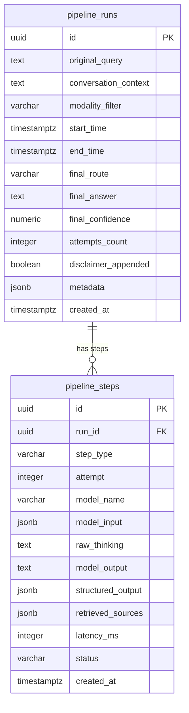

# Pipeline Logging Architecture (Unified Schema Proposal)

This document outlines the proposed simplified, decently-normalized schema to log all details of the AI search pipeline execution from start to finish.

## 1. Design Strategy: High vs. Decent Normalization

The previous architecture utilized **Class Table Inheritance** with 8 different tables (sub-tables for each step type, e.g., `step_rewrites`, `step_gates`, etc.). While highly normalized, this made understanding the sequence of runs and debug-queries extremely complex.

The new design collapses these polymorphic structures into just **two highly-readable tables**:
1. **`pipeline_runs`**: Master execution log representing a single user session/query.
2. **`pipeline_steps`**: Granular trace logs detailing every distinct action, LLM call, retrieved source, and evaluation loop iteration.

This setup offers:
* **Simplicity:** Only 2 tables to query or join.
* **Unified Tracing:** Standardized columns for LLM configuration, prompts, responses, thinking, and latency.
* **Rich Context:** JSONB fields to log full model inputs, structured outputs, and data snapshots.

---

## 2. Table Schema Details



### Table 1: `pipeline_runs`
Stores the metadata, high-level inputs, and final outcomes of a single end-to-end user query execution.

| Column | SQL Type | Description |
| :--- | :--- | :--- |
| **`id`** | `UUID` (PK) | Unique identifier for this pipeline execution. |
| **`original_query`** | `TEXT` | The exact query entered by the user. |
| **`conversation_context`** | `TEXT` | Snapshot of the conversation memory/history context passed to the agents. |
| **`modality_filter`** | `VARCHAR` | Filter applied to the search (e.g., `text`, `audio`, `video`, or `null`). |
| **`start_time`** | `TIMESTAMPTZ` | Timestamp when the pipeline execution began. |
| **`end_time`** | `TIMESTAMPTZ` | Timestamp when the pipeline execution finished. |
| **`final_route`** | `VARCHAR` | Final routing decision made (e.g., `generic` or `rag`). |
| **`final_answer`** | `TEXT` | The final output text synthesized and returned to the user. |
| **`final_confidence`** | `NUMERIC` | Overall confidence score of the final answer. |
| **`attempts_count`** | `INTEGER` | Number of iterations run before exiting the loop (minimum `1`). |
| **`disclaimer_appended`** | `BOOLEAN` | Whether the low-confidence disclaimer message was appended. |
| **`metadata`** | `JSONB` | Extensible global metadata (e.g., pipeline configuration settings). |
| **`created_at`** | `TIMESTAMPTZ` | Datetime when the database row was inserted. |

### Table 2: `pipeline_steps`
Stores detailed tracing data for each individual step (including raw inputs, raw LLM outputs, internal reasoning/thinking, and snapshots of retrieved documents).

| Column | SQL Type | Description |
| :--- | :--- | :--- |
| **`id`** | `UUID` (PK) | Unique identifier for this step. |
| **`run_id`** | `UUID` (FK) | Reference to `pipeline_runs(id)` with cascade on delete. |
| **`step_type`** | `VARCHAR` | The type of activity: `gate`, `rewrite`, `retrieval`, `synthesis`, `evaluation`. |
| **`attempt`** | `INTEGER` | The loop iteration / attempt number (starts at 1). |
| **`model_name`** | `VARCHAR` | The LLM model name used (e.g., `gemini-1.5-pro`, `gpt-4o`) or `null` for non-LLM steps. |
| **`model_input`** | `JSONB` | Exact prompt structure, system messages, templates, and history passed to the LLM. |
| **`raw_thinking`** | `TEXT` | Internal reasoning/chain-of-thought emitted by the model (if supported/available). |
| **`model_output`** | `TEXT` | Raw text response returned by the LLM. |
| **`structured_output`** | `JSONB` | JSON-parsed representation of the output (e.g., rewritten query, decision variables). |
| **`retrieved_sources`** | `JSONB` | **Snapshot** of the retrieved documents (for `retrieval` steps). Saves array of `{segment_id, file_id, title, content, path, score, rank}`. |
| **`latency_ms`** | `INTEGER` | Duration of the step in milliseconds. |
| **`status`** | `VARCHAR` | The status of the step execution (`success` or `failure`). |
| **`created_at`** | `TIMESTAMPTZ` | Datetime when the step was executed. |

---

## 3. How Specific Pipeline Information is Captured

Here is how the requested pipeline attributes map to the columns of the proposed schema:

| Required Info | Mapping in Proposed Schema |
| :--- | :--- |
| **Original Query** | `pipeline_runs.original_query` |
| **Previous Conversation** | `pipeline_runs.conversation_context` |
| **Rewritten Query** | `pipeline_steps.structured_output -> 'rewritten_query'` (in step `rewrite`) |
| **Each LLM Model** | `pipeline_steps.model_name` for each step |
| **Each LLM Model Input** | `pipeline_steps.model_input` (contains system instructions and prompt templates) |
| **Each LLM Thinking & Output** | `pipeline_steps.raw_thinking` and `pipeline_steps.model_output` |
| **Iterations** | Tracked via `pipeline_steps.attempt` grouping |
| **Reason of Iteration** | `pipeline_steps.structured_output -> 'feedback'` (in step `evaluation`) |
| **Confidence** | `pipeline_steps.structured_output -> 'confidence'` (for gate/evaluation steps) and `pipeline_runs.final_confidence` |
| **Snapshots** | `pipeline_steps.retrieved_sources` (captures source segments list at time of retrieval) |

---

## 4. Querying the Whole Pipeline Tracing

To extract the full pipeline trace from start to finish, you only need a single simple join:

```sql
SELECT 
    r.id AS run_id,
    r.original_query,
    s.attempt,
    s.step_type,
    s.model_name,
    s.model_input,
    s.raw_thinking,
    s.model_output,
    s.structured_output,
    s.retrieved_sources,
    s.latency_ms
FROM pipeline_runs r
JOIN pipeline_steps s ON r.id = s.run_id
WHERE r.id = :run_id
ORDER BY s.attempt ASC, s.created_at ASC;
```
