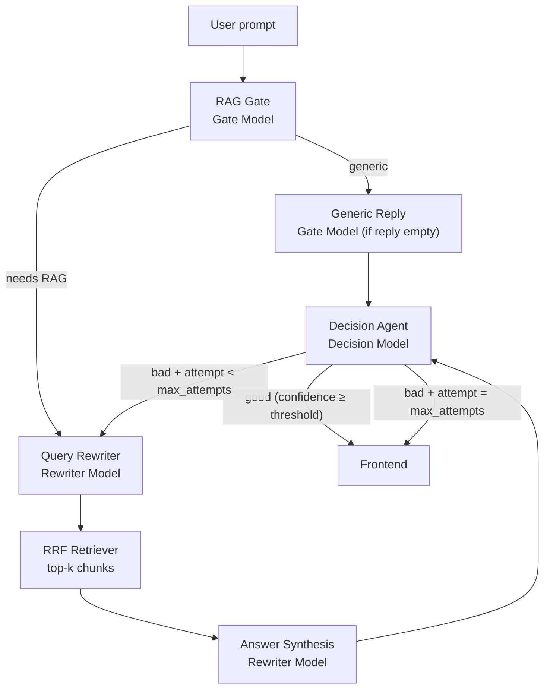

# Project Plan v2 — Scrutinize (Local LLM + Agentic RAG)

Module-wise division & phases for **Scrutinize v2**, a branch-forked evolution of the existing multi-modal embedding & retrieval system. v2 replaces the OpenAI-only query-time agent layer with a **local Qwen pipeline** (served via ngrok/Ollama) and adds **Reciprocal Rank Fusion (RRF)**, a **RAG gate**, and a **decision agent feedback loop**.

The current app on `main` (OpenAI router + synthesis, Qdrant, Neon) **stays untouched**. All v2 work lives on a separate long-lived branch.

---

## 0. Branch & Migration Strategy

| Branch | Purpose | Status |
|---|---|---|
| `main` | Current production architecture (OpenAI agents, existing `/search`) | **Frozen** — bugfixes only |
| `v2/local-llm-pipeline` | New query pipeline, RRF, decision loop | Active development |

**Rules**

- Do **not** rewrite ingestion (M2–M4), Qdrant collection schema, or Neon tables on `main`.
- v2 may add new backend modules under `backend/app/services/v2/` and a new endpoint (`POST /v2/search`) so both pipelines can coexist during development.
- Frontend switches via env flag (`VITE_API_SEARCH_PATH=/v2/search`) — default stays on v1 until v2 is validated.
- **Deferred swaps (not in initial v2 plan):** Qdrant → ChromaDB, Neon → SQLite. Document interfaces now so swaps are isolated later.

---

## 1. Module Map

| Module | Name | Lives in | Summary |
|---|---|---|---|
| **M0** | Infrastructure & DevOps | repo root, `docker-compose.yml`, `.github/workflows/` | Branch scaffold, env for local LLM base URL, CI job for v2 unit tests |
| **M1** | Backend Core | `backend/app/core`, `api/` | Shared FastAPI app; v2 routes mounted alongside v1; config for ngrok LLM endpoints |
| **M2** | Text Ingestion | `backend/app/services/text_processor.py` | **Reused unchanged** from v1 |
| **M3** | Audio Ingestion | `backend/app/services/audio_processor.py` | **Reused unchanged** from v1 |
| **M4** | Video Ingestion | `backend/app/services/video_processor.py` | **Reused unchanged** from v1 |
| **M5** | Embedding & Vector Store | `backend/app/services/embedding_service.py`, `vector_store.py`, `v2/rrf_retriever.py` | Reuse v1 Qdrant wrapper; add RRF fusion over multiple retrieval lists → top 5 |
| **M6** | Local LLM Client | `backend/app/services/v2/local_llm_client.py` | HTTP client for Ollama-style `POST /api/generate` via ngrok |
| **M7** | Query Pipeline & Agents | `backend/app/services/v2/` | Rewriter → RAG gate → (generic \| RAG+RRF+synthesis) → decision loop |
| **M8** | Frontend | `frontend/src/` | Chat UI wired to `/v2/search`; show confidence, retry count, disclaimer |
| **M9** | QA, Docs & Demo | `docs/`, `tests/` | v2 pipeline tests, architecture doc update, demo walkthrough |

---

## 2. v2 Query Pipeline (Target Architecture)



All local models call the same ngrok host (or cloud OpenAI endpoint if USE_CLOUD_LLM=True):

```
POST https://e7a8-154-192-139-73.ngrok-free.app/api/generate
```

(Ollama-compatible JSON body: `{ "model": "...", "prompt": "...", "stream": false }`.)

### 2.1 Stage-by-stage behaviour

| Stage | Model | Input | Output |
|---|---|---|---|
| **1. RAG Gate** | Gate Model | Raw query + system prompt | `{ "route": "rag" \| "generic", "reason": "...", "reply": "string or null" }` |
| **2a. Generic path** | Gate Model | Raw user query (via GenericAgent if Gate reply is null) | Natural conversational reply (no vector search) |
| **2b. RAG path — Rewriter** | Rewriter Model | Raw user query (+ decision feedback on retry) | Rewritten query with clearer keywords |
| **3b. RAG path — RRF** | (no LLM) | Rewritten query | Top segment/chunk hits from vector search |
| **4b. RAG path — Synthesis** | Rewriter Model | Query + RRF chunks | Draft answer grounded in retrieved content |
| **5. Decision Agent** | Decision Model | Raw query, rewritten query, draft answer, RAG chunks (if any) | `{ "verdict": "good" \| "retry", "confidence": 0.0–1.0, "feedback": "..." }` |
| **6. Loop / exit** | — | — | Max attempts full pipeline runs; on final low-confidence exit, append disclaimer |

### 2.2 RAG gate — when to enter RAG

The **0.8b gate** system prompt must classify the query. Enter RAG when the question is about **indexed user content**; stay generic otherwise.

| Route | Examples |
|---|---|
| **`rag`** | "Find the video where someone drinks milk", "What does my uploaded PDF say about X?", "Which audio mentions project deadline?", "Summarize the file I uploaded yesterday" |
| **`generic`** | "Hello", "What is Python?", "Write me a poem", "Explain quantum computing", general knowledge with no reference to the user's library |

The gate classifies the original user query and conversation context directly.

### 2.3 Reciprocal Rank Fusion (RRF)

Reuse the existing Qdrant collection and `EmbeddingService`. Run **multiple retrieval lists**, then fuse:

1. **List A** — embed + search with the **rewritten** query (primary).
2. **List B** — embed + search with the **original** user query (recall anchor).
3. **(Optional List C)** — embed + search with **keyword-expanded** rewrite (same 2b output, stripped to noun phrases).

RRF score for document \(d\):

\[
\text{RRF}(d) = \sum_{i} \frac{1}{k + \text{rank}_i(d)}
\]

Use `k = 60` (standard default). Return **top 5** segments after fusion. Existing modality filter from the rewriter (or request) applies to each list.

> **Note:** v1 returns segments; v2 keeps segment-level chunks but may **dedupe by `file_id`** in the response so the UI shows at most one hit per file when scores are close.

### 2.4 Decision agent loop

The **4b decision agent** evaluates the full context:

```
- original_query
- rewritten_query
- draft_answer        (generic reply OR RAG synthesis)
- retrieved_chunks[]  (empty for generic path)
- attempt_number      (1 or 2)
```

| Verdict | Condition | Action |
|---|---|---|
| `good` | `confidence >= 0.7` (configurable) | Return answer + sources to UI |
| `retry` | `confidence < 0.7` and `attempt < 2` | Pass `feedback` back to rewriter ("be more specific about…", "focus on video modality…") and re-run from Stage 1 |
| `fallback` | `confidence < 0.7` and `attempt == 2` | Return best-effort answer with appended line: **"Note: answer may vary — retrieval confidence was low."** |

On retry, the rewriter receives prior feedback so the rewritten query and RRF lists change.

---

## 3. Phase Overview

| Phase | Modules | Goal |
|---|---|---|
| **Phase 0** — Branch & LLM Client | M0, M1, M6 | Fork branch, config, working HTTP client against ngrok `/api/generate` |
| **Phase 1** — Rewriter + RAG Gate | M6, M7 | End-to-end generic vs RAG routing; generic replies without vector search |
| **Phase 2** — RRF Retrieval | M5, M7 | Fuse multi-query Qdrant lists; top-5 chunks into synthesis |
| **Phase 3** — Decision Loop | M7 | 4b decision agent, 2-attempt retry, fallback disclaimer |
| **Phase 4** — Frontend & API | M7, M8 | `/v2/search` response shape, UI for confidence/sources/disclaimer |
| **Phase 5** — QA & Docs | M9 | Tests, v2 architecture doc, demo script |

---

## 4. Phase 0 — Branch Setup & Local LLM Client

**Modules:** M0, M1, M6

| Task | Detail |
|---|---|
| Create branch | `git checkout -b v2/local-llm-pipeline` from current `main` |
| Env vars | Add to `.env.example`: `LOCAL_LLM_BASE_URL`, `LOCAL_LLM_REWRITER_MODEL=qwen3.5:2b`, `LOCAL_LLM_GATE_MODEL=qwen3.5:0.8b`, `LOCAL_LLM_DECISION_MODEL=qwen3.5:4b`, `LOCAL_LLM_TIMEOUT_S=120`, `V2_MAX_PIPELINE_ATTEMPTS=2`, `V2_CONFIDENCE_THRESHOLD=0.7` |
| `LocalLlmClient` | `backend/app/services/v2/local_llm_client.py` — `generate(model, system, user, *, json_mode=False) -> str` wrapping Ollama `/api/generate`; handle ngrok `ngrok-skip-browser-warning` header |
| Health probe | Optional `GET /v2/llm-health` — ping gate model with "ping" prompt |
| v2 package scaffold | `backend/app/services/v2/__init__.py`, `backend/app/api/v2/search.py`, mount under `/v2` |
| CI | Add pytest marker `@pytest.mark.v2`; job runs v2 unit tests without breaking v1 suite |
| ngrok stability | Document that ngrok URL rotates — env-driven base URL, not hardcoded in code |

**Deliverable:** Branch exists; `LocalLlmClient` returns a response from each configured model via ngrok; `/health` still green on v1 paths.

---

## 5. Phase 1 — Query Rewriter & RAG Gate

**Modules:** M6, M7

### M7 — New agents (replace v1 RouterAgent for v2 only)

| File | Responsibility |
|---|---|
| `query_rewriter.py` | `qwen3.5:2b` — rewrite user query; accept optional `feedback` from decision agent on retry |
| `rag_gate.py` | `qwen3.5:0.8b` — classify `rag` vs `generic`; structured JSON output |
| `generic_agent.py` | `qwen3.5:0.8b` — natural reply when gate says generic |
| `pipeline_orchestrator.py` | Wire stages 1–2–3a; no RRF yet |

### Tasks

- [ ] `QueryRewriter.rewrite(query, feedback=None) -> RewrittenQuery`
- [ ] `RagGate.classify(original, rewritten) -> GateResult(route, reason)`
- [ ] `GenericAgent.reply(query) -> str`
- [ ] `POST /v2/search` — returns answer for generic queries; RAG path returns `"RAG pipeline not yet wired"` stub
- [ ] System prompts stored in `backend/app/services/v2/prompts/` (versioned, easy to tune)
- [ ] JSON parsing with safe fallback: if gate JSON fails → default to `rag` (safer for indexed-content app)

**Deliverable:** Generic chitchat works end-to-end through `/v2/search`; indexed-content questions hit the RAG stub.

---

## 6. Phase 2 — RRF Retrieval & Answer Synthesis

**Modules:** M5, M7

### M5 — RRF retriever

| File | Responsibility |
|---|---|
| `rrf_retriever.py` | Run N embedding searches, fuse with RRF, return top 5 `SearchSource`-compatible hits |

### M7 — RAG synthesis

| File | Responsibility |
|---|---|
| `rag_synthesis_agent.py` | Local LLM answer over top-5 chunks (replaces v1 `SynthesisAgent` for v2) |

### Tasks

- [ ] `RrfRetriever.retrieve(original_query, rewritten_query, *, modality_filter, top_k=5) -> list[SearchSource]`
- [ ] Implement RRF fusion (`k=60`); unit test with mocked rank lists
- [ ] Wire RAG path in `pipeline_orchestrator.py`: gate=`rag` → RRF → synthesis → draft answer
- [ ] Reuse `EmbeddingService` + `VectorStore.search()` — **no Qdrant schema changes**
- [ ] Empty RRF results → short answer: "No matching indexed content found" (skip synthesis LLM call)

**Deliverable:** Indexed-content questions return a grounded draft answer + 5 source segments via `/v2/search` (no decision loop yet).

---

## 7. Phase 3 — Decision Agent & Retry Loop

**Modules:** M7

| File | Responsibility |
|---|---|
| `decision_agent.py` | `qwen3.5:4b` — score answer quality, emit verdict + confidence + feedback |
| `pipeline_orchestrator.py` | Loop: attempt 1 → decision → retry or return |

### Tasks

- [ ] `DecisionAgent.evaluate(context: DecisionContext) -> DecisionResult`
- [ ] Decision prompt includes all fields: original query, rewritten query, draft answer, chunk summaries, attempt number
- [ ] Orchestrator loop (max 2 attempts):

```text
for attempt in 1..MAX_ATTEMPTS:
    rewritten = rewriter.rewrite(query, feedback=prev_feedback)
    route = gate.classify(query, rewritten)
    if route == generic:
        draft = generic_agent.reply(query)
        chunks = []
    else:
        chunks = rrf.retrieve(query, rewritten)
        draft = rag_synthesis.synthesize(query, chunks)
    decision = decision_agent.evaluate(...)
    if decision.verdict == good:
        return success(draft, chunks, decision)
    prev_feedback = decision.feedback
return fallback(draft, chunks, disclaimer=True)
```

- [ ] Response schema additions: `attempts`, `confidence`, `route` (`generic`|`rag`), `disclaimer_appended: bool`
- [ ] Log each attempt (structured JSON logs for debugging ngrok latency)

**Deliverable:** Full v2 pipeline with retry and fallback disclaimer on low confidence after 2 runs.

---

## 8. Phase 4 — Frontend & API Contract

**Modules:** M7, M8

### API — `POST /v2/search`

Extend v1 `SearchResponse` (or new `SearchV2Response`):

| Field | Type | Description |
|---|---|---|
| `query` | string | Original user query |
| `rewritten_query` | string | After 2b rewriter (final attempt) |
| `route` | `"generic"` \| `"rag"` | Gate decision |
| `answer` | string | Final answer (may include disclaimer) |
| `sources` | `SearchSource[]` | RRF chunks (empty for generic) |
| `confidence` | float | Decision agent score 0–1 |
| `attempts` | int | 1 or 2 |
| `disclaimer_appended` | bool | True when fallback message added |

### Frontend tasks

- [ ] Env toggle: `VITE_SEARCH_API=/v2/search`
- [ ] `SearchView` — show confidence badge (optional), route chip (Generic / Library search)
- [ ] When `disclaimer_appended`, render muted footnote under answer
- [ ] Sources panel unchanged (reuse `SourceCard`); empty for generic replies
- [ ] Loading state covers multi-attempt latency (rewriter + gate + RRF + decision may take 30–90s on local models)

**Deliverable:** UI exercises full v2 pipeline against ngrok-backed models.

---

## 9. Phase 5 — Testing, Documentation & Demo

**Modules:** M9

| Task | Detail |
|---|---|
| Unit tests | Mock `LocalLlmClient`; test RRF fusion math, gate JSON parsing, orchestrator loop (good first try, retry then good, double fallback) |
| Integration tests | Real Qdrant + mocked LLM HTTP; one RAG and one generic path |
| Security | No ngrok URL or model prompts leaked in error responses; timeout handling |
| Docs | `docs/architecture/architecture_v2.md` — pipeline diagram, model roles, RRF formula |
| Module doc | `docs/modules/m7-v2-query-pipeline.md` |
| Demo script | 1 generic query + 2 indexed-content queries showing retry + disclaimer case |
| README v2 section | Branch checkout, env vars, ngrok setup notes |

**Deliverable:** Green CI for v2 markers; architecture doc and demo recording for the new pipeline.

---

## 10. What Changes vs v1 (Summary)

| Area | v1 (`main`) | v2 (`v2/local-llm-pipeline`) |
|---|---|---|
| Query routing | GPT-4o-mini function calling (`RouterAgent`) | Local `qwen3.5:0.8b` RAG gate |
| Query rewrite | Inside router tool call | Dedicated `qwen3.5:2b` rewriter |
| Retrieval | Single embedding search, top-k | **RRF** over original + rewritten queries, top 5 |
| Answer generation | GPT-4o-mini `SynthesisAgent` | Local LLM synthesis + generic path |
| Quality control | None | **`qwen3.5:4b` decision agent**, max 2 attempts |
| LLM hosting | OpenAI API | ngrok → local Ollama `/api/generate` |
| Embeddings | OpenAI `text-embedding-3-small` | **Unchanged in v2 initial plan** (still OpenAI) |
| Vector DB | Qdrant | **Unchanged** (ChromaDB swap deferred) |
| Relational DB | Neon | **Unchanged** (SQLite swap deferred) |
| Ingestion | M2–M4 pipelines | **Reused as-is** |
| Search endpoint | `POST /search` | New `POST /v2/search` (v1 kept) |

---

## 11. Future Work (Explicitly Out of Scope for Initial v2)

| Swap | Approach when ready |
|---|---|
| **Qdrant → ChromaDB** | Implement `VectorStore` protocol; point `RrfRetriever` at new backend; re-index or migrate collection |
| **Neon → SQLite** | Swap SQLModel engine URL; run SQLite migrations; no query-pipeline changes |
| **Local embeddings** | Replace `EmbeddingService` with local model (e.g. `nomic-embed-text`) to remove OpenAI dependency entirely |
| **Streaming responses** | Ollama `stream: true` + SSE from FastAPI to frontend |
| **Persistent ngrok / self-host** | Replace rotating ngrok URL with Tailscale, Cloudflare Tunnel, or on-server Ollama |

---

## 12. Suggested Timeline

| Phase | Duration (suggested) |
|---|---|
| Phase 0 — Branch & LLM client | 0.5 day |
| Phase 1 — Rewriter + gate | 1 day |
| Phase 2 — RRF + synthesis | 1–1.5 days |
| Phase 3 — Decision loop | 1 day |
| Phase 4 — Frontend & API | 0.5–1 day |
| Phase 5 — QA & docs | 1 day |

**Total:** ~5–6 days

---

## 13. Risks & Mitigations

| Risk | Mitigation |
|---|---|
| ngrok URL rotates or tunnel drops | Env-driven `LOCAL_LLM_BASE_URL`; health probe; clear error in UI |
| Local models too slow for demo (2b + 0.8b + 4b × 2 attempts) | Set `V2_MAX_PIPELINE_ATTEMPTS=1` for demos; cache rewriter output within a session |
| 0.8b gate misclassifies generic as RAG (or vice versa) | Tune system prompt; log `reason`; integration tests with fixed prompt set; default to `rag` on parse failure |
| RRF no better than single search | A/B log v1 vs v2 retrieval scores; tune candidate pool size before fusion (e.g. top 20 per list → fuse to 5) |
| Decision agent always retries | Raise confidence threshold tuning; cap synthesis length; provide chunk summaries not full text to 4b |
| OpenAI still required for embeddings/ingestion | Accept for initial v2; document as follow-up in §11 |
| Two pipelines diverge | Keep shared M2–M5; isolate all query-time logic under `services/v2/` |

---

## 14. Configuration Reference (v2 additions)

| Setting | Env var | Default |
|---|---|---|
| Local LLM base URL | `LOCAL_LLM_BASE_URL` | `https://e7a8-154-192-139-73.ngrok-free.app` |
| Rewriter model | `LOCAL_LLM_REWRITER_MODEL` | `qwen3.5:2b` |
| Gate / generic model | `LOCAL_LLM_GATE_MODEL` | `qwen3.5:0.8b` |
| Decision model | `LOCAL_LLM_DECISION_MODEL` | `qwen3.5:4b` |
| HTTP timeout | `LOCAL_LLM_TIMEOUT_S` | `120` |
| Max pipeline attempts | `V2_MAX_PIPELINE_ATTEMPTS` | `2` |
| Confidence threshold | `V2_CONFIDENCE_THRESHOLD` | `0.7` |
| RRF constant k | `V2_RRF_K` | `60` |
| RRF lists per query | `V2_RRF_NUM_LISTS` | `2` (rewritten + original) |
| Fused top-k | `V2_RRF_TOP_K` | `5` |

---

## 15. Related Docs

- [plan.md](./plan.md) — original v1 module & phase plan (unchanged)
- [architecture/architecture.md](./architecture/architecture.md) — v1 system design
- [modules/m6-search.md](./modules/m6-search.md) — current `/search` pipeline (reference for RRF inputs)
