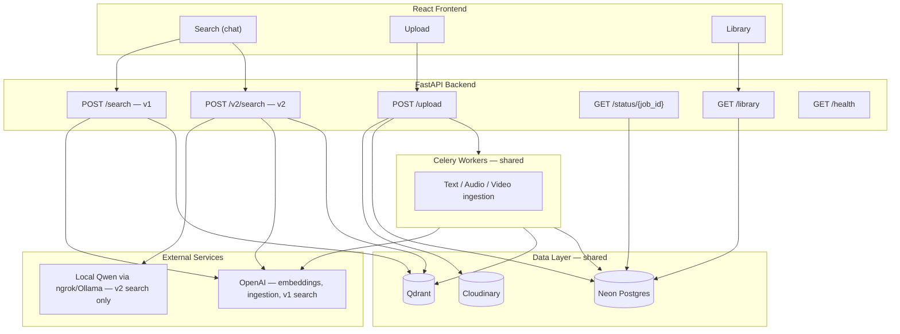
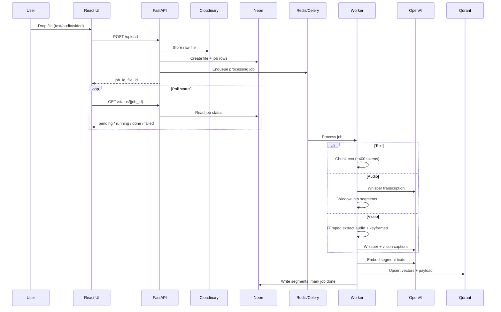
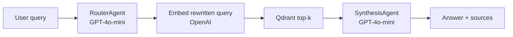
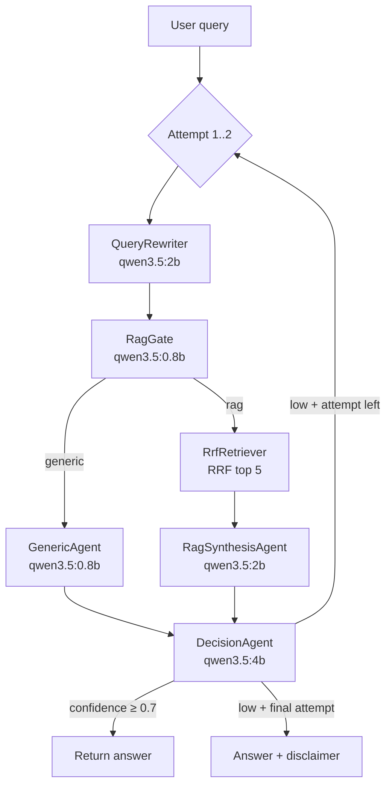

# Scrutinize — v1 vs v2 & Full App Overview

This document explains how the **entire Scrutinize app** works, what **v1** and **v2** share, and what differs between the two search pipelines.

Related docs: [`plan.md`](./plan.md) (v1), [`plan_v2.md`](./plan_v2.md) (v2), [`architecture/architecture.md`](./architecture/architecture.md), [`logs.md`](./logs.md) (implementation log).

---

## 1. What Scrutinize Is (Entire App)

Scrutinize is a **multi-modal document library** with a chat-style UI. Users can:

1. **Upload** text, audio, or video files
2. Wait for background workers to **index** them (chunk → embed → store)
3. **Search** with natural language and get an AI answer plus source snippets
4. **Browse** indexed files in a library view

Both v1 and v2 use the **same ingestion stack** and **same data stores**. Only the **query-time search pipeline** differs.



---

## 2. Shared Features (v1 and v2)

These parts are **identical** regardless of which search pipeline you use.

### Frontend (React + Vite)

| Feature | Location |
|---|---|
| Search chat UI | `frontend/src/components/SearchView.tsx` |
| Upload (drag-and-drop) | `frontend/src/components/UploadView.tsx` |
| Library / My Index | `frontend/src/components/LibraryView.tsx` |
| Source cards (text / audio / video playback) | `frontend/src/components/SourceCard.tsx` |
| Modality filter chips | `frontend/src/components/ModalityChips.tsx` |
| App state | `frontend/src/context/AppContext.tsx` |

Upload, library, and health checks always use the **same API paths** — not v1/v2 specific.

### Backend — ingestion & storage

| Feature | Location |
|---|---|
| File upload | `backend/app/api/upload.py` |
| Job status polling | `backend/app/api/routes.py` → `/status/{job_id}` |
| Library listing & delete | `backend/app/api/library.py` |
| Text chunking | `backend/app/services/text_processor.py` |
| Audio (Whisper) | `backend/app/services/audio_processor.py` |
| Video (FFmpeg + vision) | `backend/app/services/video_processor.py` |
| Embeddings | `backend/app/services/embedding_service.py` |
| Qdrant vector store | `backend/app/services/vector_store.py` |
| Neon metadata (files, jobs, segments) | `backend/app/models/` |
| Celery workers | `backend/app/workers/` |

### Infrastructure

| Component | Purpose |
|---|---|
| **Qdrant** | Vector search over indexed segments |
| **Neon Postgres** | Files, jobs, segment metadata |
| **Cloudinary** | Raw uploaded files (playback URLs) |
| **Redis + Celery** | Async ingestion queue |
| **OpenAI** | Embeddings for all searches; Whisper/vision during ingestion; **v1 search agents** |

### Shared search inputs

Both pipelines accept the same request shape for search:

- `query` — natural language question
- `modality_filter` — optional `text` \| `audio` \| `video`

Both return **sources** with the same structure (`segment_id`, `file_id`, `modality`, `title`, `content`, `source_path`, timestamps, `score`).

---

## 3. What Differs — v1 vs v2

| Area | v1 | v2 |
|---|---|---|
| **Branch focus** | `main` (original) | `v2/local-llm-pipeline` |
| **Search endpoint** | `POST /search` | `POST /v2/search` |
| **Frontend env** | `VITE_SEARCH_API=/search` | `VITE_SEARCH_API=/v2/search` (default on v2 branch) |
| **Query-time LLMs** | OpenAI GPT-4o-mini | Local Qwen via ngrok/Ollama |
| **Routing** | Single router agent (function calling) | Dedicated rewriter + RAG gate (generic vs library) |
| **Generic chat** | Always runs RAG | Can answer without vector search |
| **Retrieval** | One embedding search | **RRF** over original + rewritten queries |
| **Answer generation** | OpenAI synthesis agent | Local RAG synthesis agent |
| **Quality control** | None | Decision agent + up to 2 retries + disclaimer |
| **Extra API** | — | `GET /v2/llm-health` |
| **Response fields** | `search_query` | `rewritten_query`, `route`, `gate_reason`, `confidence`, `attempts`, `disclaimer_appended` |

### Code locations

| v1 only | v2 only |
|---|---|
| `backend/app/services/agents/router_agent.py` | `backend/app/services/v2/query_rewriter.py` |
| `backend/app/services/agents/synthesis_agent.py` | `backend/app/services/v2/rag_gate.py` |
| `backend/app/services/search_service.py` | `backend/app/services/v2/generic_agent.py` |
| `backend/app/api/search.py` | `backend/app/services/v2/rrf_retriever.py` |
| | `backend/app/services/v2/rag_synthesis_agent.py` |
| | `backend/app/services/v2/decision_agent.py` |
| | `backend/app/services/v2/pipeline_orchestrator.py` |
| | `backend/app/services/v2/local_llm_client.py` |
| | `backend/app/api/v2/search.py` |

---

## 4. Workflow — Ingestion (Shared)

Same for v1 and v2. Happens when a user uploads a file.



**Result:** Segments live in Qdrant with content, modality, timestamps, and Cloudinary URLs. Both search pipelines read from this same index.

---

## 5. Workflow — Search v1

OpenAI-only, single pass, no retry loop.



**Steps**

1. **Router** (`router_agent.py`) — rewrites query + optional modality filter via function calling
2. **Embed** — `text-embedding-3-small` on rewritten query
3. **Search** — Qdrant cosine similarity, default top 5
4. **Synthesize** — GPT-4o-mini produces cited answer from chunks

**Endpoint:** `POST /search`  
**Orchestrator:** `backend/app/services/search_service.py`  
**Requires:** `OPENAI_API_KEY`

**Response (simplified):**

```json
{
  "query": "...",
  "search_query": "...",
  "modality_filter": null,
  "answer": "...",
  "sources": [...]
}
```

---

## 6. Workflow — Search v2

Local Qwen pipeline with RAG gate, RRF, decision loop, and retries.



### Generic path (fast — ~1 LLM call)

1. **Conversation memory** — prepare summaries + last 10 messages
2. **RAG gate (0.8b)** — classifies and returns a direct `reply` for generic questions
3. **Return immediately** — no rewriter, no second generic agent, no decision agent

### RAG path (library questions)

1. **Conversation memory** — same context preparation
2. **Gate** — route = `rag`
3. **Rewriter (2b)** — with conversation context
4. **RRF retrieve** → **synthesis (2b)** → **decision (4b)** with retry loop

**Endpoint:** `POST /v2/search`  
**Orchestrator:** `backend/app/services/v2/pipeline_orchestrator.py`  
**Requires:** `LOCAL_LLM_BASE_URL` (ngrok/Ollama) + `OPENAI_API_KEY` (embeddings only)

**Response (simplified):**

```json
{
  "query": "...",
  "rewritten_query": "...",
  "route": "rag",
  "answer": "...",
  "sources": [...],
  "attempts": 1,
  "confidence": 0.88,
  "disclaimer_appended": false,
  "conversation": {
    "summaries": ["Earlier discussion about pasta..."],
    "messages": [{"role": "user", "content": "..."}, {"role": "assistant", "content": "..."}]
  }
}
```

### Conversation memory

- Client sends `conversation` on each `POST /v2/search`
- Backend keeps up to **10 recent messages** in context for all agents
- When a window fills, older messages are **summarized** (2b model) and stored in `summaries[]`
- All summaries are included in future prompts alongside the active message window
- Updated `conversation` is returned on every response; the frontend stores it in `AppContext`

---

## 7. End-to-End User Journey (Entire App)

```text
┌─────────────────────────────────────────────────────────────────┐
│                        SCRUTINIZE APP                           │
├─────────────────────────────────────────────────────────────────┤
│  1. UPLOAD                                                      │
│     User → Upload view → POST /upload → worker indexes file     │
│     Poll /status until "done"                                   │
├─────────────────────────────────────────────────────────────────┤
│  2. LIBRARY (optional)                                          │
│     Browse indexed files → GET /library                         │
│     Preview / delete files                                      │
├─────────────────────────────────────────────────────────────────┤
│  3. SEARCH                                                      │
│     User types question → Search view                           │
│     │                                                           │
│     ├─ v1: POST /search     (OpenAI router → Qdrant → synth)    │
│     └─ v2: POST /v2/search  (local Qwen pipeline + RRF)         │
│                                                                 │
│     UI shows answer, sources, playback for audio/video          │
│     v2 also shows: route chip, confidence, disclaimer           │
└─────────────────────────────────────────────────────────────────┘
```

---

## 8. Switching Between v1 and v2

Both endpoints run in the **same FastAPI process**. Toggle via frontend env:

```env
# v2 (default on v2 branch)
VITE_SEARCH_API=/v2/search

# v1
VITE_SEARCH_API=/search
```

Backend needs:

| Pipeline | Required env |
|---|---|
| v1 search | `OPENAI_API_KEY` |
| v2 search | `OPENAI_API_KEY` (embeddings) + `LOCAL_LLM_BASE_URL` (ngrok/Ollama) |

Check local LLM connectivity:

```bash
curl http://localhost:8000/v2/llm-health
```

---

## 9. Side-by-Side Summary

| Question | v1 | v2 |
|---|---|---|
| Can I upload text/audio/video? | Yes | Yes |
| Same Qdrant index? | Yes | Yes |
| Same library UI? | Yes | Yes |
| Handles "Hello, how are you?" without searching library? | No — always searches | Yes — generic route |
| How many LLM calls per search? | ~2 (router + synthesis) | ~4–8 (rewriter, gate, synth/generic, decision × attempts) |
| Retrieval method | Single vector search | RRF (2 query lists fused) |
| Self-hosted query LLMs? | No | Yes (Qwen via Ollama/ngrok) |
| Retry if answer quality low? | No | Yes (max 2 attempts) |
| Latency | Seconds (OpenAI cloud) | Often 30–90s (local models) |

---

## 10. Deferred (Neither v1 nor v2 Yet)

From [`plan_v2.md`](./plan_v2.md):

- Qdrant → ChromaDB swap
- Neon → SQLite swap
- Local embedding model (remove OpenAI dependency entirely)

Ingestion and both search pipelines would keep working; only the swapped components would change behind the same interfaces.
